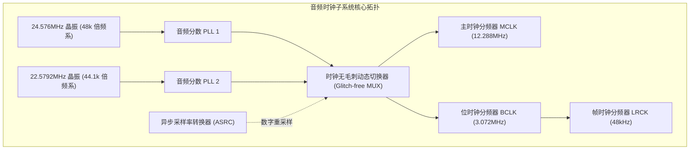

# 06 时钟系统、PLL 与 ASRC

## 模块导读与原厂定位

音频信号处理对时钟的纯净度与时间确定性有着近乎偏执的严苛要求。不同于数字逻辑只关心在时钟边沿数据是否就绪，模拟音频中的 ADC 和 DAC 在时钟上升沿**直接对电压进行时间离散采样与重建**。

时钟信号上的哪怕几皮秒（$\text{ps}$）的相位抖动（Clock Jitter），都会直接转化为调制噪声，摧毁高保真 DAC 的信噪比。

本模块系统拆解音频双时钟基准源、分数 PLL、孔径抖动、跨时钟域（CDC）隔离以及异步采样率转换器（ASRC）的硬件微架构。

---

## 模块文章索引

1. [双音频时钟基准与分数 PLL](01-audio-pll-dual-frequency.md)：48kHz 系（24.576MHz）与 44.1kHz 系（22.5792MHz）双晶振必要性与 Fractional-N PLL 原理
2. [时钟抖动 Jitter 与相位噪声分析](02-clock-jitter-phase-noise.md)：周期抖动、周期间抖动与孔径抖动（Aperture Jitter）对高保真转换器 SNR 衰减机理
3. [异步采样率转换 ASRC 硬件架构](03-asrc-hardware-architecture.md)：数字锁相环（DPLL）频偏动态估计、多相插值滤波（Polyphase FIR）与无缝重采样
4. [跨时钟域 CDC 与异步隔离](04-clock-synchronization-cdc.md)：格雷码双端口异步 FIFO、双触发器电平同步器与时钟门控（Clock Gating）防亚稳态设计
5. [音频时钟树布线与屏蔽规范](05-clock-engineering-guide.md)：差分时钟走线、伴地屏蔽、扩频时钟（SSC）对音频的致命破坏与屏蔽准则
6. [ASRC 采样率失锁破音案例](06-cases-debug.md)：实战案例：蓝牙通话 16kHz 与系统 48kHz 混音时 ASRC 频偏跟踪滤波器发散引发的连续破音排查
7. [孔径抖动对高保真 DAC 极限推导](07-engineering-analysis.md)：时钟抖动限制下 ADC/DAC 理论最大信噪比数学推导与皮秒级抖动预算分配
