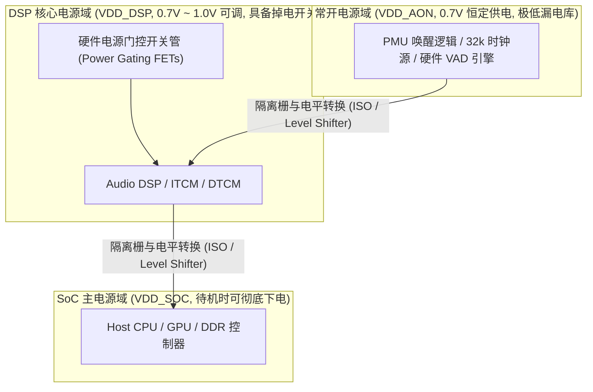

# 01 电源域划分与 DVFS 状态机

## 1. 硬件解决什么问题：不同声学场景下的能耗两极分化

音频子系统的算力需求在不同场景下跨度高达数十倍：
- **待机监听状态**：仅需微弱特征提取，算力 $< 1\text{ MIPS}$，功耗必须 $< 0.1\text{ mW}$；
- **普通通话状态**：运行 AEC 与降噪算法，算力约 $50\text{ MIPS}$，功耗要求 $< 5\text{ mW}$；
- **全景声游戏/空间音频**：多路 HRTF 空间混音加深度学习降噪，算力需求高达 $300\text{ MIPS}$ 以上。

单一固定的供电电压和主频无法兼顾这两极需求。芯片必须通过**物理电源域精细分割（Power Islands）**与**动态电压频率调整（DVFS）**，实现“给多大负荷、供多大水”。

---

## 2. 硬件微架构与组成：四级电源岛与电平转换器



---

## 3. 软件可见接口：DVFS 操作点（OPP）配置表

在 Linux 内核与 DSP 固件中，音频子系统定义了多个离散的操作性能点（Operating Performance Points, OPP）：

```c
// 音频子系统 DVFS 操作点定义
static struct audio_opp_table g_audio_opp[] = {
    // OPP 0: 超低功耗常开监听模式 (AON KWS)
    { .freq_hz = 24576000,   .volt_uv = 700000,  .mode = AUDIO_MODE_AON_LISTEN },
    // OPP 1: 普通通话/单麦降噪模式
    { .freq_hz = 98304000,   .volt_uv = 750000,  .mode = AUDIO_MODE_VOICE_CALL },
    // OPP 2: 双麦降噪与高保真放音
    { .freq_hz = 196608000,  .volt_uv = 850000,  .mode = AUDIO_MODE_HIFI_PLAYBACK },
    // OPP 3: 空间音频与重度神经声学降噪 (Turbo 模式)
    { .freq_hz = 393216000,  .volt_uv = 1000000, .mode = AUDIO_MODE_TURBO_SPATIAL },
};
```

---

## 4. 四流全链路分析：DVFS 动态升降频升降压时序流

1. **工作负载评估流**：DSP 任务调度器监测到音频算法从简单的 MP3 解码切换为 8 声道空间渲染，算力利用率突破 $85\%$。
2. **安全升压先行流（Voltage Scaling Up First）**：
   - 调度器向 PMIC 发出升压指令，将供电轨从 0.75V 提升至 1.0V；
   - **铁律：升频前必须先升压，降频后方可降压！**
   - 等待 PMIC 输出稳定（通常需等待 $50\mu\text{s}$ 电源步进时间）。
3. **安全升频流（Frequency Scaling）**：电压稳定后，配置 PLL 分频器平滑提升主频至 393MHz。
4. **无缝执行流**：计算单元算力成倍释放，且整个切换过程中音频 DMA 与 FIFO 持续吐数据，无任何卡顿。

---

## 5. 软硬件设计约束

- **隔离栅（Isolation Cells）与钳位**：当 DSP 核心电源域掉电进入睡眠时，其输出到常开 AON 域的控制信号必须经过硬件隔离栅强制钳位为确定的逻辑 0 或 1。若缺少隔离，浮空（Floating）的不定态输入会导致下游常开 CMOS 门电路发生上下管同时微导通，产生巨大的**直通击穿漏电流（Crowbar Current）**。
