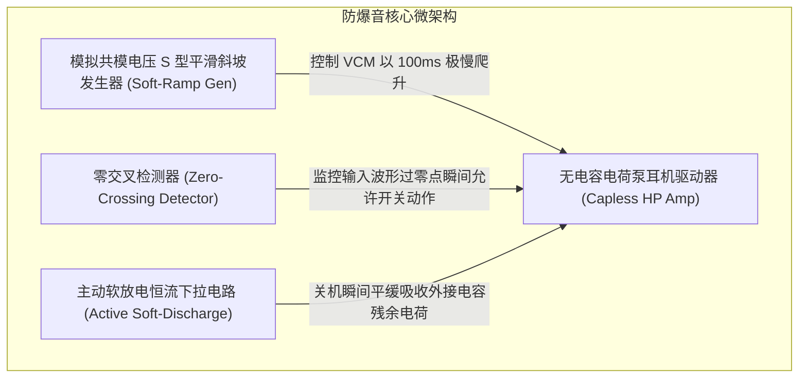

# 02 防爆音 POP/Click 硬件机理

## 1. 硬件解决什么问题：消灭开关机与切歌瞬间的刺耳冲击

人耳对音频输出端的微小直流瞬态阶跃极其敏感。根据声学物理学，哪怕仅有 **几十毫伏（mV）** 的微弱直流偏置（DC Offset）瞬间施加到扬声器音圈上，音圈瞬间受安培力推动发生阶跃位移，就会在空气中爆发出刺耳的“砰/咔哒”（Pop / Click）爆音。

爆音产生的三大典型场景：
1. **设备开机/关机瞬间**：供电轨上下电时电容充放电不平衡；
2. **耳机插入/拔出瞬间**：机械触点未对齐瞬间接地与短路；
3. **音频流通路切换（DAPM Routing Switch）**：耳放使能管（Enable Gate）突然导通。

---

## 2. 硬件微架构与组成：软启动斜坡发生器与零交叉检测器



---

## 3. 两大防爆音核心硬件技术剖析

### 1. 模拟共模电压 S 型平滑爬升（VCM Soft-Ramp）
传统功放上电时，共模偏置电压（通常 $V_{\text{CM}} = \frac{1}{2} V_{\text{DD}}$）呈陡峭的阶跃跳变，直接被交流耦合电容转化为电流脉冲喷涌至扬声器。
- **硬件解决方案**：片内内置可编程模拟电流镜，控制 VCM 沿着平滑的 **S 型曲线（Sigmoid Curve）**以 $50\text{ ms} \sim 200\text{ ms}$ 的极其缓慢速率充电建立。人耳听觉下限是 20Hz，超低频（$< 5\text{ Hz}$）的缓慢电压变化被人耳完全视作静音。

### 2. 零交叉检测切换（Zero-Crossing Switching）
在音乐播放中动态调节音量（Volume Step）或静音（Mute）时：
- 若在正弦波峰值（如最大振幅处）突然切断音频，瞬态阶跃将产生丰富的可闻高频谐波爆音；
- **硬件解决方案**：比较器实时监视音频波形，**只有在模拟信号瞬时电压正好穿越 0V（零偏置点）的纳秒级窗口内，才允许硬件开关动作或更新增益**。

---

## 4. 软件可见接口：软启动时间与零交叉控制寄存器

```c
// 防爆音控制寄存器: CODEC_ANTI_POP_CTRL (Offset: 0x0240)
#define REG_ANTI_POP_CTRL        (*(volatile uint32_t *)(CODEC_BASE + 0x0240))
#define ANTI_POP_RAMP_100MS       (2U << 0)  // VCM 爬升时间设为 100ms
#define ANTI_POP_ZC_ENABLE        (1U << 4)  // 使能音量零交叉平滑检测
#define ANTI_POP_ZC_TIMEOUT_20MS  (1U << 6)  // 若 20ms 内无过零点，强制超时切换
#define ANTI_POP_ACTIVE_PULLDOWN  (1U << 8)  // 下电时开启主动受控软下拉放电
```

---

## 5. 软硬件设计约束

- **零交叉超时保护（Zero-Crossing Timeout）**：若当前播放的是纯直流或极低频大直流信号，信号可能数十毫秒都不穿过 0V。硬件必须具备超时溢出计数器（如 20ms 超时），超时后自动退化为微步阶梯衰减，防止系统因等待零点而永久挂起。
- **无输出电容架构（Capless Headphone Driver）**：现代 Codec 内部集成负压反转电荷泵（True Ground Inverting Charge Pump），产生 $-V_{\text{DD}}$ 供电轨。使耳放输出可以直接以真实大地（0V Ground）为参考基准，**彻底省去了两个笨重易爆音的百微法外部交流隔直电容**。
