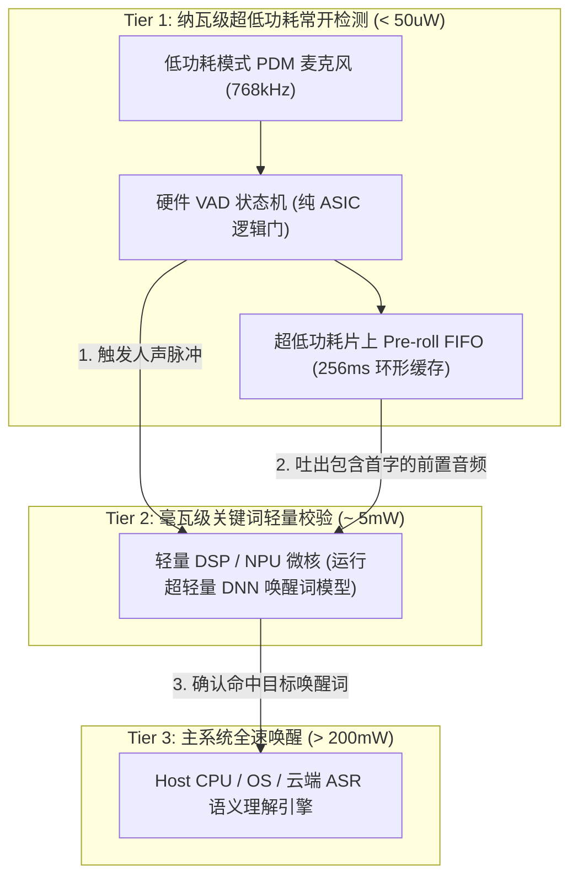

# 03 超低功耗常开唤醒 AON/KWS

## 1. 硬件解决什么问题：微瓦级全天候声学监听架构

智能设备在待机时必须时刻准备响应用户的语音唤醒词（如“嘿 Siri”或“小爱同学”）。
全链路如果在高功耗主核心上运行，数小时就会耗尽电池。

原厂架构通过**分级漏电控制与阶梯式多级唤醒（Tiered Wakeup Architecture）**，在待机功耗与唤醒响应速度之间取得了极致平衡。

---

## 2. 硬件微架构与组成：三级阶梯唤醒拓扑

---

## 3. 为什么必须配备 Pre-roll 硬件缓冲？
- 人说话发音的最初几十毫秒通常是微弱的清辅音（如“小爱”的“x”或“Siri”的“s”）；
- 硬件 VAD 往往需要积累约 $30\text{ ms} \sim 50\text{ ms}$ 的能量才能断定有人声发音；
- 若无 Pre-roll 缓冲，DSP 唤醒后录制到的声音将**丢失开头的声母辅音**，导致后续神经网络识别率断崖式暴跌；
- 硬件 Pre-roll FIFO 在硬件 VAD 判定成功的瞬间，立即冻结并允许 DSP 逆向读取过去 256ms 的原始未压缩样点，完美保全发音完整性。
