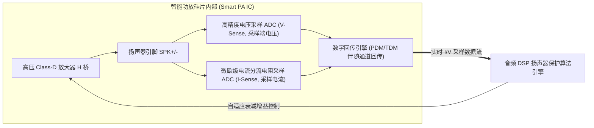

# 04 智能功放与扬声器 IV-Sense 保护

## 1. 硬件解决什么问题：榨干微型喇叭极限而不烧毁音圈

智能手机、轻薄笔记本和智能穿戴中的微型扬声器（Micro-speaker）物理尺寸极小（如 1115 扬声器盒）。若按其标称的安全连续额定功率（通常仅 $0.5\text{ W}$）驱动，外放声音极其微弱单薄。

现代**智能功放（Smart PA）**通过在硅片输出端集成纳秒级**实时电流与电压感测电路（IV-Sense）**，结合声学热力学物理模型，在确保音圈温度不超标、振膜位移不触底的前提下，将扬声器瞬间推爆至 **$3\text{ W} \sim 5\text{ W}$ 峰值功率**，释放震撼澎湃的声压级（SPL）。

---

## 2. 硬件微架构与组成：IV-Sense 闭环实时感测架构

---

## 3. 实时阻抗估计与热力学物理模型推算

根据电学物理定律，铜音圈的电阻随温度升高而呈现严格的线性正比例变化：
$$R_t = R_0 \cdot (1 + \alpha \cdot \Delta T)$$
其中：
- $R_0$ 为室温（$25^\circ\text{C}$）下的音圈静态直流电阻（如标称 $8.0\Omega$）；
- $\alpha$ 为金属铜的电阻温度系数（$\alpha \approx 0.00393 / ^\circ\text{C}$）；
- $\Delta T$ 为音圈温升。

### 算法闭环工作机理
1. **阻抗实时求解**：DSP 核心以 48kHz 速率持续读取电压采样 $V(t)$ 与电流采样 $I(t)$，通过最小二乘法实时提取基频直流电阻 $R(t) = \frac{V}{I}$。
2. **温度精准反推**：
   $$T_{\text{coil}} = 25^\circ\text{C} + \frac{R_t - R_0}{R_0 \cdot 0.00393}$$
3. **自适应功率压缩**：当检测到音圈温度逼近物理极限（如 $140^\circ\text{C}$，胶水融化烧焦临界点）时，DSP 算法自动压缩动态范围增益，平滑调小输出，冷却音圈。
4. **振膜位移（Excursion）预测**：通过输入音频频谱卷积扬声器声学传递函数，实时预测振膜行程 $x(t)$。若行程即将超过物理冲程极限（如 $0.45\text{ mm}$），自适应高通滤波器（Dynamic HPF）瞬间切除该频段重低音，杜绝扬声器拍边打底破音。
