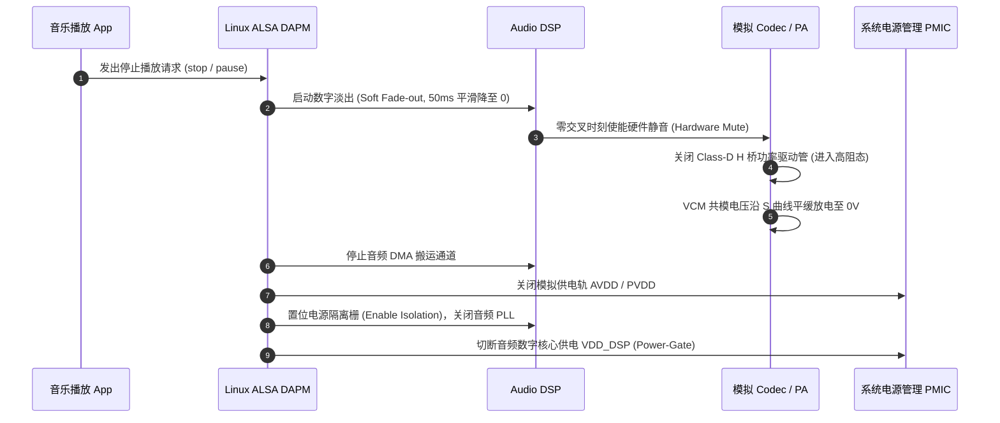

# 05 音频低功耗设计规范

## 1. 硬件解决什么问题：全生命周期电源编排与漏电流阻断

在复杂 SoC 中，音频的低功耗绝非简单的一键关机，而是需要精密的软硬件协同电源编排（Power Sequencing）：
从用户点击暂停、音频流终止、淡出静音、关闭功放、注销 DMA、断开时钟门控，直至电源域掉电隔离。任何一步时序颠倒，都会导致系统发生数百微安的寄生漏电或在关机瞬间炸出巨响。

---

## 2. 标椎音频下电与休眠安全时序图

---

## 3. 低功耗设计四大红线检查项

1. **悬空引脚漏电排查**：在进入睡眠前，所有未使用的外部音频引脚（如第二路 I2S、未焊接的 PDM 麦克风引脚）必须在 IO 复用控制器中显式配置为**内部弱下拉（Pull-Down）或模拟高阻态**，严禁让 CMOS 输入端处于中间浮空电平引发漏电。
2. **电平转换器两端供电状态**：若主域掉电而从域带电，电平转换芯片（Level Shifter）必须具备断电保护（Partial Power Down Protection）特性，防止电流反向灌入。
