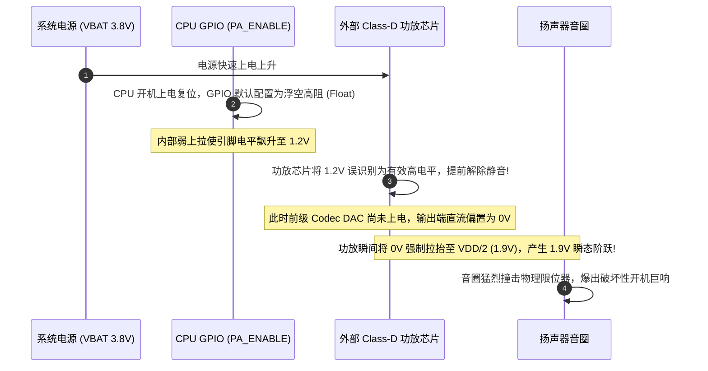

# 06 PA 直流偏移跳变爆音案例

## 1. 案例背景：整机开机瞬间扬声器爆发出刺耳“啪”巨响

在某款三防户外手持对讲机终端测试中，系统每次按下开机按键、进入 Android 桌面的一瞬间，机身顶部的大功率扬声器（5W 功放）就会猛烈震动，爆发出极其刺耳的“啪”爆音，声压级高达 95 dB SPL，在安静环境下极为吓人。

---

## 2. 调试定位全过程与示波器实测波形



### 深入分析排查步骤

1. **示波器多通道联合测量**：
   - 通道 1 接功放供电轨 $V_{\text{BAT}}$；
   - 通道 2 接功放芯片使能控制引脚 `PA_EN`；
   - 通道 3 接扬声器差分输出端 $V_{\text{OUT+}} - V_{\text{OUT-}}$。
2. **波形捕捉复盘**：
   - 抓到在供电轨达到 $3.8\text{ V}$ 的第 $15\text{ ms}$ 时，`PA_EN` 信号在 CPU 固件尚未运行前，就已经出现了一个高达 $1.5\text{ V}$ 的半浮空电压。
   - 外部 Class-D 功放的使能引脚高电平识别阈值仅为 $1.2\text{ V}$，导致功放功率级瞬间被粗暴开启。
   - 此时前级主控芯片的音频 DAC 电路还在复位中，输出电平为绝对 $0\text{ V}$。功放强行将扬声器两端从 0V 猛推至 $1.9\text{ V}$（工作偏置），在音圈两端产生了高达 $1.9\text{ V}$ 的巨大直流冲击脉冲！

---

## 3. 根因剖析（Root Cause）

1. **硬件下拉电阻缺失**：PCB 设计中，`PA_EN` 控制引脚未贴装硬件物理强下拉电阻（仅依赖 CPU 芯片内部脆弱且在上电复位期间可能失效的弱下拉）。
2. **上电编排逻辑缺陷**：Linux 驱动过早地打开了功放使能，而前置 Codec 的共模偏置电压（VCM）尚未完全建立平稳。

---

## 4. 解决方案与修复

### 1. 硬件电路加固
在 PCB 上的 `PA_EN` 引脚对地并联一颗 **$10\text{ k}\Omega$ 强物理下拉电阻**，确保在上电复位的任何盲区，功放均被死死锁定在禁能静音状态。

### 2. 软件启动时序重排
修改 Linux 内核 Machine Driver 的声卡初始化钩子：

```c
static int board_audio_init(struct snd_soc_pcm_runtime *rtd)
{
    // 1. 先将 PA_EN 强制拉低死
    gpio_set_value(GPIO_PA_EN, 0);

    // 2. 开启前级 Codec，使能 VCM 软启动慢爬坡 (等待 150ms 爬升完毕)
    codec_enable_vcm_ramp();
    msleep(150);

    // 3. 确保前级 DAC 直流稳定建立后，方可解除后级功放静音
    gpio_set_value(GPIO_PA_EN, 1);
    return 0;
}
```

---

## 5. 验证结果

重新上电开机，示波器监测扬声器差分输出电压，开机瞬间直流跳变幅度从之前的 **$1.9\text{ V}$ 骤降至 $< 5\text{ mV}$**。开机爆音彻底消失，通过严苛的量产声学校准测试。
