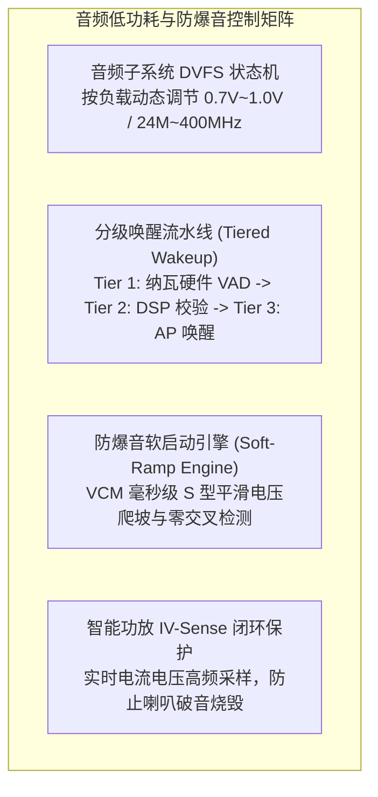

# 07 低功耗与防爆音技术

## 模块导读与原厂定位

音频子系统是移动与可穿戴设备中极少数需要“全天候 7x24 小时保持感知”的核心组件。如何在超低功耗常开（Always-On AON）状态下将系统静态漏电控制在微瓦（$\mu\text{W}$）级，是决定智能耳机与手表续航天数的胜负手。

与此同时，在功放上下电、通道开启/关闭或音频流切换时，由于输出端直流电平瞬态跳变引发的**爆音（POP / Click Noise）**，是直接导致终端被消费者退货的头号声学体验杀手。

本模块系统拆解动态电压频率调整（DVFS）、防爆音硬件斜坡发生器（Soft-ramp）、微安级分级唤醒流水线以及微型扬声器 IV-Sense 实时闭环保护技术。

---

## 模块文章索引

1. [电源域划分与 DVFS 状态机](01-audio-power-domains-dvfs.md)：AON 域、DSP 核心域、模拟 Codec 域多电源岛划分与动态电压频率调节
2. [防爆音 POP/Click 硬件机理](02-pop-click-suppression.md)：差分共模电压（VCM）瞬态阶跃与爆音机理、零交叉切换（Zero-Crossing）与软淡入淡出（Ramp-up）
3. [超低功耗常开唤醒 AON/KWS](03-always-on-voice-wakeup.md)：微安级常开监听系统设计、前置 FIFO 预录机制（Pre-roll）与分级漏电控制
4. [智能功放与扬声器 IV-Sense 保护](04-class-d-speaker-protection.md)：大音量微型扬声器热保护（Thermal Limit）与振膜冲程保护（Excursion Limit）
5. [音频低功耗设计规范](05-power-management-engineering-guide.md)：软硬件协同电源编排规范、休眠/唤醒恢复时序与漏电流抑制检查项
6. [PA 直流偏移跳变爆音案例](06-cases-debug.md)：实战案例：扬声器使能瞬间直流电压跳变导致剧烈开机爆音根因排查与放电回路优化
7. [常开 AON 域功耗与电池寿命推演](07-engineering-analysis.md)：AON 静态漏电、时钟动态翻转与偶发唤醒加权等效功耗数学模型
