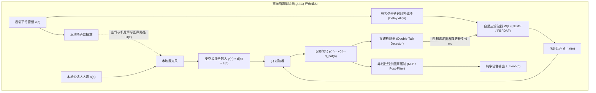

# 01 回声消除 AEC 理论与工程实现

## 1. 硬件解决什么问题：消灭免提通话时对端听到自己的回声

当用户开启手机免提、智能音箱语音对讲或车载电话时，扬声器播放出来的对端声音，会直接通过空气传播和外壳机震，重新窜入本地麦克风。

若不加处理，对端用户就会在 $200\text{ ms} \sim 500\text{ ms}$ 的网络往返延迟后，清晰地听到自己说过的声音（即**声学回声 Acoustic Echo**）。强烈的回声会使交谈完全无法继续，甚至在双向免提时激发出毁灭性的正反馈自激啸叫。

**声学回声消除器（AEC, Acoustic Echo Cancellation）**的目标是建立扬声器到麦克风的声学房间脉冲响应（RIR）模型，实时从麦克风信号中将回声分量精准扣除。

---

## 2. 硬件微架构与组成：AEC 核心处理拓扑

---

## 3. 算法核心数学方程：频域分块自适应滤波（PBFDAF）

在长回响时间（$T_{60} > 300\text{ ms}$）的真实房间中，时域滤波器的抽头数高达上千点，时域卷积计算量过大。工业界普遍采用**分块频域自适应滤波（Partitioned Block Frequency Domain Adaptive Filter, PBFDAF）**：

设块大小为 $B$，每个分块通过 FFT 变换至频域进行点乘：
1. **频域回声估计**：
   $$\hat{D}_m(k) = \sum_{p=0}^{P-1} W_{m, p}(k) \cdot X_{m-p}(k)$$
2. **时域误差转换**：
   $$e_m(n) = y_m(n) - \text{IFFT}\left\{ \hat{D}_m(k) \right\}$$
3. **频域权重梯度更新（带归一化步长）**：
   $$W_{m+1, p}(k) = W_{m, p}(k) + \mu \cdot \frac{X_{m-p}^*(k) \cdot E_m(k)}{P_X(k) + \epsilon}$$
其中 $P_X(k)$ 为参考信号在频点 $k$ 处的自适应功率谱估计，$\mu$ 为步长因子。

---

## 4. 四流全链路分析：双讲状态（Double-Talk）下的系数冻结流

1. **单讲状态（Single-Talk，仅对端说话）**：本地无人发声，$y(n)$ 中只有纯回声。误差 $e(n)$ 反映模型拟合偏差，步长 $\mu$ 全开，自适应滤波器以毫秒级速度快速收敛。
2. **双讲突发（Double-Talk，两端同时说话）**：本地人声 $s(n)$ 突然涌入麦克风。
3. **双讲检测器（DTD）判定**：DTD 监视互相关系数与能量比。由于本地人声对于自适应滤波器而言属于巨大的**强非相关外生干扰噪声**；
4. **冻结流转**：若继续迭代，强人声将迫使滤波器系数瞬态发散炸毁！DTD 立即将学习率 $\mu$ 瞬间拉降至 0（**系数强制冻结**），同时启用后级非线性残余回声压制（NLP），既保护了滤波器权重，又消除了残余漏音。

---

## 5. 软硬件设计约束

- **硬件时延固定性（Deterministic Latency）**：从扬声器 DAC 发出声音，到内部 DMA 拷贝参考信号回送给 AEC 的时间差 $\Delta t_{\text{ref}}$ **必须是绝对固定且确定性的**。若系统调度导致该延迟动态跳变几个样点，AEC 自适应滤波器将无法收敛，回声消除完全失效。
- **声学回声损耗（Echo Return Loss Enhancement, ERLE）**：线性滤波器部分通常提供 $15\text{ dB} \sim 25\text{ dB}$ 的回声衰减；后级 NLP 算法提供额外的 $20\text{ dB} \sim 30\text{ dB}$ 衰减，综合回声抑制深度必须达到 **$> 45\text{ dB}$**。
