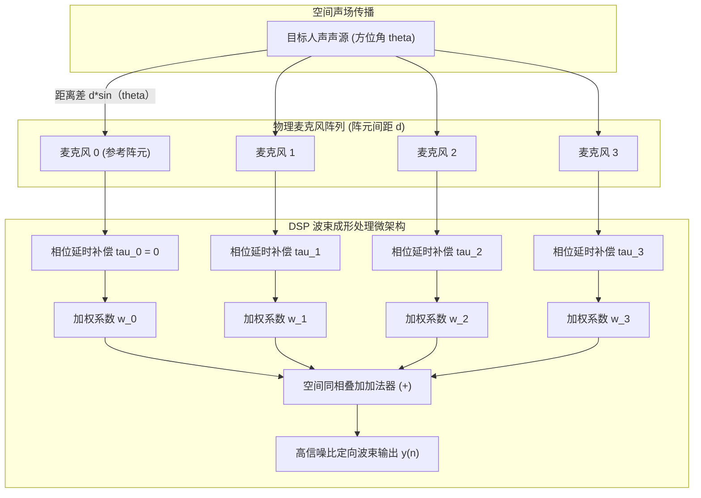

# 02 麦克风阵列与波束成形 Beamforming

## 1. 硬件解决什么问题：空间选择性声源增强与定向拾音

单颗麦克风是全向性传感器（Omni-directional），对空间所有方位的声音（人声、侧向电视杂音、后向风扇噪音）一视同仁地采集。在嘈杂的会议室或客厅中，单麦克风拾音信噪比极差。

**麦克风阵列波束成形（Microphone Array Beamforming）**通过在物理空间布置两颗或多颗微型麦克风，利用声波到达不同麦克风之间的**空间相位差与传播时延差**，在数字域通过空间加权求和，构建出具有空间指向性的“虚拟拾音波束（Acoustic Beam）”。

---

## 2. 硬件微架构与组成：延时求和（Delay-and-Sum）微架构

---

## 3. 算法数学推导：自适应 MVDR 波束成形

延时求和波束在复杂多干扰场景下旁瓣泄露较大。工业界广泛采用**最小方差无畸变响应波束（Minimum Variance Distortionless Response, MVDR）**：
在保证目标方向（导向矢量 $a(\theta)$）信号无畸变通过（增益恒为 1）的前提下，最小化输出总功率（即最大限度压制所有非目标方向的噪声）：
$$\min_w w^H R_{nn} w \quad \text{s.t.} \quad w^H a(\theta) = 1$$
利用拉格朗日乘子法求解最优加权矢量解：
$$w_{\text{MVDR}} = \frac{R_{nn}^{-1} a(\theta)}{a^H(\theta) R_{nn}^{-1} a(\theta)}$$
其中 $R_{nn}$ 为噪声空间协方差矩阵。MVDR 能够自适应地在强干扰声源的来向方向上产生**极深的零陷（Null Steer）**，将干扰声强力扣除 30dB 以上。

---

## 4. 软硬件设计约束

- **空间混叠与阵元间距准则（Spatial Aliasing）**：根据空间奈奎斯特采样定理，阵元间距 $d$ 必须满足：
$$d \le \frac{\lambda_{\text{min}}}{2} = \frac{c}{2 f_{\text{max}}}$$
若人声最高分析频率 $f_{\text{max}} = 8\text{ kHz}$，空气声速 $c = 340\text{ m/s}$：
$$d \le \frac{340}{2 \times 8000} = 0.02125\text{ m} = 21.25\text{ mm}$$
**设计红线**：若麦克风物理间距超过 $21\text{ mm}$，在高频段空间波束将产生伪副瓣（Grating Lobes），导致侧向噪音被当做人声放大。
- **麦克风相位与灵敏度一致性**：各麦克风的幅频与相频响应制造公差必须控制在 $\pm 1\text{ dB}$ 和 $\pm 3^\circ$ 以内，出厂产测必须进行阵列声学校准。
