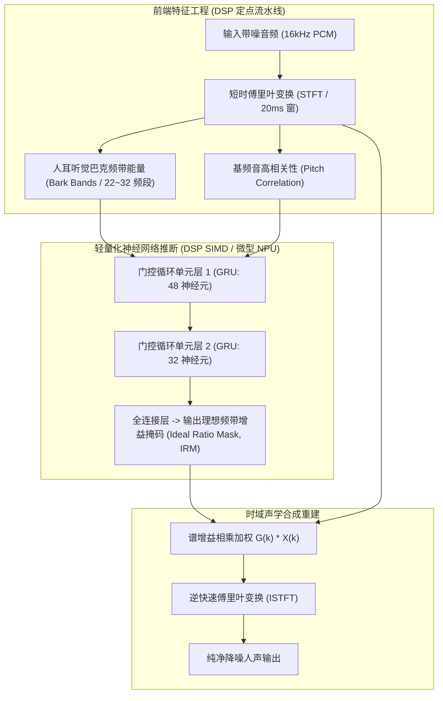

# 03 噪声抑制与端侧 AI 降噪

## 1. 硬件解决什么问题：复杂多变环境非平稳噪声的智能剥离

传统的经典降噪算法（如谱减法 Spectral Subtraction、维纳滤波 Wiener Filter）基于一个核心假设：**背景噪声是统计平稳的（Stationary Noise，如风扇嗡嗡声、汽车胎噪）**。
它们通过在静音段估计底噪功率谱，然后从带噪语音中减去该噪声估计。

然而在现实生活中，绝大多数严重破坏通话的噪声是**非平稳的突发噪声（Non-stationary Noise）**：如键盘敲击声、餐厅碗碟碰撞声、婴儿啼哭、犬吠或汽车鸣笛。经典算法无法跟踪这种毫秒级突发瞬态。

**端侧轻量化深度学习降噪（AI-NS，如 RNNoise / 卷积循环网络 CRN）**通过大量带噪人声与环境噪声数据集的离线监督训练，能够精准从复杂杂音中将人声谐波指纹剥离提纯。

---

## 2. 硬件微架构与组成：经典与 AI 混合降噪流水线

---

## 3. 经典降噪与 AI 深度降噪核心指标对比

| 降噪技术路线 | 核心数学/模型机制 | 典型算法代表 | 稳态噪声抑制 | 突发非稳态噪声抑制 | DSP 算力消耗 |
| :--- | :--- | :--- | :--- | :--- | :--- |
| **经典谱估计算法** | 谱减法 / 维纳滤波 / 最小统计量追踪 | OMLSA / MCRA | 良好 ($15\text{ dB}$) | 极差 (产生明显音乐噪声) | **极低 (< 5 MIPS)** |
| **混合特征 AI 降噪** | 听觉子带特征 + 循环网络 (GRU/LSTM) | RNNoise | 优秀 ($25\text{ dB}$) | **极佳 ($20\text{ dB}$，敲击声消除)** | **适中 (20~40 MIPS)** |
| **端到端深度时域模型** | 编码器-解码器卷积网络 (Wave-to-Wave) | Conv-TasNet | 极致 ($35\text{ dB}$) | 极致 (人声完全纯净) | **极高 (> 200 MIPS)** |

---

## 4. 软硬件设计约束

- **音乐噪声（Musical Noise）抑制**：经典谱减法在 SNR 较低时，由于噪声谱随机波动的截断，会在频域留下离散的孤立能量尖峰，转换到时域听起来像外星人说话或水滴声（音乐噪声）。算法中必须设置增益下限阈值（Gain Floor，通常设为 $-15\text{ dB} \sim -20\text{ dB}$），宁可保留微弱背景底噪，也决不引入非自然的人工合成杂音。
- **端侧模型内存驻留（Memory Footprint）**：面向 TWS 耳机与手表的 AI-NS 模型，其参数量必须严格压缩在 **$50\text{ KB} \sim 150\text{ KB}$** 范围内，并全面量化为 INT8 定点权重，使其能够完全塞入 DSP 的 DTCM 内部执行，杜绝片外内存访存功耗。
