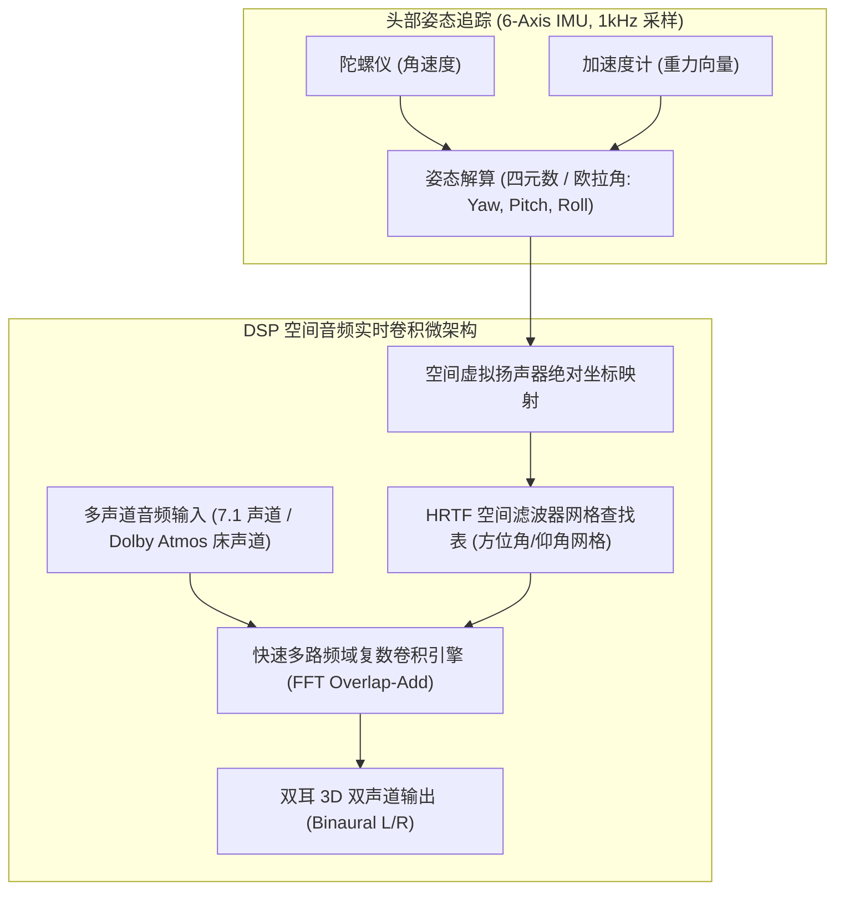

# 04 空间音频与双耳 HRTF 渲染

## 1. 硬件解决什么问题：用普通双声道耳机还原真实三维全景声场

人类之所以能通过双耳分辨声音是在头顶、后方、远方还是近处，完全依赖物理声波在传播到耳膜前经过人脸轮廓、肩部反射和耳廓皱褶产生的**微小时间延迟差（ITD）与频率衰减差（ILD）**。

传统的普通双声道音乐播放，声音听起来仿佛是从颅骨正中央发出的（头中效应，In-Head Localization），缺乏任何临场感与空间包围感。

**空间音频（Spatial Audio / 3D Binaural Rendering）**通过在 DSP 芯片中实时卷积**头部相关传输函数（HRTF, Head-Related Transfer Function）**，结合 6 轴惯性传感器（IMU）极低延迟动态追踪佩戴者头部姿态，构建真实三维环绕声场。

---

## 2. 硬件微架构与组成：空间音频声学渲染引擎

---

## 3. 双耳定位三大声学物理机制

1. **双耳时间差（Interaural Time Difference, ITD）**：
   - 声音来自侧面时，到达远端耳朵需要绕过头部多走约 $20\text{ cm}$；
   - 最大时间差为：
   $$\tau_{\text{max}} = \frac{r}{c} (\theta + \sin\theta) \approx \frac{0.09}{340} \left( \frac{\pi}{2} + 1 \right) \approx 0.68\text{ ms}$$
   - 人脑利用低频（$< 1.5\text{ kHz}$）信号的相位差精准锁定水平方位角。
2. **双耳声级差（Interaural Level Difference, ILD）**：
   - 高频声波（$> 2\text{ kHz}$）波长小于人头尺寸，头部形成强烈的声影遮挡（Acoustic Shadow），远端耳朵声压大幅衰减达 $10\text{ dB} \sim 20\text{ dB}$。
3. **耳廓滤波（Pinna Spectral Cues）**：
   - 耳廓的复杂凹凸结构会在 $5\text{ kHz} \sim 10\text{ kHz}$ 产生独特的谱凹陷（Spectral Notches），大脑利用这些特征区分声音是在头顶还是下方、在前方还是背后。

---

## 4. 软硬件设计约束

- **动作到声音延迟（Motion-to-Sound Latency）**：从用户转动头部，到耳机内声场相应完成旋转补偿更新的总时延，**必须严格控制在 $< 20\text{ ms}$ 以内**。若延迟超过 30ms，人脑的前庭系统与听觉反馈将产生严重割裂，引发强烈的晕动症（Motion Sickness）与恶心眩晕感。
