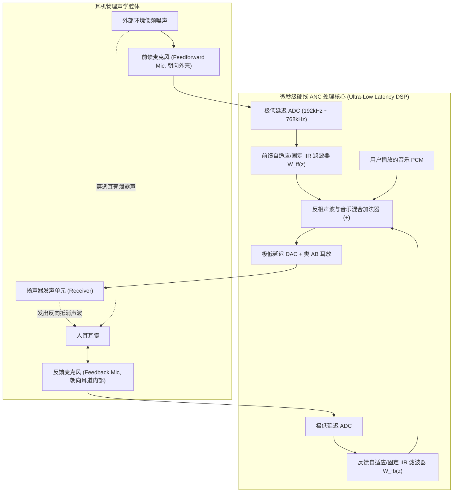

# 05 主动降噪 ANC 系统架构

## 1. 硬件解决什么问题：以反向声波物理抵消外界噪声

传统入耳式耳机依靠耳塞橡胶套物理隔绝外界噪声（被动降噪，Passive Attenuation）。但声学物理规律决定了：高频噪声（$> 1\text{ kHz}$）容易被物理阻隔，而低频噪声（如飞机引擎轰鸣、地铁低频轰隆声、空调轰鸣，频率在 $50\text{ Hz} \sim 1\text{ kHz}$）波长达数米，能够直接穿透耳塞深入耳道。

**主动降噪（ANC, Active Noise Cancellation）**基于声波相消干涉（Destructive Interference）原理：
通过麦克风实时采集外界环境噪声，并在极短时间内通过扬声器发出一个**振幅相同、相位严格相反（差 180 度）的反相声波**，两者在耳道物理空间中相撞，将声波能量相互抵消归零。

---

## 2. 硬件微架构与组成：混合式 ANC（Hybrid ANC）架构

### 三大主流 ANC 拓扑对比

| 拓扑架构 | 麦克风配置 | 降噪频宽 | 核心优势 | 核心技术风险 |
| :--- | :--- | :--- | :--- | :--- |
| **前馈式 (Feedforward)** | 仅有外侧麦克风 | 宽 ($100\text{Hz} \sim 3\text{kHz}$) | 降噪频带宽，系统无自激啸叫风险 | 无法感知耳道内部实际残留噪声，受佩戴漏气影响大 |
| **反馈式 (Feedback)** | 仅有内侧麦克风 | 窄 ($50\text{Hz} \sim 800\text{Hz}$) | 真实监控耳膜处噪声，自适应抗佩戴漏气 | 闭环增益过大极易产生自激啸叫（Howling），压制音乐低频 |
| **混合式 (Hybrid ANC)** | 外侧 + 内侧双麦克风 | **全频段深度降噪 ($35\text{dB} \sim 50\text{dB}$)** | 融合前馈的高频宽与反馈的高深度；**现代旗舰降噪耳机标配** | 硬件成本高，算法调谐复杂度翻倍 |

---

## 3. 软硬件设计约束：死生一线的“时间赛跑”

在 ANC 系统中，系统总延迟是决定降噪生死的第一铁律：
- 设环境声波从前馈麦克风传播到耳塞出音口与耳膜相撞，其空气物理传播距离仅有约 $d \approx 1.5\text{ cm}$；
- 声波在空气中传播的时间仅为：
$$t_{\text{air}} = \frac{0.015\text{ m}}{340\text{ m/s}} \approx \mathbf{44.1\mu\text{s}}$$
**残酷的工程现实**：
整个电子链路（前馈麦克风拾音 -> 模拟放大 -> ADC转换 -> 抽取滤波 -> IIR降噪滤波 -> DAC数模转换 -> 模拟平滑 -> 功放驱动扬声器振膜物理振动），**必须在短短 $44\mu\text{s}$ 以内全部完成！**

若总电路延迟超过空气延迟，反相声波将“迟到”，不但无法抵消噪声，反而会在高频与原噪声同相叠加，变成**放大外界噪音的灾难性啸叫！**
因此，工业界 ANC 必须采用专有硬线 ASIC 或运行在 **$> 768\text{ kHz}$ 极高采样率下的超浅 IIR 硬件滤波器**。
