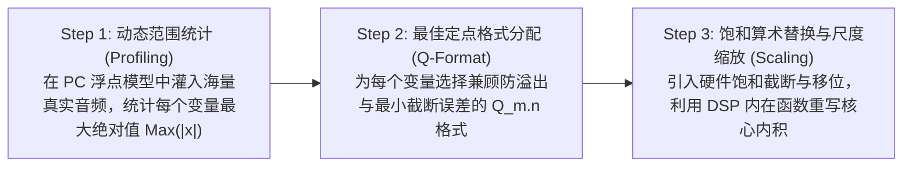

# 06 声学算法定点化优化指南

## 1. 硬件解决什么问题：把几十 GFLOPS 的声学浮点算法塞入毫瓦级定点 DSP

算法科学家通常在 PC 上利用 Matlab 或 Python/PyTorch 开发声学前处理模型（全部采用 32-bit 或 64-bit 浮点数）。
然而嵌入式音频 DSP（如耳机主控芯片）出于功耗和芯片面积考量，通常**仅配备高吞吐定点（Fixed-Point）乘加单元，硬件单精度浮点单元（FPU）非常昂贵甚至完全缺失**。

若盲目将浮点代码部署到无 FPU 的 DSP 上，编译器会自动生成庞大的软浮点模拟软件库（Soft-float emulation），单次乘加周期暴涨 50 倍以上，系统瞬间崩溃。

---

## 2. 经典声学算子定点化三步法规范

---

## 3. 常见声学算子的 Q 格式选择标准

| 算子/数据对象 | 物理物理区间 | 推荐定点表示格式 | 整数保护位 | 精度分辨率 ($2^{-n}$) |
| :--- | :--- | :--- | :--- | :--- |
| **PCM 音频采样点** | $[-1.0, +1.0)$ | **Q1.31** (或 Q1.15) | 1 bit 符号位 | $4.65 \times 10^{-10}$ |
| **FIR 滤波系数** | $(-2.0, +2.0)$ | **Q2.30** | 2 bits 整数位 | $9.31 \times 10^{-10}$ |
| **FFT 旋转因子 (Twiddle)** | $[-1.0, +1.0]$ | **Q1.31** (单位圆上) | 1 bit 符号位 | 最高精度 |
| **对数能量与分贝值** | $[0\text{ dB}, 100\text{ dB}]$| **Q8.24** | 8 bits 整数位 | 适应大动态范围 |

---

## 4. 软硬件设计约束

- **非线性函数查表法（LUT + Linear Interpolation）**：声学算法中频繁涉及 $\log_{10}(x)$（分贝转换）、$\sqrt{x}$（能量开方）、$\frac{1}{x}$（归一化除法）与 $\exp(x)$（激活函数）。在定点 DSP 上，严禁直接调用标准数学库 `math.h`。必须采用 **64~256 采样点的预计算片上查找表（LUT）结合单周期线性插值**，以牺牲 $<0.01\%$ 的微小精度换取百倍速度跃升。
