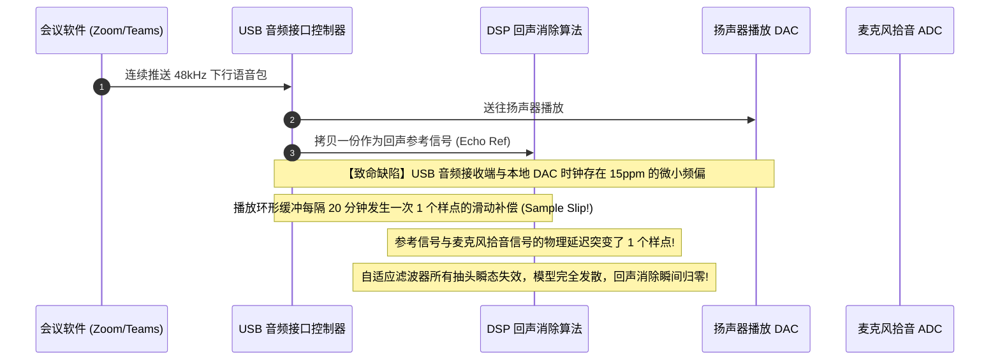

# 07 AEC 参考信号对齐丢失案例

## 1. 案例背景：智能会议音箱在通话中突发剧烈回声漏音与啸叫

某款企业级高清视频会议音箱在常规单讲测试中表现优异（回声衰减 ERLE 达到发烧级的 50dB）。
然而，在用户连续开会 1 小时后，对端用户突然听到极其剧烈的回声，自己说一句话，会议音箱就原封不动地大声播回一句话，且伴随逐渐抬升的自激啸叫。重新插拔会议软件后，问题又能短暂消失。

---

## 2. 调试定位全过程与参考信号延时追踪

### 深入排查三部曲

1. **时延互相关分析（Cross-Correlation Analysis）**：
   - 提取保存出故障时刻的麦克风原始录音 $y(n)$ 与送入 AEC 的参考信号 $x(n)$；
   - 计算两者的广义互相关时延估计（GCC-PHAT）：
   - 开机前 5 分钟：峰值时延稳定锁定在 **第 142 个采样点**；
   - 开会 40 分钟后：峰值时延跳变到了 **第 143 个采样点**；
   - 开会 70 分钟后：峰值时延跳变到了 **第 144 个采样点**！
2. **根因定位**：
   - 驱动工程师在处理 USB 异步音频传输时，为了防止 PC 端与本地 DAC 晶振漂移导致缓冲区溢出，在驱动层写了一段粗暴的“跳步逻辑”（Drop/Insert Sample）：当缓冲偏大时直接扔掉 1 个采样点。
   - 这导致参考信号与实际麦克风声音之间的物理相对延迟，每隔半小时就会**突变一个样点（$20.8\mu\text{s}$）**！
   - 自适应滤波器建立的数千个精细声学极点在延迟突变的一瞬间全部与物理世界脱节，导致模型发散，回声全面泄露。

---

## 3. 根因剖析与解决方案

### 1. 消除粗暴删样点，启用硬件 ASRC 平滑跟踪
在 USB 音频输入端接入硬件 ASRC，通过无级连续多相插值调整采样率，消除晶振频偏，**严禁在音频流中硬生生插入或删除整数样点**。

### 2. 增加 AEC 时延动态跟踪看门狗（Delay Tracker）
在 AEC 算法前端追加微型的互相关峰值监视线程。若检测到声学物理时延发生不可抗力的阶跃，主动重置自适应滤波器步长，在 50ms 内快速重新收敛。

---

## 4. 验证结果

连续进行 72 小时超长视频会议压力测试，参考信号与拾音信号延迟始终恒定在 142 样点，零抖动，回声抑制深度始终稳定在 48dB 以上。
