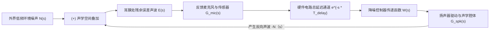

# 08 ANC 环路延迟与稳定裕度推演

## 1. 硬件解决什么问题：主动降噪闭环系统的声学物理极限

为什么目前市面上所有顶级的主动降噪耳机，其有效降噪频段都**无法逾越 3kHz ~ 4kHz**？为什么降噪无法消除高频人声和哨音？

这绝非算法算力不足，而是受制于**控制理论中的闭环相位延迟与奈奎斯特稳定性准则（Nyquist Stability Criterion）**。

---

## 2. 声学反馈闭环数学模型

### 闭环传递函数推导
耳道内最终残余声波与原始外界噪声的闭环灵敏度函数（Sensitivity Function）为：
$$S(s) = \frac{E(s)}{N(s)} = \frac{1}{1 + G(s) W(s) e^{-s T_{\text{delay}}}}$$
为了实现降噪，残余能量必须小于外界噪声：
$$|S(j\omega)| < 1 \iff |1 + G(j\omega) W(j\omega) e^{-j\omega T_{\text{delay}}}| > 1$$
最理想情况是开环增益相位为 $180^\circ$（反相）：
$$G(j\omega) W(j\omega) e^{-j\omega T_{\text{delay}}} = -|T(j\omega)| = |T(j\omega)| e^{j\pi}$$

---

## 3. 相位延迟与奈奎斯特降噪极限公式

系统总延迟引入的相位滞后（Phase Lag）与频率成正比：
$$\theta_{\text{delay}}(\omega) = \omega \cdot T_{\text{delay}} = 2\pi f \cdot T_{\text{delay}}$$
当频率升高，相位延迟不断累加：
- 当 $\theta_{\text{delay}} = 60^\circ$（$\frac{\pi}{3}$）时，降噪能力降为 0dB（无法降噪）；
- 当 $\theta_{\text{delay}} = 180^\circ$（$\pi$）时，原本用于抵消的反相声波由于延迟，在耳道内完全变成了**与外界噪声同相相加（In-phase Addition）**，灵敏度函数分母变小，系统产生强烈的**噪声自发放大与自激尖叫（Bode Sensitivity Integral / Waterbed Effect）**！

### 降噪截止频率理论上限推导
令最大允许相位误差为 $\Delta \theta_{\text{max}} = \frac{\pi}{3}$（$60^\circ$ 裕量）：
$$2\pi f_{\text{limit}} T_{\text{delay}} \le \frac{\pi}{3} \implies f_{\text{limit}} = \frac{1}{6 \cdot T_{\text{delay}}}$$

---

## 4. 真实工程系统参数极限测算

在典型高端降噪耳机中，硬件总延迟分解：
- 麦克风与出音孔空气声学延时：$15\mu\text{s}$；
- 麦克风与扬声器机械振膜相位延迟：$10\mu\text{s}$；
- 极速 Sigma-Delta ADC 与 DAC 群延迟（768kHz 超采样）：$12\mu\text{s}$；
- 数字 IIR 硬件滤波器计算延迟：$3\mu\text{s}$。
**系统总延迟极限**：
$$T_{\text{delay}} = 15 + 10 + 12 + 3 = \mathbf{40\mu\text{s}}$$
代入理论截止频率公式：
$$f_{\text{limit}} = \frac{1}{6 \times 40 \times 10^{-6}\text{ s}} = \frac{1}{240 \times 10^{-6}} \approx \mathbf{4166\text{ Hz}}$$

---

## 5. 原厂架构设计结论

推论：
1. **4.1kHz 是物理延迟铸就的绝对铁律天花板**：在 $40\mu\text{s}$ 的极致硬件延迟下，系统在 $4.1\text{ kHz}$ 以上不仅无法降噪，而且必须使用高通滤波器强行将开环增益滚降到 0，否则系统必然发生剧烈啸叫。
2. **水床效应（Waterbed Effect）**：根据波特灵敏度积分定理，低频处获得的降噪深度（如在 100Hz 处降低 40dB），必须以高频处灵敏度抬升放大为代价。工程师调调音的本质就是在低频降噪深度与高频啸叫裕量之间进行拉锯平衡。
