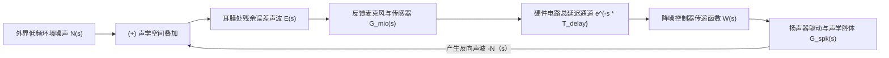

# 08 ANC 环路延迟与稳定裕度推演

## 1. 硬件解决什么问题：主动降噪闭环系统的声学物理极限

主动降噪的效果通常随频率变化。本文用一个简化反馈模型，观察延迟如何影响相位与稳定裕度；模型中的 **3kHz ~ 4kHz** 范围不作为所有耳机的统一性能上限。

---

## 2. 声学反馈闭环数学模型

```mermaid
graph LR
    NOISE["外界低频环境噪声 N(s)"] --> SUM1["(+) 声学空间叠加"]
    SUM1 --> RESIDUAL["耳膜处残余误差声波 E(s)"]

    RESIDUAL --> MIC["反馈麦克风与传感器 G_mic(s)"]
    MIC --> HW_CHAIN["硬件电路总延迟通道 e^{-s * T_delay}"]
    HW_CHAIN --> FILTER["降噪控制器传递函数 W(s)"]
    FILTER --> DRIVER["扬声器驱动与声学腔体 G_spk(s)"]

    DRIVER -->|产生反向声波 -N（s）| SUM1
```

### 闭环传递函数推导
耳道内最终残余声波与原始外界噪声的闭环灵敏度函数（Sensitivity Function）为：
$$S(s) = \frac{E(s)}{N(s)} = \frac{1}{1 + G(s) W(s) e^{-s T_{\text{delay}}}}$$
为了实现降噪，残余能量必须小于外界噪声：
$$|S(j\omega)| < 1 \iff |1 + G(j\omega) W(j\omega) e^{-j\omega T_{\text{delay}}}| > 1$$
这里采用负反馈约定，开环增益为 $L=GWe^{-sT_{\text{delay}}}$。当 $L$ 为正实数时，分母为 $1+|L|$，残余噪声受到抑制；扬声器在求和点产生反向声波，不等于这个约定下的开环增益应取 $180^\circ$。相反，当开环相位达到 $180^\circ$ 时（下式的 $|T(j\omega)|$ 表示开环增益幅值）：
$$G(j\omega) W(j\omega) e^{-j\omega T_{\text{delay}}} = -|T(j\omega)| = |T(j\omega)| e^{j\pi}$$
分母幅值变为 $|1-|T(j\omega)||$，开环幅值接近 1 时，残余噪声可能被放大，并需要检查闭环稳定性。负反馈灵敏度函数的符号约定可参见 [MathWorks loopsens 文档](https://www.mathworks.com/help/robust/ref/dynamicsystem.loopsens.html)。

---

## 3. 相位延迟与奈奎斯特降噪极限公式

系统总延迟引入的相位滞后（Phase Lag）与频率成正比：
$$\theta_{\text{delay}}(\omega) = \omega \cdot T_{\text{delay}} = 2\pi f \cdot T_{\text{delay}}$$
当频率升高，延迟引入的相位滞后不断累加：
- 本例把 $60^\circ$（$\frac{\pi}{3}$）选作延迟项的相位预算；它本身不能推出降噪能力恰好降为 0dB。
- $180^\circ$（$\pi$）的延迟相位也不能单独判定系统失稳。还需结合 $G$、$W$ 的相位及幅值，检查完整开环增益是否接近临界点 $-1$。噪声放大与闭环自激应分别由灵敏度函数和稳定性分析确认。

### 降噪截止频率理论上限推导
令最大允许相位误差为 $\Delta \theta_{\text{max}} = \frac{\pi}{3}$（$60^\circ$ 裕量）：
$$2\pi f_{\text{limit}} T_{\text{delay}} \le \frac{\pi}{3} \implies f_{\text{limit}} = \frac{1}{6 \cdot T_{\text{delay}}}$$

---

## 4. 真实工程系统参数极限测算

以下取一组参数计算延迟预算，机械与声学通路的频率相关相位在这里用等效延迟近似：
- 麦克风与出音孔空气声学延时：$15\mu\text{s}$；
- 麦克风与扬声器机械振膜相位延迟：$10\mu\text{s}$；
- 极速 Sigma-Delta ADC 与 DAC 群延迟（768kHz 超采样）：$12\mu\text{s}$；
- 数字 IIR 硬件滤波器计算延迟：$3\mu\text{s}$。
**系统总延迟极限**：
$$T_{\text{delay}} = 15 + 10 + 12 + 3 = \mathbf{40\mu\text{s}}$$
代入本例的相位预算公式：
$$f_{\text{limit}} = \frac{1}{6 \times 40 \times 10^{-6}\text{ s}} = \frac{1}{240 \times 10^{-6}} \approx \mathbf{4166\text{ Hz}}$$

---

## 5. 原厂架构设计结论

推论：
1. **4.1kHz 来自本例的延迟与相位预算**：取 $40\mu\text{s}$ 延迟和 $60^\circ$ 相位预算，得到约 $4.1\text{ kHz}$。实际降噪频段与稳定性还需结合声学通路、控制器传递函数和增益交越点分析。
2. **水床效应（Waterbed Effect）**：根据波特灵敏度积分定理，低频处获得的降噪深度（如在 100Hz 处降低 40dB），必须以高频处灵敏度抬升放大为代价。调音时需要同时检查低频降噪深度、其他频段的噪声放大和稳定裕度。
