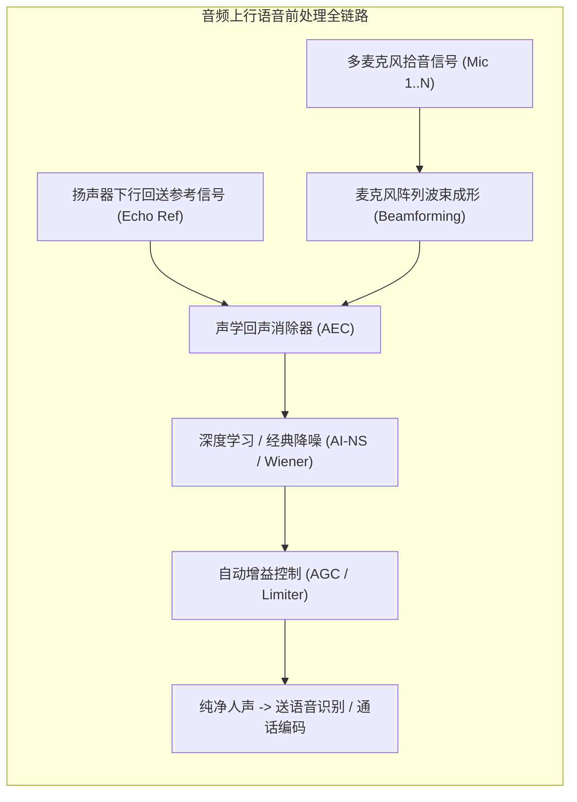

# 08 声学前处理与核心算法

## 模块导读与原厂定位

现代智能音频终端（如智能音箱、TWS 降噪耳机、车载座舱与会议对讲平板）的核心声学竞争力，不仅依赖底层的模拟芯片与接口硬件，更取决于在 DSP 核心上运行的实时声学前处理算法群。

在真实的声学物理世界中，存在严重的扬声器声音回串、环境强噪声干扰、房间混响反射以及复杂声场分布。

本模块系统拆解**回声消除（AEC）**、**自适应波束成形（Beamforming）**、**AI 神经声学降噪（AI-NS）**、**主动降噪（ANC）**以及**双耳空间音频（Spatial Audio / HRTF）**的核心理论、微架构加速与定点优化。

---

## 模块文章索引

1. [回声消除 AEC 理论与工程实现](01-aec-echo-cancellation.md)：自适应自回归滤波（NLMS/FDAF）、参考信号对齐、双讲检测（Double-Talk）与非线性残留回声抑制（NLP）
2. [麦克风阵列与波束成形 Beamforming](02-microphone-array-beamforming.md)：Delay-and-Sum 固定波束、MVDR 最小方差无畸变响应自适应波束与阵列物理空间几何
3. [噪声抑制与端侧 AI 降噪](03-noise-suppression-ans-ai.md)：经典谱减法与维纳滤波、端侧轻量化深度学习网络（RNNoise / CRN）与频带特征工程
4. [空间音频与双耳 HRTF 渲染](04-spatial-audio-binaural.md)：头部相关传输函数（HRTF）、耳廓声学滤波、双耳时间差（ITD）与低延迟头部姿态追踪
5. [主动降噪 ANC 系统架构](05-anc-active-noise-cancellation.md)：前馈式（Feedforward）、反馈式（Feedback）与混合式（Hybrid ANC）及微秒级硬件通路
6. [声学算法定点化优化指南](06-algorithms-engineering-guide.md)：频域复数浮点转 Q31 定点、旋转因子压缩、非线性激活函数查找表（LUT）与算力裁剪
7. [AEC 参考信号对齐丢失案例](07-cases-debug.md)：实战案例：扬声器参考信号与麦克风拾音发生微秒级漂移导致回声漏音啸叫根因分析
8. [ANC 环路延迟与稳定裕度推演](08-engineering-analysis.md)：声学主动降噪闭环相位延迟、奈奎斯特稳定性判据与可降噪理论最高频率数学推导
