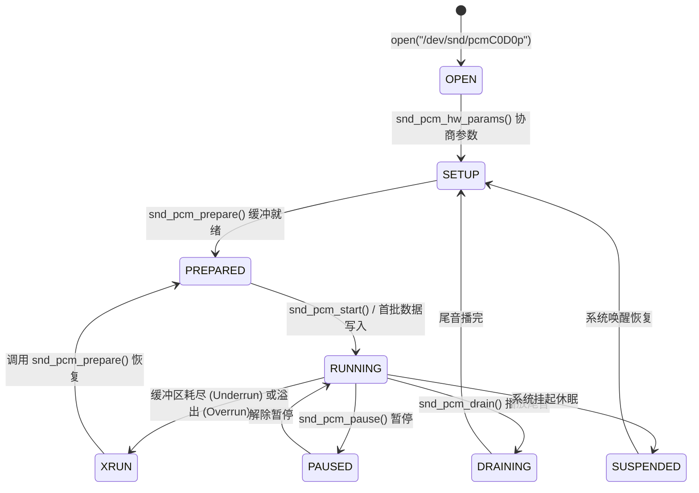

# 01 ALSA 核心框架与 PCM 体系

## 1. 硬件解决什么问题：将异构音频硬件抽象为通用操作系统流

在操作系统层面，不同的音频芯片可能具有完全不同的寄存器定义、DMA 突发格式和总线接口。若直接由应用程序访问硬件，软件生态将碎片化且无法维护。

**ALSA（Advanced Linux Sound Architecture）**为 Linux 内核提供了统一的音频驱动模型：
它将硬件细节抽象为标准的文件描述符（File Descriptor）接口，向上为应用层暴露统一的 `/dev/snd/pcmC*D*p`（播放）与 `/dev/snd/pcmC*D*c`（录音）设备节点，并通过环形缓冲区实现了高效的零拷贝用户态内存映射（MMAP）。

---

## 2. 硬件微架构与组成：ALSA PCM 状态机拓扑



---

## 3. 软件可见接口：硬件参数协商（hw_params）核心结构体

应用程序在启动录放音之前，必须通过 `ioctl(SNDRV_PCM_IOCTL_HW_PARAMS)` 与内核协商出双方均能支持的音频格式交集：

```c
// Linux 内核驱动导出的硬件能力约束: snd_pcm_hardware
struct snd_pcm_hardware my_soc_pcm_hw = {
    // 驱动支持的缓冲传输特性
    .info = SNDRV_PCM_INFO_MMAP |
            SNDRV_PCM_INFO_MMAP_VALID |
            SNDRV_PCM_INFO_INTERLEAVED |  // 支持左右声道交织传输
            SNDRV_PCM_INFO_BLOCK_TRANSFER |
            SNDRV_PCM_INFO_RESUME,

    .formats = SNDRV_PCM_FMTBIT_S16_LE |  // 16位小端
               SNDRV_PCM_FMTBIT_S24_LE |  // 24位小端
               SNDRV_PCM_FMTBIT_S32_LE,   // 32位小端

    .rates = SNDRV_PCM_RATE_44100 | SNDRV_PCM_RATE_48000 | SNDRV_PCM_RATE_96000,
    .rate_min = 44100,
    .rate_max = 96000,

    .channels_min = 2,
    .channels_max = 8,

    // 缓冲区尺寸物理边界
    .buffer_bytes_max = 64 * 1024,
    .period_bytes_min = 256,
    .period_bytes_max = 16 * 1024,
    .periods_min = 2,
    .periods_max = 8,
};
```

---

## 4. 四流全链路分析：用户态至内核态的零拷贝 MMAP 流

1. **内存映射流（MMAP Flow）**：用户态音频服务（如 TinyALSA）调用 `mmap()`，直接将内核分配的一致性物理 DMA 缓冲区映射到自身用户虚拟地址空间。**彻底消除了每次写音频都调用 `write()` 带来的内核态-用户态数据拷贝开销**。
2. **写指针推移（Application Pointer, appl_ptr）**：应用程序向当前空闲缓冲槽位写入解码后的 PCM 样点，并通过原子操作向前推进 `appl_ptr`。
3. **硬件消费推进（Hardware Pointer, hw_ptr）**：音频 DMA 控制器从环形缓冲读取数据并送入物理 FIFO，每搬完一个 Period 触发硬件中断，更新 `hw_ptr`。
4. **环形防越界保护**：内核在调度时持续计算未消费余量：
   $$\text{avail} = \text{Buffer\_Size} - (\text{appl\_ptr} - \text{hw\_ptr})$$
   若 `appl_ptr == hw_ptr`（应用程序来不及填数据），硬件触发 **XRUN Underrun 异常**。
