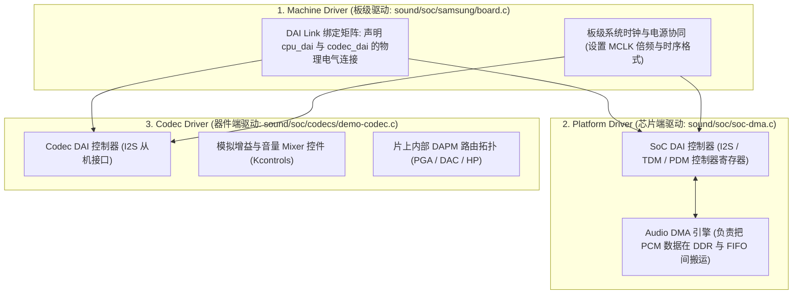

# 02 ASoC 架构三件套深度解析

## 1. 硬件解决什么问题：嵌入式 SoC 与外部 Codec 的代码强耦合

在早期 Linux 音频驱动中，某个 SoC（如三星 S3C2440）的音频驱动往往将 DMA 搬运代码、I2S 寄存器读写与外部 Wolfson Codec 芯片的控制逻辑硬编码在一个巨大的 `.c` 文件中。
当同一颗 SoC 换用了另一款 Realtek Codec 芯片，或者同一颗 Codec 挂接在不同的主控芯片上时，驱动代码几乎需要全部推倒重写，复用性极差。

**ASoC（ALSA System on Chip）**框架应运而生，其核心哲学是将嵌入式音频系统严格解耦为**三大独立组件（ASoC Three Components）**。

---

## 2. 硬件微架构与组成：ASoC 三大组件拓扑关系



### 三大组件职责严格定义

| 组件名称 | 核心职责 | 代码驻留目录 | 跨平台复用性 |
| :--- | :--- | :--- | :--- |
| **Codec 驱动** | 控制音频编解码芯片内部的模拟/数字特性（寄存器读写、PGA增益、DAPM部件树）。**完全不知道自己连接到了哪款 CPU**。 | `sound/soc/codecs/` | **100% 芯片无关**，可在任何 ARM/x86/RISC-V 平台上直接复用 |
| **Platform 驱动** | 控制 SoC 自身的数字音频接口（I2S/TDM 控制器）与 DMA 搬运引擎。**完全不知道连接的是哪颗 Codec 芯片**。 | `sound/soc/<vendor>/` | **板级无关**，芯片原厂提供后，可在该 SoC 的所有板型中复用 |
| **Machine 驱动** | 充当月下老人，通过 `snd_soc_dai_link` 将特定的 CPU DAI 与特定的 Codec DAI 绑定，定义板级特定引脚（GPIO Mute / 耳机插孔检测）。 | `sound/soc/<vendor>/` | **特定板型专有**，每款硬件主板编写一份 |

---

## 3. 软件代码实现：经典 DAI Link 结构体绑定定义

```c
// 典型 Machine 驱动中的 DAI Link 声明
static struct snd_soc_dai_link my_board_dai_links[] = {
    {
        .name = "HiFi Primary Audio",
        .stream_name = "HiFi Playback/Capture",

        // 绑定 Platform 端 (CPU DAI)
        .cpu_dai_name = "soc-i2s.0",
        .platform_name = "soc-dma-engine",

        // 绑定 Codec 端
        .codec_name = "demo-codec.1-0010", // 挂在 I2C1 上的 0x10 地址从设备
        .codec_dai_name = "demo-codec-hifi-dai",

        // 声明物理连接格式
        .dai_fmt = SND_SOC_DAIFMT_I2S |          // 标准 I2S
                   SND_SOC_DAIFMT_NB_NF |        // 正常位时钟与帧时钟极性
                   SND_SOC_DAIFMT_CBS_CFS,       // SoC 为 Master，Codec 为 Slave

        .ops = &my_board_ops,                    // 板级时钟设置回调
    },
};
```
