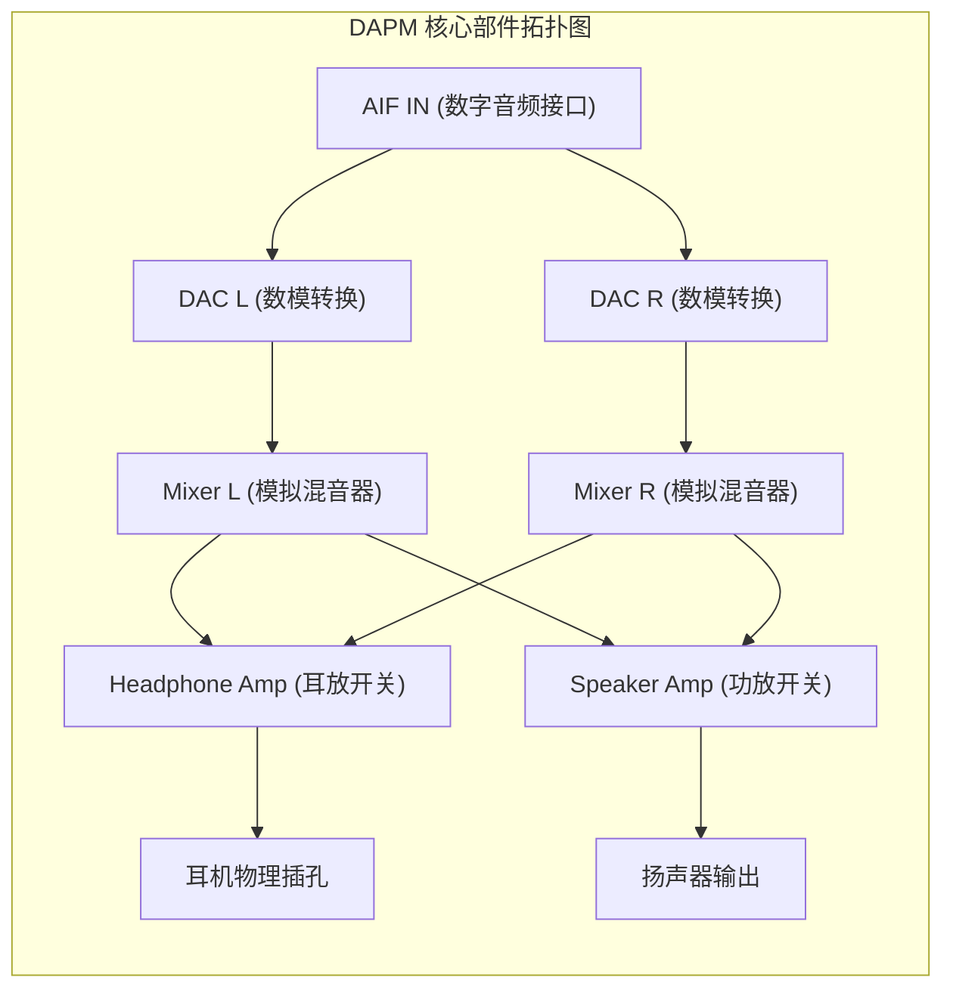

# 03 DAPM 动态音频电源管理与路由

## 1. 硬件解决什么问题：按需供电与自动化音频通路编排

现代音频 Codec 芯片内部集成了数十个微小的模拟模块（多个麦克风偏置、左/右 PGA、左/右 ADC、左/右 DAC、立体声耳放、差分扬声器功放、混音器 Mixer）。
若在播放耳机音乐时，将所有模块全部带电开启，芯片将产生不必要的严重发热与毫瓦级无效耗电；若由应用程序逐一手动控制每个寄存器上下电，极易出错且产生爆音。

**DAPM（Dynamic Audio Power Management，动态音频电源管理）**是 ASoC 的灵魂所在：
它将音频芯片内部所有的物理电路抽象为一个**有向图（Directed Graph）**。**只有当前被音频流实际贯通经过的硬件节点，DAPM 才会自动为其供电；没有信号流经的模块在硬件上被自动断电隔离**。

---

## 2. 硬件微架构与组成：DAPM Widget 部件与 Route 路由图



### 典型 DAPM 部件（Widget）分类
- **电源/开关部件**：`SND_SOC_DAPM_PGA`、`SND_SOC_DAPM_DAC`、`SND_SOC_DAPM_ADC`；
- **路由控制部件**：`SND_SOC_DAPM_MIXER`（多路混音）、`SND_SOC_DAPM_MUX`（单选开关）；
- **终端物理接口**：`SND_SOC_DAPM_HP`（耳机引脚）、`SND_SOC_DAPM_MIC`（麦克风引脚）。

---

## 3. 软件代码实现：DAPM 路由表（Audio Routes）定义

在驱动中，工程师使用极简的“终点 <- 控制开关 <- 起点”语法定义内部物理连线：

```c
// Codec 内部 DAPM 路由拓扑表定义
static const struct snd_soc_dapm_route my_audio_routes[] = {
    // 播放通路: 数字音频流送入 DAC
    { "Left DAC", NULL, "Playback Stream" },
    { "Right DAC", NULL, "Playback Stream" },

    // DAC 输出送入混音器 Mixer (受 Kcontrol 开关控制)
    { "Left Mixer", "DAC Playback Switch", "Left DAC" },
    { "Right Mixer", "DAC Playback Switch", "Right DAC" },

    // 混音器送入耳放
    { "Headphone Amp", NULL, "Left Mixer" },
    { "Headphone Amp", NULL, "Right Mixer" },

    // 耳放驱动耳机物理插孔
    { "HP Jack", NULL, "Headphone Amp" },
};
```

---

## 4. 四流全链路分析：DAPM 自动化电源联动时序流

1. **用户态路由流**：用户插入耳机，Android Audio HAL 调用 `tinymix "DAC Playback Switch" 1`，将混音器开关闭合。
2. **图遍历流（Graph Walk）**：DAPM 核心从终端“HP Jack”发起**反向深度优先搜索（DFS）**，寻找是否存在一条到达“Playback Stream”的连通完整路径。
3. **状态变化判断**：若路径连通，DAPM 将沿途的 `Left DAC`、`Left Mixer` 与 `Headphone Amp` 标记为“需上电（Power-Up）”。
4. **延迟排序与平滑上电**：DAPM 严格按照声学防爆音顺序执行微秒级上电：
   - 先开 DAC -> 再开 Mixer -> 稳定共模偏置 -> 最后开启 Headphone Amp；
   - 彻底杜绝了因后级先开被前级直流跳变冲击的爆音现象。
