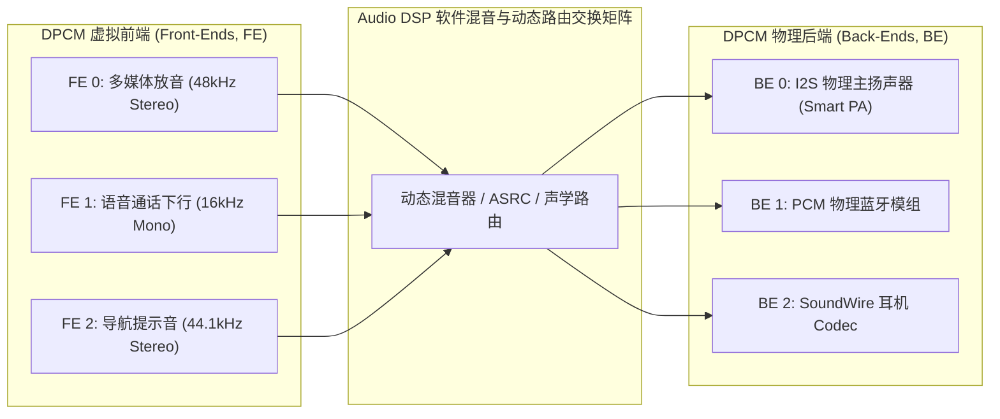

# 04 DPCM 与 SoundWire 驱动子系统

## 1. 硬件解决什么问题：DSP 多路动态路由与 SoundWire 现代总线支持

随着现代智能设备普遍引入片上 Audio DSP，传统 ASoC“一个 CPU DAI 严格对应一个 Codec DAI”的点对点刚性模型无法满足复杂声学场景：
1. **DPCM（Dynamic PCM）前后端解耦**：应用程序看到的逻辑声卡是前端（Front-End, FE），而物理输出的 I2S 接口是后端（Back-End, BE）。DSP 内部可能将通话语音动态分发给蓝牙、扬声器或录音回环，前后端采样率各不相同。
2. **SoundWire 总线原生支持**：传统的 I2C+I2S 需要两个独立的驱动子系统。Linux 内核演进了专有的 **SoundWire 总线子系统（`drivers/soundwire/`）**，实现统一的从设备枚举、控制报文打通与多通道音频流绑定。

---

## 2. 硬件微架构与组成：DPCM 前后端架构拓扑



---

## 3. 软件代码实现：Linux SoundWire 驱动注册规范

```c
// 现代 Linux SoundWire 从设备驱动驱动骨架
static struct sdw_driver my_sdw_codec_driver = {
    .driver = {
        .name = "my-soundwire-codec",
        .pm = &my_sdw_pm_ops,
    },
    .probe = my_sdw_codec_probe,
    .remove = my_sdw_codec_remove,
    .ops = &my_sdw_slave_ops,       // SoundWire 中断与状态回调
    .id_table = my_sdw_id_table,    // 厂商与设备识别码
};
module_sdw_driver(my_sdw_codec_driver);
```
