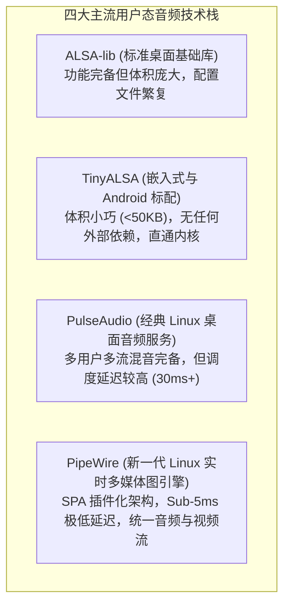

# 05 用户态音频服务栈演进

## 1. 硬件解决什么问题：多 App 音频并发混音与低延迟图调度

Linux 内核 ALSA 驱动原则上**仅支持单进程独占式打开硬件 PCM 设备**。若音乐 App 已经打开了 `/dev/snd/pcmC0D0p`，系统导航提示音或微信来电就无法同时发声。

必须在用户态建立高效的音频服务中间件，实现多客户端并发混音（Mixing）、策略仲裁、音量策略分发与低时延任务图（Audio Processing Graph）编排调度。

---

## 2. 硬件微架构与组成：主流用户态音频框架全景对比



### 用户态框架对比矩阵

| 框架名称 | 典型运行环境 | 代码体积 | 调度时延 | 核心定位与优势 |
| :--- | :--- | :--- | :--- | :--- |
| **TinyALSA** | 嵌入式 Linux / Android HAL | **极简 (< 30KB)** | **极低 (取决于底层内核)** | 直接对 ALSA ioctl 进行极简 C 语言封装，原厂 Bring-up 与产测调试首选 |
| **PulseAudio** | 传统 Ubuntu / 桌面 Linux | 庞大 | 较高 (20ms ~ 50ms) | 功能极其丰富（网络音频串流、多蓝牙编解码支持、动态混音） |
| **PipeWire** | 现代 Linux (Fedora/SteamOS) / 专业音频 | 适中 | **发烧级 (< 5ms)** | 基于 Pipe 消息与环形缓冲设计，彻底解决专业音乐制作低延迟与桌面易用性冲突 |

---

## 3. 核心 API 快速实操：TinyALSA 极简开发示例

```c
#include <tinyalsa/asoundlib.h>

// TinyALSA 极低延迟播放 48kHz 立体声 PCM 核心逻辑
int play_audio_tinyalsa(const char *pcm_data, size_t size) {
    struct pcm_config config = {
        .channels = 2,
        .rate = 48000,
        .period_size = 128,        // 单周期 128 点 (2.67ms)
        .period_count = 2,         // 乒乓双缓冲
        .format = PCM_FORMAT_S16_LE,
    };

    // 打开声卡 0, 设备 0
    struct pcm *pcm = pcm_open(0, 0, PCM_OUT, &config);
    if (!pcm || !pcm_is_ready(pcm)) {
        printf("Failed to open PCM: %s\n", pcm_get_error(pcm));
        return -1;
    }

    // 阻塞写入 PCM 样点
    pcm_write(pcm, pcm_data, size);

    pcm_close(pcm);
    return 0;
}
```
