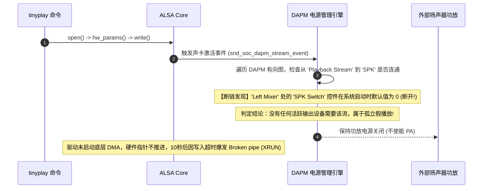

# 07 DAPM 路由断链与 XRUN 欠载案例

## 1. 案例背景：用户态执行播放命令卡死且扬声器死寂无声

某款工控平板在适配新型主板时，软件工程师执行：
```bash
tinyplay /test.wav -D 0 -d 0
```
系统出现诡异现象：
1. 终端命令行光标停滞卡死，持续 10 秒后打印错误退出：`pcm_write: cannot write stream: Broken pipe (Underrun)`；
2. 整个过程中，扬声器完全没有发出任何声音，使用万用表测量功放使能引脚，始终处于拉低未使能状态。

---

## 2. 调试定位全过程与 DAPM 路由图深潜



### 深入分析排查步骤

1. **查看声卡拓扑状态（DAPM 调试秘籍）**：
   Linux 内核提供了强大的 Debugfs 接口，直接反映每个 DAPM Widget 的物理供电状态：
   ```bash
   cat /sys/kernel/debug/asoc/my-soundcard/dapm/SPK
   # 输出显示: SPK: Off (电源关闭)
   cat /sys/kernel/debug/asoc/my-soundcard/dapm/Playback\ Stream
   # 输出显示: Playback Stream: Off (未连通到任何有效终端!)
   ```
2. **检查底层 Mixer 控件状态**：
   ```bash
   tinymix
   # 检查输出列表，发现关键控制项:
   # 12 BOOL 1 Speaker Switch: [Off]  <-- 默认处于关闭状态!
   ```

---

## 3. 根因剖析（Root Cause）

1. **DAPM 路由默认未导通**：Machine 驱动虽然定义了完整的拓扑有向图，但用于连通信号的关键 Kcontrol 控件（`Speaker Switch`）在内核加载时的默认初始值是 `0`（关闭）。
2. **ALSA 驱动缺少默认音频配置文件（UCM / State）**：系统缺少 `asound.state` 初始化脚本，导致用户态认为声卡已就绪，而内核 DAPM 认为通路断开，从而压根未给后级功放供电。

---

## 4. 解决方案与修复代码

### 1. 软件快速修复（用户态打开开关）
执行初始化配置命令：
```bash
tinymix "Speaker Switch" 1
tinymix "DAC Playback Volume" 120
tinyplay /test.wav -D 0 -d 0  # 扬声器瞬间洪亮发声!
```

### 2. 驱动级加固修复（定义默认连通路径）
在 Machine Driver 中，将常开的关键链路声明为无开关的直连线（使用 `NULL` 替代开关名）：

```c
static const struct snd_soc_dapm_route fixed_audio_routes[] = {
    // 关键修复: 将受控开关改为硬件直连通拓扑，保证开机默认连通
    { "Speaker Amp", NULL, "DAC Output" },
    { "SPK", NULL, "Speaker Amp" },
};
```
并在驱动 probe 函数末尾调用 `snd_soc_dapm_sync(dapm)` 强制同步初始拓扑，彻底杜绝首次播放无声故障。
