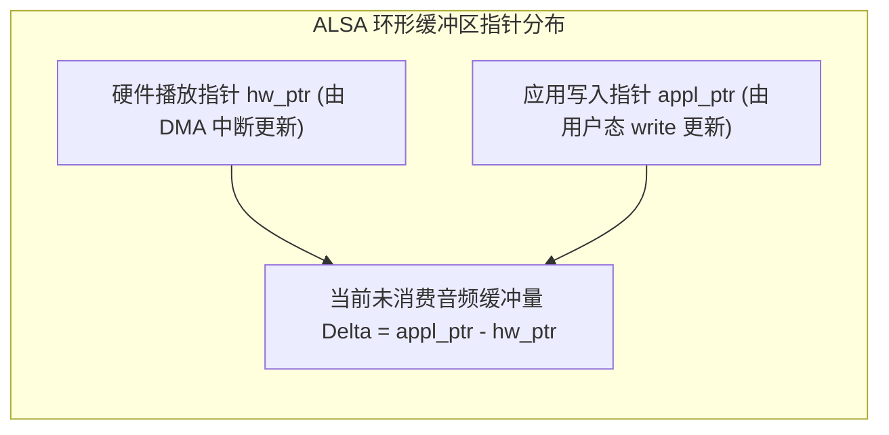

# 08 ALSA 环形缓冲与时延模型推演

## 1. 硬件解决什么问题：环形缓冲区水位推进与数学时延模型

在 ALSA 的环形缓冲机制中，`hw_ptr`（硬件指针）与 `appl_ptr`（应用指针）像两个在环形跑道上赛跑的选手：
- 应用态进程是前面的“充水人”，以非均匀的突发节拍写入数据，将 `appl_ptr` 向前推；
- 硬件 DMA 是后面的“放水人”，以严格恒定的采样率时钟将 `hw_ptr` 向前追赶。

两者之间的距离直接决定了**音频的系统滞后时延（Playback Latency）**。

---

## 2. 环形缓冲水位数学关系推演

### 关键时延公式推导
设采样率为 $f_s$（样点/秒），环形缓冲区总样点数为 $B_{\text{size}}$（Buffer Size），单个 Period 样点数为 $P_{\text{size}}$。
1. **最小系统固有硬件缓冲延迟（Minimum Latency）**：
   当应用态保持缓冲内始终维持至少一个周期的安全数据，防止 DMA 饥饿：
   $$t_{\text{latency, min}} = \frac{P_{\text{size}}}{f_s}$$
2. **最大系统滞后延迟（Maximum Latency）**：
   当应用态将整个环形缓冲区填满时：
   $$t_{\text{latency, max}} = \frac{B_{\text{size}}}{f_s}$$

---

## 3. 典型系统参数量化对比推演表

设采样率 $f_s = 48000\text{ Hz}$：

| 调度策略模式 | Period Size | Buffer Size | 典型 Period 中断周期 | 系统音频端到端缓冲时延 |
| :--- | :--- | :--- | :--- | :--- |
| **超低延迟 (Low Latency / Pro Audio)** | 64 样点 | 128 样点 | **$1.33\text{ ms}$** | **$2.67\text{ ms}$** |
| **标准交互 (Interactive / Game)** | 192 样点 | 768 样点 | **$4.00\text{ ms}$** | **$16.00\text{ ms}$** |
| **常规多媒体 (Standard Linux)** | 1024 样点 | 4096 样点 | **$21.33\text{ ms}$** | **$85.33\text{ ms}$** |
| **深度节能 (Audio Offload / Music)** | 4096 样点 | 32768 样点 | **$85.33\text{ ms}$** | **$682.67\text{ ms}$** |

---

## 4. 架构设计指导准则

推论：
1. **不可兼得的物理铁律**：想要将播放延迟压低到 $5\text{ ms}$ 以内，Buffer Size 必须 $< 256$ 样点。这意味着应用程序**必须在每 2.6 毫秒内必须被唤醒并完成一次音频计算**。任何超过 2ms 的 CPU 调度抖动都会直接引发系统 Underrun。
2. **专业实时系统的系统优化组合拳**：在追求低延迟时，仅调小 ALSA 参数远远不够，必须同步开启 Linux 的 **`PREEMPT_RT` 全抢占实时内核补丁**，并将音频工作线程的实时调度策略设置为 **`SCHED_FIFO`，优先级提升至 90 以上**。
