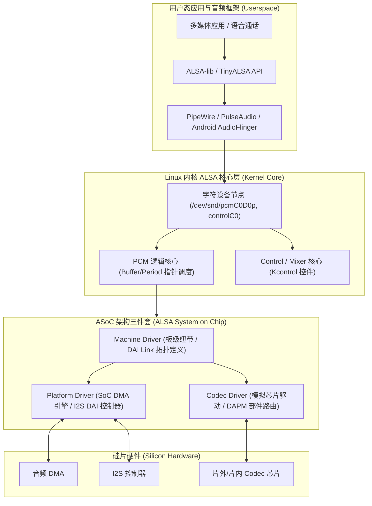

# 09 Linux ALSA/ASoC 驱动栈

## 模块导读与原厂定位

在现代嵌入式系统、汽车座舱与移动设备中，Linux 音频子系统构成了硬件芯片与上层多媒体应用程序之间最关键的承重墙。

从底层的 DMA 内存映射、I2S 控制器寄存器交互，到高层的声卡拓扑绑定与毫安级动态音频电源编排（DAPM），**ALSA（Advanced Linux Sound Architecture）及其专为嵌入式设计的 ASoC（ALSA System on Chip）框架**定义了一套严密、解耦且高度可复用的原厂驱动架构体系。

---

## 模块文章索引

1. [ALSA 核心框架与 PCM 体系](01-alsa-framework-core.md)：PCM 设备节点抽象、hw_params 硬件参数协商、环形缓冲区控制与 /proc/asound 调试接口
2. [ASoC 架构三件套深度解析](02-asoc-three-components.md)：Machine 驱动（桥梁拓扑）、Platform 驱动（DMA与DAI）与 Codec 驱动职责解耦与协同
3. [DAPM 动态音频电源管理与路由](03-dapm-dynamic-audio-power.md)：DAPM Widget 部件图、音频路由 Route 表、开关与上下电状态机自动联动
4. [DPCM 与 SoundWire 驱动子系统](04-dpcm-soundwire-subsystem.md)：动态 PCM（DPCM）前后端（FE/BE）解耦、DSP 拓扑与 Linux SoundWire 驱动总线模型
5. [用户态音频服务栈演进](05-userspace-tinyalsa-pipewire.md)：从 ALSA-lib 到嵌入式 TinyALSA、Android HAL AudioFlinger 与新一代 PipeWire 实时图架构
6. [Linux 音频驱动开发规范](06-driver-engineering-guide.md)：环形缓冲自循环管理、Runtime PM 动态电源挂起唤醒与严防死锁的中断约束
7. [DAPM 路由断链与 XRUN 欠载案例](07-cases-debug.md)：实战案例：声卡通路配错导致扬声器无声故障与线程优先级反转导致 XRUN 断音剖析
8. [ALSA 环形缓冲与时延模型推演](08-engineering-analysis.md)：`hw_ptr` 与 `appl_ptr` 指针推进时序差、Period/Buffer 尺寸对系统调度延迟与功耗的量化关系
