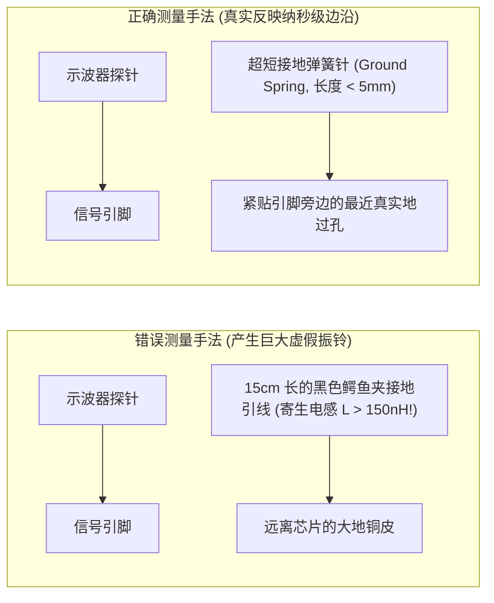

# 01 物理层信号排查与示波器抓波

## 1. 硬件解决什么问题：用物理波形刺破抽象软件 Bug 的迷雾

当音频系统出现杂音、断音或声道错位时，纯粹查看内核软件日志往往毫无头绪。
示波器（Oscilloscope）与逻辑分析仪（Logic Analyzer）是直击芯片硬件物理层的第一双“透视眼”。

然而，音频高频时钟具有纳秒级的陡峭跳变，若测量手法不专业（如使用长长的示波器鳄鱼夹地线），地线寄生电感会直接在屏幕上产生虚假的巨幅振铃波形，导致工程师误判电路故障。

---

## 2. 正确的探头接地与物理层测量规范

---

## 3. 逻辑分析仪 I2S 总线硬件协议解码实操

现代逻辑分析仪（如 Saleae 或专用硬件协议仪）支持对 I2S 信号进行实时协议解码：
- **触发条件设置**：将触发源设为 `LRCK` 的下降沿（捕获左声道帧起始时刻）；
- **参数关键匹配项**：
  1. `Word Select Inverted`：按实际 WS 极性配置；常见 I2S 低电平为左，但左对齐格式本身不要求反转 WS；
  2. `Data Delay`：标准 I2S 设为 `1 Clock`（延迟 1 拍），左对齐设为 `0 Clock`；
  3. `Bits per Sample`：设为实际传输位深（如 24-bit / 32-bit）。
- **核对要点**：观察解码器解析出的首个有效字节数值，与写入 FIFO 的 PCM 源码逐 bit 进行二进制对齐比对，秒级排查移位偏离。
