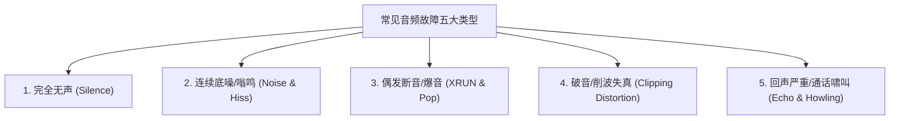

# 04 音频全链路故障排查字典

## 1. 硬件解决什么问题：常见声学与驱动故障极速分类定位

面对现场复杂多样的音频故障，按照标准化的故障树排查字典进行剪枝，能在 15 分钟内精准圈定故障根因所在的物理层次。

---

## 2. 五大类典型音频故障排查速查字典

### 故障 1：完全无声（Silence）排查清单
1. **时钟是否起振**：示波器抓取 BCLK/LRCK 是否有脉冲波形（检查音频 PLL 是否锁定、引脚 Pinmux 是否配错）；
2. **DAPM 路径是否闭合**：检查 `tinymix` 中后级开关控件（`Speaker Switch` / `HP Mute`）是否开启；
3. **功放使能引脚**：测量外部功放芯片的 `PA_EN` 引脚电压是否为高电平；
4. **DMA 指针是否推进**：查看 `/proc/asound/card0/pcm0p/sub0/status` 中 `hw_ptr` 是否随时间递增。

### 故障 2：底噪与蜂鸣（Hiss & Humming）排查清单
1. **白噪声底噪（Hiss）大**：模拟增益 PGA 是否设置过大，导致前级器件热噪声被过度放大；
2. **50Hz/100Hz 交流低频嗡鸣**：供电回路存在接地环路（Ground Loop），检查电源适配器共模隔离；
3. **1kHz 刺耳高频尖叫**：USB 1kHz SOF 帧时钟或屏幕刷新信号串入音频走线；
4. **217Hz 周期性蜂鸣**：4G/5G 射频天线功率突发辐射耦合至麦克风偏置（MICBIAS）线路。

### 故障 3：偶发断音与爆音（XRUN & Pop）排查清单
1. **系统日志报错 `Broken pipe` / `Underrun`**：DDR 带宽被 GPU/NPU 挤占，需提高音频 DMA 的 NoC QoS 优先级；
2. **切歌/暂停瞬间爆音**：DAC 输出端存在直流偏置跳变，开启 Codec 硬件零交叉检测（Zero-Crossing）与 VCM 软启动慢爬坡；
3. **中断处理超时**：其他外设驱动在中断上下文中执行耗时操作，导致音频中断被挂起饿死。

### 故障 4：破音与严重削波失真（Clipping）排查清单
1. **数字全量程硬截断（Hard Clipping）**：上层软件 EQ 增益调节超过了 0 dBFS，导致样点被强制截断在 `0x7FFF`；
2. **功放供电轨饱和**：扬声器所需功率超过了功放芯片供电电压上限（$P = \frac{V^2}{2R}$），需启用 DRC 动态限幅器；
3. **格式对齐错位**：I2S 配置为标准格式但实际发送的是左对齐，导致所有数据左移 1 位，最高有效位溢出。

### 故障 5：通话回声严重（Echo）排查清单
1. **AEC 参考信号丢失**：检查底层回声消除参考信号通道（Echo Reference）是否使能；
2. **参考信号群延迟突变**：USB 或蓝牙异步时钟漂移导致驱动粗暴丢样点，破坏了自适应滤波器的相位对齐；
3. **结构漏气震动**：扬声器震动通过外壳机械结构直接刚性传导到麦克风，声学隔离度（Acoustic Isolation）不足。
