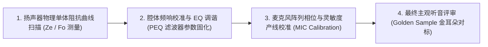

# 05 声学系统调音与量产产测规范

## 1. 硬件解决什么问题：从实验室手板到百万量产一致性把控

声学是系统物理结构、扬声器单体、算法与芯片 Codec 的集大成者。
单颗芯片在实验室测试指标完美，并不代表组装成整机后就能发出动听的声音。此外，在产线大批量生产时，扬声器和麦克风的制造公差（灵敏度差异可达 $\pm 3\text{ dB}$）会导致每台机器声音不一致。

---

## 2. 经典主客观调音四大阶段规范

---

## 3. 产线自动化测试（ATE）核心指标测试用例

在工厂制造产线上，每台成品必须在**微型静音箱（Shielding Audio Box）**内完成 3 秒极速声学全检：
1. **扫频纯音测试（Chirp Sweep，100Hz ~ 10kHz）**：
   - 提取谐波失真，检测扬声器是否存在微小装配杂音（Rub & Buzz 异常杂音，如胶水开裂或音圈擦边）；
2. **灵敏度绝对值校验**：
   - 灌入 1kHz @ 94dB SPL 标准声压，校准麦克风输出数字幅值，将校准补偿参数（Calibration Offset）写入芯片内部 OTP / eFuse；
3. **极性（Polarity）检测**：
   - 灌入不对称脉冲波，检测扬声器正负极是否反接。
