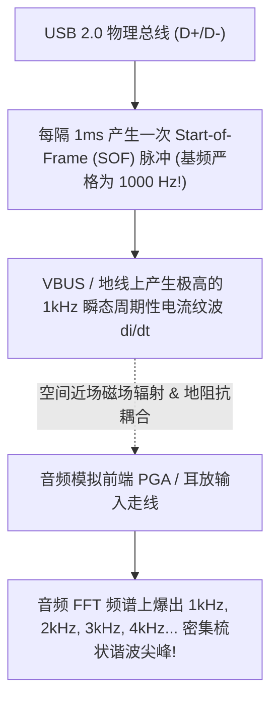

# 06 时钟与电源串扰 1kHz 谐波案例

## 1. 案例背景：USB 接入电脑时耳机中清晰听到 1kHz 啸叫

某款带 USB 接口的专业声卡在独立电池供电时，耳机输出信噪比高达 118dB，底噪极度纯净。
然而，一旦使用 USB 线缆连接 PC 电脑进行录放音，佩戴高灵敏度入耳式耳机（IEM）时，背景中会清晰听到一种尖锐、单调的 **1kHz 周期性高频蜂鸣声（1kHz Whine）**。

---

## 2. 调试定位全过程与频域 FFT 深潜分析

### 深入分析三部曲

1. **AP 仪器高精度 FFT 频谱扫描**：
   - 观察音频模拟输出端频域谱：在未播放任何音乐的静音状态下，原本平坦在 $-120\text{ dBV}$ 的底噪线上，**以 1.000kHz 为基准，依次冒出了 2kHz、3kHz、4kHz 直至 15kHz 的密集“梳状谐波梳（Comb Spectrum）”**！
   - 1kHz 处的能量尖峰高达 $-82\text{ dBV}$，完全落入人耳听觉最敏感区间。
2. **物理周期关联性锁定**：
   - 为什么偏偏是严格的 $1000\text{ Hz}$？
   - 查阅 USB 2.0 协议规范：USB Full-Speed / High-Speed 处于活动状态时，主机控制器**每隔严格的 $1.000\text{ ms}$ 发送一次 SOF（Start of Frame）微帧同步数据包**！
   - SOF 包引发的瞬态电流脉冲频率严格等于：
   $$f_{\text{SOF}} = \frac{1}{1.000\text{ ms}} = 1000.0\text{ Hz}$$
3. **近场探头空间探测**：
   - 使用近场 H-Field 磁场探头扫描 PCB，发现 USB 输入端的共模电感走线与音频耳机输出走线在底层紧紧平行并排走了将近 $4\text{ cm}$，且两者距离不到 $0.3\text{ mm}$！

---

## 3. 根因剖析（Root Cause）

1. **严重的容性/感性近场串扰**：高速数字脉冲走线与高阻抗模拟音频走线长距离平行布线，破坏了 3W 规则与立体包地隔离。
2. **USB 供电地线与音频模拟地共用了铜皮**：PC 电脑主板电源地线上的 1kHz 开关回流电流直接流经了声卡耳放的地参考焊盘。

---

## 4. 解决方案与工程整改

### 1. 硬件 PCB 物理改板重构
- **物理净空隔离**：将 USB 差分对与电源线彻底移到板边，距离模拟音频走线保持至少 **$15\text{ mm}$ 以上的绝对物理距离**；
- **USB 地与音频地隔离**：在 USB 接口处采用高速磁隔离芯片（如 ADuM4160）或采用独立共模扼流圈进行地回路切断；
- **耳放输入走线内层包地**：耳放输入信号线全部埋入 PCB 内层（Layer 3），上下层均为完整 AGND 屏蔽层。

---

## 5. 验证结果

改板后重新连接 PC 进行 APx555 频谱扫描，**1kHz 梳状谱尖峰彻底沉降抹平，消失在 $-120\text{ dBV}$ 的平坦底噪线以下**，1kHz 周期性啸叫缺陷被彻底消灭。
