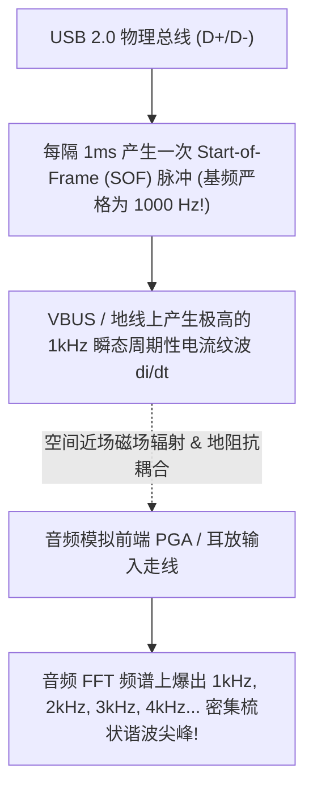

# 06 时钟与电源串扰 1kHz 谐波案例

## 1. 案例背景：USB 接入电脑时耳机中清晰听到 1kHz 啸叫

某款带 USB 接口的专业声卡在独立电池供电时，耳机输出信噪比高达 118dB，未发现同样的周期性蜂鸣声。
然而，一旦使用 USB 线缆连接 PC 电脑进行录放音，佩戴高灵敏度入耳式耳机（IEM）时，背景中会清晰听到一种尖锐、单调的 **1kHz 周期性高频蜂鸣声（1kHz Whine）**。

---

## 2. 调试定位全过程与频域 FFT 深潜分析

下图按 Full-Speed 链路的 1ms 标称帧周期说明一种耦合路径；仅凭 1kHz 梳状谱还不能确认 SOF 是噪声来源。

```mermaid
graph TD
    USB_BUS["USB 2.0 物理总线 (D+/D-)"] --> SOF_PKT["每隔 1ms 产生一次 Start-of-Frame (SOF) 脉冲 (基频严格为 1000 Hz!)"]
    SOF_PKT --> DI_DT["VBUS / 地线上产生极高的 1kHz 瞬态周期性电流纹波 di/dt"]
    DI_DT -.空间近场磁场辐射 & 地阻抗耦合.-> MIC_PGA["音频模拟前端 PGA / 耳放输入走线"]
    MIC_PGA --> FFT_PEAKS["音频 FFT 频谱上爆出 1kHz, 2kHz, 3kHz, 4kHz... 密集梳状谐波尖峰!"]
```

### 深入分析三部曲

1. **AP 仪器高精度 FFT 频谱扫描**：
   - 观察音频模拟输出端频域谱：在未播放任何音乐的静音状态下，原本平坦在 $-120\text{ dBV}$ 的底噪线上，**以 1.000kHz 为基准，依次冒出了 2kHz、3kHz、4kHz 直至 15kHz 的密集“梳状谐波梳（Comb Spectrum）”**！
   - 1kHz 处的能量尖峰高达 $-82\text{ dBV}$，完全落入人耳听觉最敏感区间。
2. **物理周期关联性锁定**：
   - 将 $1000\text{ Hz}$ 谱线与 USB 传输及供电电流的时间变化对照。
   - Full-Speed 链路在活动状态下以标称 **$1.000\text{ ms}$ 帧周期**发送 SOF（Start of Frame）；High-Speed 则以 **$125\mu\text{s}$ 微帧周期**发送 SOF，对应 8kHz，不能把两者都写成 1ms。帧和微帧时序可参见 [USB-IF USB 2.0 规范](https://www.usb.org/document-library/usb-20-specification)及 [Microchip 的 SOF/MSOF 寄存器说明](https://onlinedocs.microchip.com/oxy/GUID-22527069-B4D6-49B9-BACC-3AF1C52EB48C-en-US-21/GUID-16D3DE49-2DB8-45AF-9691-AED54653568E.html)。
   - 对本图采用的 Full-Speed 帧周期，SOF 的标称重复频率为：
   $$f_{\text{SOF}} = \frac{1}{1.000\text{ ms}} = 1000.0\text{ Hz}$$
   - 排查时先确认实际协商速度，再同步测量总线活动、电流纹波与音频输出。若是 High-Speed 链路，需要进一步查明 1ms 周期的负载或调度活动，不能直接把 1kHz 谱线归因于 SOF。
3. **近场探头空间探测**：
   - 使用近场 H-Field 磁场探头扫描 PCB，发现 USB 输入端的共模电感走线与音频耳机输出走线在底层紧紧平行并排走了将近 $4\text{ cm}$，且两者距离不到 $0.3\text{ mm}$！

---

## 3. 根因剖析（Root Cause）

1. **严重的容性/感性近场串扰**：高速数字脉冲走线与高阻抗模拟音频走线长距离平行布线，破坏了 3W 规则与立体包地隔离。
2. **USB 供电地线与音频模拟地共用了铜皮**：PC 电脑主板电源地线上的 1kHz 开关回流电流直接流经了声卡耳放的地参考焊盘。

---

## 4. 解决方案与工程整改

### 1. 硬件 PCB 物理改板重构
- **物理净空隔离**：将 USB 差分对与电源线彻底移到板边，距离模拟音频走线保持至少 **$15\text{ mm}$ 以上的绝对物理距离**；
- **USB 地与音频地隔离**：在 USB 接口处采用高速磁隔离芯片（如 ADuM4160）或采用独立共模扼流圈进行地回路切断；
- **耳放输入走线内层包地**：耳放输入信号线全部埋入 PCB 内层（Layer 3），上下层均为完整 AGND 屏蔽层。

---

## 5. 验证结果

改板后重新连接 PC 进行 APx555 频谱扫描，本次测试中，**1kHz 梳状谱尖峰低于 $-120\text{ dBV}$ 的底噪线**。还需在相同测量带宽下覆盖不同 USB 主机、线缆与供电条件。
