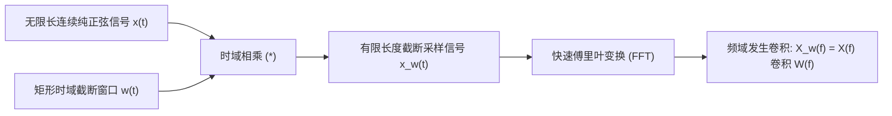

# 07 FFT 频谱分析与谐波失真推导

## 1. 硬件解决什么问题：频域变换中的频谱泄漏与窗函数精准选取

在对音频芯片输出进行数字化测试与客观失真度（THD）计算时，必须对采集到的有限长度离散时域序列执行快速傅里叶变换（FFT）。

若时域截断边界不连续，原本单一频率的正弦波能量会扩散泄露到全频段所有相邻频点中（**频谱泄漏，Spectral Leakage**），导致测得的失真指标虚假超标。

---

## 2. 连续信号的时域截断与卷积泄漏数学模型

时域上的有限长度截断相当于信号乘以矩形窗 $w(t) = \text{rect}(t/T)$。在频域中，时域乘积对应频域卷积：
$$X_w(f) = X(f) * W(f)$$
矩形窗的频域响应为著名的 Sinc 函数：
$$W(f) = T \cdot \frac{\sin(\pi f T)}{\pi f T}$$
Sinc 函数具有极高且衰减缓慢的旁瓣（第一旁瓣抑制仅有 $-13.3\text{ dB}$）。
若采样信号的频率不是 FFT 频域分辨率格点（Bin）的整数倍，信号基波的主瓣能量将通过巨大的旁瓣喷涌蔓延至整个频谱，彻底淹没真实的微弱二次、三次谐波。

---

## 3. 音频主流加窗函数特性对比

| 窗函数名称 | 第一旁瓣峰值衰减 | 主瓣宽度 (Bins) | 适用音频测试场景 |
| :--- | :--- | :--- | :--- |
| **矩形窗 (Rectangular)** | $-13.3\text{ dB}$ | 2 | **仅适用于严格相干采样（Coherent Sampling）** |
| **汉宁窗 (Hanning / Hann)** | **$-31.5\text{ dB}$** | 4 | **通用音频谐波分析首选**，平衡频率分辨力与泄漏 |
| **布莱克曼-哈里斯 (4-term BH)**| **$-92.0\text{ dB}$** | 8 | **高保真 THD 测试首选**，旁瓣衰减极深，不掩盖谐波 |
| **平顶窗 (Flat-top)** | $-44.0\text{ dB}$ | 10 | **振幅绝对校准首选**，主瓣平坦，幅值测量误差 $<0.01\text{ dB}$ |

---

## 4. 相干采样（Coherent Sampling）数学黄金条件

在芯片自动化测试（ATE）中，工程师通过控制信号发生器频率与采样时钟，强制满足**相干采样黄金方程**，从而彻底消灭任何频谱泄漏，实现无需加窗的完美 FFT：
$$\frac{f_{\text{in}}}{f_s} = \frac{M}{N}$$
其中：
- $f_{\text{in}}$ 为输入的测试正弦波频率；
- $f_s$ 为系统采样率；
- $N$ 为 FFT 的总样点数（通常取 2 的整数次幂，如 4096 或 8192）；
- **$M$ 必须是与 $N$ 互质的整数（即 $M$ 为奇数素数）**！

### 真实参数推演
设采样率 $f_s = 48000\text{ Hz}$，FFT 点数 $N = 4096$ 点。目标测试频率接近 $1000\text{ Hz}$：
$$M_{\text{target}} = \text{round}\left( \frac{1000}{48000} \times 4096 \right) = \text{round}(85.333) = 85$$
检查：$M = 85$（因数为 5, 17），与 $N = 4096$（因数仅有 2）互质，满足条件！
由此反求出信号发生器必须设置的精准相干频率：
$$f_{\text{coherent}} = \frac{85}{4096} \times 48000\text{ Hz} = \mathbf{996.09375\text{ Hz}}$$
**推论**：在仪器中将信号发生器频率精确设定为 $996.09375\text{ Hz}$，采样序列的首尾样点在时域上将实现微秒级的完美闭环连续。此时即使采用无任何窗函数的纯矩形窗，FFT 频谱上也**仅在第 85 个 Bin 上呈现单线脉冲，旁瓣泄漏绝对为 0**，测量出的底噪与失真达到理论数学精度的极限。
