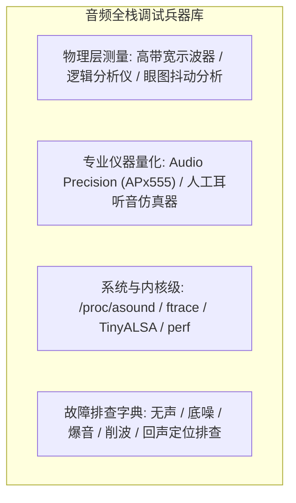

# 10 调试测量与调音声学

## 模块导读与原厂定位

音频系统的调试是工程界公认最考验软硬件全栈综合能力的领域之一：
当遇到“有声音但底噪大”、“偶发爆音”、“高音毛刺”、“麦克风拾音沉闷”等声学缺陷时，问题可能出在硬件 PCB 地电位、时钟相位抖动、模拟前端偏置、Linux 驱动 XRUN，也可能是用户态混音重采样或结构腔体共振。

本模块系统梳理从**示波器/逻辑分析仪物理层捕获**、**行业金标 Audio Precision（AP）声学仪器测试**、**Linux 内核调试工具链**到**全链路故障分类速查排查字典**的原厂调试调优方法论。

---

## 模块文章索引

1. [物理层信号排查与示波器抓波](01-audio-oscilloscope-analyzer.md)：示波器高阻探头接地、BCLK/LRCK/SDATA 时序建立保持时间测量与 I2S 协议总线硬件解码
2. [Audio Precision 专业仪器测试](02-ap-audio-precision-testing.md)：APx555 仪器连线、THD+N 扫频曲线、频率响应平直度、底噪谱密度与声道分离度测试规范
3. [Linux 内核音频调试利器与 Trace](03-linux-audio-debug-tools.md)：`/proc/asound` 状态、`tinymix`/`tinycap` 实战抓流、ftrace 跟踪音频调度抖动与 ALSA debug 日志
4. [音频全链路故障排查字典](04-audio-fault-triage-checklist.md)：五大类典型声学故障（无声、底噪蜂鸣、断音XRUN、破音削波、回声漏音）秒级定位排查手册
5. [声学系统调音与量产产测规范](05-debug-engineering-guide.md)：EQ 均衡器曲线调校、扬声器 Fo/Ze 阻抗曲线校准与工厂自动化生产测试（ATE）规范
6. [时钟与电源串扰 1kHz 谐波案例](06-cases-debug.md)：实战案例：USB 1kHz 帧时钟与音频模拟走线近场耦合产生 1kHz 蜂鸣尖峰根因定位与整改
7. [FFT 频谱分析与谐波失真推导](07-engineering-analysis.md)：音频频域 FFT 分段加窗（Hanning/Flat-top）、频谱泄漏抑制与多阶非线性谐波计算公式推导
