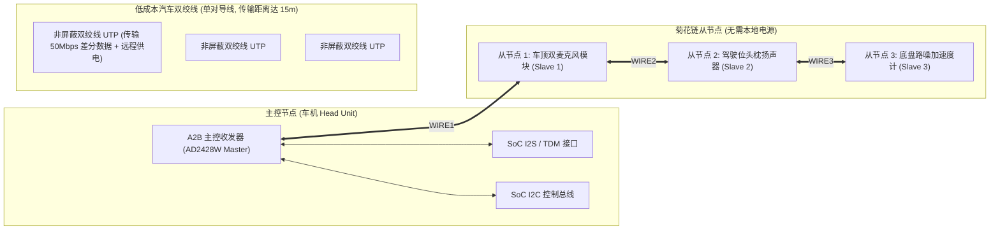

# 01 智能座舱 A2B 汽车音频总线

## 1. 硬件解决什么问题：消灭汽车内部数百公斤沉重笨拙的线束

在现代智能网联汽车中，车身内部布满了数十个声学节点：驾驶员通话麦克风、副驾语音麦克风、4 个车轮加速度传感器（用于路噪降噪 RANC）、车门高低音喇叭、头枕私密扬声器。

若采用传统的模拟屏蔽线缆连接，全车音频线束重达 **数十公斤**，不仅成本高昂、占用狭窄的汽车底盘通道，且极易受车载高压电机、逆变器的强电磁干扰。

ADI 推出的 **A2B（Automotive Audio Bus，汽车音频总线）**彻底颠覆了车载声学网络：
**仅凭一根非屏蔽双绞线（UTP）**，即可在单条菊花链总线上同时串联多达 14 个节点，实时双向传输多达 32 声道未压缩数字音频，并同时提供高达 $300\text{ mA}$ 的远程总线供电（PoDL，Power over Data Line）。

---

## 2. 硬件微架构与组成：A2B 单线菊花链网络拓扑



### A2B 核心电气与时序特性
- **恒定超低确定性时延**：A2B 采用基于超帧（Superframe）的硬同步时分复用传输，主从节点之间**单向传输延迟严格恒定为 50 微秒（$< 50\mu\text{s}$，仅有 2 个音频采样周期）**，为车载道路降噪（RANC）提供了完美的物理相位保障。
- **数据线远程供电（PoDL）**：主控节点在双绞线差分信号上施加直流偏置电压（如 8V），远端麦克风节点通过片上集成电感分离直流电，直接为本地 MEMS 麦克风与从收发器供电，**从节点完全无需额外拉电源线**。

---

## 3. 软件可见接口：Linux 内核 A2B 协议栈与节点发现

A2B 总线在 Linux 内核中呈现为标准总线子系统，主设备启动时执行**逐级向外发现与配置（Sequential Node Discovery）**：

```c
// A2B 节点初始化配置结构体
struct a2b_node_config {
    uint8_t node_addr;       // 逻辑节点号 (0: 主节点, 1..14: 从节点)
    uint8_t downstream_slots;// 下行音频槽位数 (如 8 声道扬声器下发)
    uint8_t upstream_slots;  // 上行音频槽位数 (如 4 麦克风拾音回传)
    bool    bus_power_en;    // 开启当前段线缆远程供电 (PoDL)
};
```

---

## 4. 四流全链路分析：超帧同步与双向数据流转

1. **同步前导流（Synchronization Preamble）**：主节点每隔 $1/f_s = 20.83\mu\text{s}$（48kHz 周期）发起一个超帧，在总线上发出特定违规编码的前导同步脉冲（SCF）。全链路上所有从节点的本地锁相环（PLL）以此脉冲为绝对时钟基准对齐。
2. **控制与下行流（Downstream Data）**：主节点紧接着发送控制命令报文与下行音频时隙（Slot 0~7），沿菊花链逐级向下传递，头枕扬声器从节点在约定槽位提取音频。
3. **上行回传流（Upstream Data）**：下行传输完毕后，总线瞬间反转为上行传输模式；车顶麦克风节点在对应时隙注入自己采集到的 24-bit 语音样点，逆向回传至车机 SoC。
4. **环路故障自愈流**：若线缆中途被意外挤压短路或断开，受损节点前一级的收发器能够自动检测到阻抗异常，通过内部模拟开关将总线终端匹配电阻拉起，**维持前面完好节点继续正常工作**并上报断线位置。
