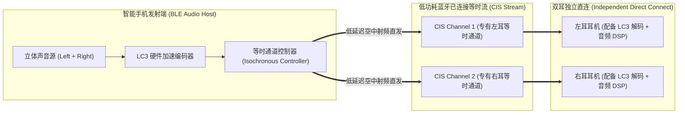

# 02 TWS 蓝牙耳机系统架构与 BLE Audio

## 1. 硬件解决什么问题：真无线双耳立体声的跨身体同步与音质突破

传统蓝牙经典音频（Classic Bluetooth A2DP）基于老旧的 SBC 编码，面临三大先天致命缺陷：
1. **点对点单播限制**：经典蓝牙只支持单路音频流，早期 TWS 耳机不得不采用“主耳接收再转发副耳”的转发机制（Snoop 监听或 Relay），导致副耳延迟严重，且主耳耗电翻倍；
2. **SBC 压缩失真与高延迟**：SBC 算法粗糙，压缩后音质干瘪，且编解码延迟高达 $150\text{ ms} \sim 250\text{ ms}$，打游戏时音画严重脱节；
3. **射频功耗巨大**：经典蓝牙发射功耗偏高，限制了微型耳机的续航。

蓝牙技术联盟（SIG）推出的 **LE Audio（低功耗蓝牙音频）与 LC3 编码器**彻底重构了无线声学体系。

---

## 2. 硬件微架构与组成：BLE Audio 多重流（Multi-Stream）双耳架构

### 传统经典蓝牙与 LE Audio 革命性升级对比

| 技术特性 | 传统经典蓝牙 (Classic Audio / A2DP) | 现代低功耗蓝牙音频 (BLE Audio / LE Audio) |
| :--- | :--- | :--- |
| **标准编解码器** | SBC 编码 (低压缩率，高失真) | **LC3 (Low Complexity Communication Codec)** |
| **同音质所需码率** | 328 kbps (SBC) | **160 kbps (LC3)**（带宽直降一半，音质大幅超越） |
| **双耳连接拓扑** | 主耳中继转发 / 伪监听 (复杂易断连) | **原生多重流（Multi-Stream）**，手机同时直连左右双耳 |
| **端到端编解码延迟**| 150ms ~ 250ms (无法打游戏) | **20ms ~ 40ms (极致低延迟，媲美有线)** |
| **广播分享能力** | 不支持 (仅限单对单) | **Auracast 广播音频**（无限数量耳机同时收听同一电视）|

---

## 3. 左右耳微秒级时间同步机理（Time Synchronization）

在没有物理导线连接的情况下，左右耳机的扬声器发声时间必须控制在 **$< 10\mu\text{s}$ 的误差以内**。若两耳发声时差超过 $20\mu\text{s}$，人脑会因为双耳时间差（ITD）混乱而产生声场偏斜与严重眩晕。
- **BLE Audio 解决方案**：空中数据包携带绝对的**时间戳（Presentation Time）**；
- 手机端蓝牙协议栈规定两路音频在未来某一个精确的微秒时刻 $T_{\text{present}}$ 统一发声；
- 左右耳机的本地时钟基于 BLE 射频物理层连接事件锚点（Connection Anchor Point）进行高精度硬件锁相对齐，确保两耳在同一纳秒瞬间启动 DAC 播放。
