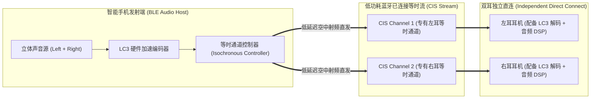

# 02 TWS 蓝牙耳机系统架构与 BLE Audio

## 1. 硬件解决什么问题：真无线双耳立体声的跨身体同步与音质突破

经典蓝牙音频（Classic Bluetooth A2DP）与 LE Audio 的区别，需要分开看编码、连接拓扑和播放缓冲：
1. **双耳连接**：部分 TWS 方案由主耳接收后向副耳转发，也有其他连接方式。转发会带来同步与功耗分配问题，具体代价取决于实现；
2. **端到端时延**：$150\text{ ms} \sim 250\text{ ms}$ 这类播放时延包含编码、传输和缓冲，不能全部归因于 SBC 算法；
3. **功耗**：射频活动时间、重传、解码和 DSP 处理共同影响续航，应在相同业务条件下比较。

蓝牙技术联盟（SIG）的 **LE Audio** 引入等时传输、多重流和 LC3 编码，为双耳同步与广播音频提供了标准化机制。

---

## 2. 硬件微架构与组成：BLE Audio 多重流（Multi-Stream）双耳架构

```mermaid
graph LR
    subgraph Smartphone_Host["智能手机发射端 (BLE Audio Host)"]
        MEDIA_STREAM["立体声音源 (Left + Right)"]
        LC3_ENC["LC3 硬件加速编码器"]
        ISO_CONTROLLER["等时通道控制器 (Isochronous Controller)"]
        MEDIA_STREAM --> LC3_ENC --> ISO_CONTROLLER
    end

    subgraph BLE_CIS["低功耗蓝牙已连接等时流 (CIS Stream)"]
        CIS_L["CIS Channel 1 (专有左耳等时通道)"]
        CIS_R["CIS Channel 2 (专有右耳等时通道)"]
    end

    subgraph TWS_Earphones["双耳独立直连 (Independent Direct Connect)"]
        LEFT_EAR["左耳耳机 (配备 LC3 解码 + 音频 DSP)"]
        RIGHT_EAR["右耳耳机 (配备 LC3 解码 + 音频 DSP)"]
    end

    ISO_CONTROLLER ==>|低延迟空中射频直发| CIS_L
    ISO_CONTROLLER ==>|低延迟空中射频直发| CIS_R
    CIS_L ==> LEFT_EAR
    CIS_R ==> RIGHT_EAR
```

### 传统经典蓝牙与 LE Audio 革命性升级对比

| 技术特性 | 传统经典蓝牙 (Classic Audio / A2DP) | 现代低功耗蓝牙音频 (BLE Audio / LE Audio) |
| :--- | :--- | :--- |
| **标准编解码器** | SBC，也可协商其他编码器 | **LC3 (Low Complexity Communication Codec)** |
| **码率比较** | 328 kbps (SBC) | **160 kbps (LC3)**；听感比较需固定音源与编码配置 |
| **双耳连接拓扑** | 可采用主耳转发或监听等实现 | **多重流（Multi-Stream）**可分别连接左右耳 |
| **端到端播放延迟**| 150ms ~ 250ms；取决于具体播放链路 | **20ms ~ 40ms**这类目标需在设备上测量 |
| **广播分享能力** | A2DP 面向连接传输 | **Auracast 广播音频**支持多个接收设备收听 |

---

## 3. 左右耳微秒级时间同步机理（Time Synchronization）

左右耳的播放时差会影响声像与相位关系。若设计采用 **$< 10\mu\text{s}$** 的同步目标，需要测量整个输出链路；$20\mu\text{s}$ 不能直接视为所有用户发生眩晕的固定阈值。
- **BLE Audio 解决方案**：空中数据包携带绝对的**时间戳（Presentation Time）**；
- 手机端蓝牙协议栈规定两路音频在未来某一个精确的微秒时刻 $T_{\text{present}}$ 统一发声；
- 左右耳机根据传输时基与约定的呈现时间安排播放，并处理本地时钟漂移；实际同步误差还包含解码、缓冲和 DAC 启动的差异。
