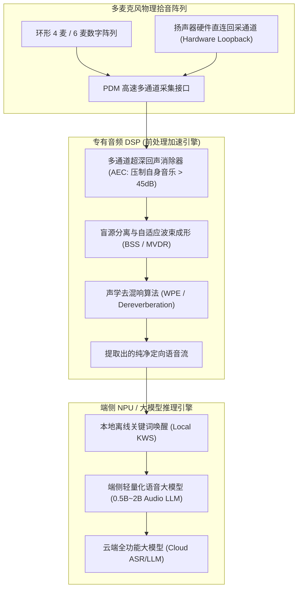

# 03 智能音箱远场拾音与端侧大模型

## 1. 硬件解决什么问题：在 5 米嘈杂客厅中听清主人微弱指令

智能音箱或语音助手面临最恶劣的声学拾音挑战：
1. **自身声学自激（Self-Sound Interference）**：音箱自己正在以 80dB SPL 的巨大音量播放摇滚乐，扬声器距离自带的麦克风仅有几厘米；
2. **远场微弱人声（Far-Field Attenuation）**：用户在 5 米开外的沙发上轻声说话，到达音箱麦克风处的声压级仅有 50dB SPL；
3. **房间复杂混响（Reverberation）**：声波在墙壁、地板之间经过数百次回弹反射。

此时自身播放的音乐强度是人声的 **1000 倍以上（信噪比 SNR 低至 -30dB）**！

---

## 2. 硬件微架构与组成：远场全双工声学交互拓扑

---

## 3. 全双工随时打断（Barge-in）的核心技术挑战

- 所谓 **Barge-in（随时打断）**，是指音箱正在滔滔不绝播报新闻时，用户可以随时随地插话打断它，音箱必须在 200ms 内灵敏中止播放并倾听新指令。
- **硬件核心要求**：扬声器回采参考信号的失真度 THD 必须 $< 0.01\%$。若功放产生削波非线性失真，AEC 的线性自适应滤波器将无法在数学上预测这些失真分量，导致回声无法扣干净，从而使得唤醒引擎把音箱自己的声音当做人声误唤醒。
