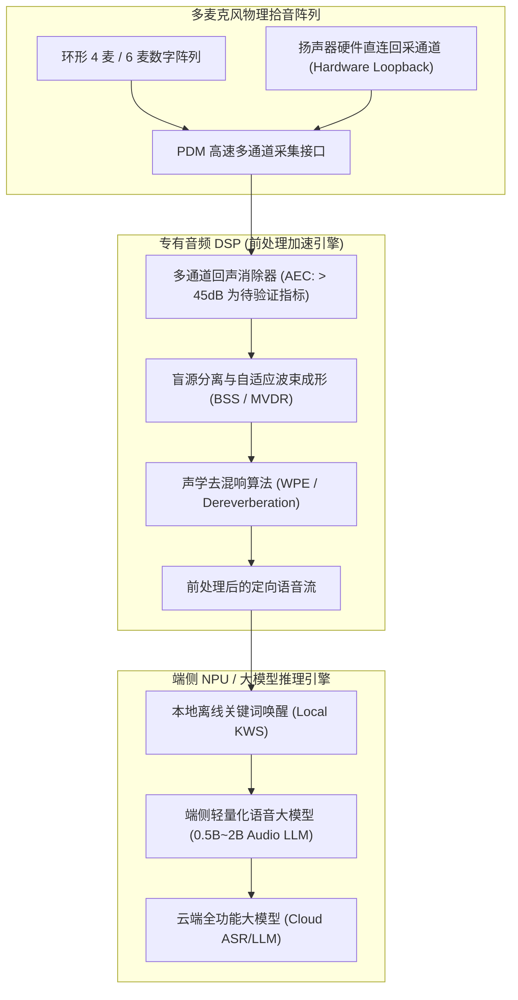

# 03 智能音箱远场拾音与端侧大模型

## 1. 硬件解决什么问题：在 5 米嘈杂客厅中听清主人微弱指令

智能音箱的远场拾音需要同时处理自身播放、距离衰减和房间混响。以下是一组用于说明问题的声学条件：
1. **自身声学自激（Self-Sound Interference）**：音箱自己正在以 80dB SPL 的巨大音量播放摇滚乐，扬声器距离自带的麦克风仅有几厘米；
2. **远场微弱人声（Far-Field Attenuation）**：用户在 5 米开外的沙发上轻声说话，到达音箱麦克风处的声压级仅有 50dB SPL；
3. **房间复杂混响（Reverberation）**：声波在墙壁、地板之间经过数百次回弹反射。

若在同一麦克风位置测得两者相差 30dB，功率比约为 **1000 倍（SNR 为 -30dB）**。不同位置测得的声压级不能直接用于计算麦克风处的信噪比。

---

## 2. 硬件微架构与组成：远场全双工声学交互拓扑

```mermaid
graph TD
    subgraph Acoustic_Hardware["多麦克风物理拾音阵列"]
        MIC_RING["环形 4 麦 / 6 麦数字阵列"] --> PDM_IF["PDM 高速多通道采集接口"]
        SPK_LOOPBACK["扬声器硬件直连回采通道 (Hardware Loopback)"] --> PDM_IF
    end

    subgraph Audio_DSP_Pipeline["专有音频 DSP (前处理加速引擎)"]
        PDM_IF --> MULTI_AEC["多通道回声消除器 (AEC: > 45dB 为待验证指标)"]
        MULTI_AEC --> BSS_BF["盲源分离与自适应波束成形 (BSS / MVDR)"]
        BSS_BF --> DEREVERB["声学去混响算法 (WPE / Dereverberation)"]
        DEREVERB --> CLEAN_OUT["前处理后的定向语音流"]
    end

    subgraph Edge_NPU_Engine["端侧 NPU / 大模型推理引擎"]
        CLEAN_OUT --> KWS_LOCAL["本地离线关键词唤醒 (Local KWS)"]
        KWS_LOCAL --> SLM["端侧轻量化语音大模型 (0.5B~2B Audio LLM)"]
        SLM --> CLOUD["云端全功能大模型 (Cloud ASR/LLM)"]
    end
```

---

## 3. 全双工随时打断（Barge-in）的核心技术挑战

- **Barge-in（语音打断）**指设备播报时检测用户插话，并停止旧回复、开始处理新指令。若响应目标为 200ms，需要分别预算检测窗口、控制排队和静音生效时间。
- **回声参考要求**：参考信号应尽量对应实际扬声器输出。若将 THD $< 0.01\%$ 作为设计目标，需要说明测量点与电平；功放削波等非线性会增加线性 AEC 的残余回声，是否影响唤醒还要通过回放和双讲测试判断。
