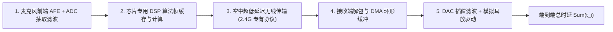

# 06 麦克风至扬声器全链路延迟预算推演

## 1. 硬件解决什么问题：端到端“麦克风入声到扬声器出声”微秒级精准预算

在专业无线麦克风、K 歌返听耳塞与游戏对讲系统中，声音从歌手口腔发出、被麦克风拾取，经过无线传输与处理，最终从耳塞播放出来的**麦克风至扬声器全链路延迟（Mic-to-SPK Latency）**是核心指标。

若延迟超过 $10\text{ ms}$，用户唱歌时就会产生明显的混响拖尾错觉，严重破坏音准。本节建立全链路纳秒级逐级预算模型。

---

## 2. 全链路逐级时延累加模型

### 全链路各级极限时延数据推演表

| 信号链路处理节点 | 产生延迟物理机理 | 标准消费级系统配置 | 专业级极低延迟系统配置 |
| :--- | :--- | :--- | :--- |
| **1. 麦克风 ADC 转换** | Sigma-Delta CIC 抽取滤波器群延迟 | $0.67\text{ ms}$ (48kHz) | **$0.08\text{ ms}$ (192kHz 超采样)** |
| **2. DSP 算法处理** | 算法处理窗长与计算耗时 | $5.33\text{ ms}$ (256点时域窗) | **$0.33\text{ ms}$ (16点超浅滤波)** |
| **3. 无线传输信道** | 蓝牙 LE Audio 等时时隙 | $15.00\text{ ms}$ | **$1.85\text{ ms}$ (专有 2.4G 双向私有协议)** |
| **4. 接收端缓冲** | 抵御空中丢包重传的安全缓冲 | $5.00\text{ ms}$ | **$0.67\text{ ms}$ (单帧缓冲)** |
| **5. DAC 数模转换** | 数字升采样插值滤波群延迟 | $0.67\text{ ms}$ | **$0.08\text{ ms}$ (192kHz 超采样)** |
| **6. 功放与声学换能** | 模拟输出与扬声器振膜响应 | $0.05\text{ ms}$ | **$0.05\text{ ms}$** |
| **端到端总时延汇总** | $\sum_{k=1}^6 t_k$ | **26.72 ms** (无法专业返听) | **3.06 ms (发烧级，彻底消除人耳感知)** |

---

## 3. 架构设计指导准则

推论：
想要将无线音频端到端总时延压进 **$5\text{ ms}$ 以内**，必须在系统全链路同时实行“极速四步法”：
1. **采样率提升至 96k 或 192k**（压缩 ADC/DAC 滤波器物理群延迟）；
2. **算法放弃大帧长频域变换，全面转向时域样本流自适应滤波**；
3. **废弃通用蓝牙协议栈，采用 2.4GHz 私有物理层等时帧（帧周期 $< 1.5\text{ ms}$）**；
4. **DMA 环形缓冲区压低至 16~32 样点**。
