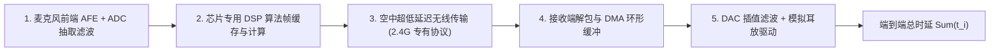

# 06 麦克风至扬声器全链路延迟预算推演

## 1. 硬件解决什么问题：端到端“麦克风入声到扬声器出声”微秒级精准预算

在专业无线麦克风、K 歌返听耳塞与游戏对讲系统中，声音从歌手口腔发出、被麦克风拾取，经过无线传输与处理，最终从耳塞播放出来的**麦克风至扬声器全链路延迟（Mic-to-SPK Latency）**是核心指标。

返听时延会影响演唱体验，$10\text{ ms}$ 可以作为待评估的产品目标，听感还取决于监听方式和使用者。本节按转换、算法、无线传输和缓冲逐项列预算。

---

## 2. 全链路逐级时延累加模型

```mermaid
graph LR
    P1["1. 麦克风前端 AFE + ADC 抽取滤波"] --> P2["2. 芯片专用 DSP 算法帧缓存与计算"]
    P2 --> P3["3. 空中超低延迟无线传输 (2.4G 专有协议)"]
    P3 --> P4["4. 接收端解包与 DMA 环形缓冲"]
    P4 --> P5["5. DAC 插值滤波 + 模拟耳放驱动"]
    P5 --> P6["端到端总时延 Sum(t_i)"]
```

### 全链路各级极限时延数据推演表

| 信号链路处理节点 | 产生延迟物理机理 | 标准消费级系统配置 | 专业级极低延迟系统配置 |
| :--- | :--- | :--- | :--- |
| **1. 麦克风 ADC 转换** | Sigma-Delta CIC 抽取滤波器群延迟 | $0.67\text{ ms}$ (48kHz) | **$0.08\text{ ms}$ (192kHz 超采样)** |
| **2. DSP 算法处理** | 算法处理窗长与计算耗时 | $5.33\text{ ms}$ (256点时域窗) | **$0.33\text{ ms}$ (16点超浅滤波)** |
| **3. 无线传输信道** | 蓝牙 LE Audio 等时时隙 | $15.00\text{ ms}$ | **$1.85\text{ ms}$ (专有 2.4G 双向私有协议)** |
| **4. 接收端缓冲** | 抵御空中丢包重传的安全缓冲 | $5.00\text{ ms}$ | **$0.67\text{ ms}$ (单帧缓冲)** |
| **5. DAC 数模转换** | 数字升采样插值滤波群延迟 | $0.67\text{ ms}$ | **$0.08\text{ ms}$ (192kHz 超采样)** |
| **6. 功放与声学换能** | 模拟输出与扬声器振膜响应 | $0.05\text{ ms}$ | **$0.05\text{ ms}$** |
| **端到端总时延汇总** | $\sum_{k=1}^6 t_k$ | **26.72 ms** | **3.06 ms**；实际总时延与听感需测量 |

---

## 3. 架构设计指导准则

若目标为 **$5\text{ ms}$ 以内**，可以按预算检查以下几项，而不是直接套用一种固定配置：
1. 评估 **96k 或 192k** 采样率下目标 ADC/DAC 的滤波延迟，同时考虑带宽与功耗；
2. 比较算法的窗长、块长和计算时间，判断小块时域处理是否满足功能要求；
3. 检查无线协议的实际传输与重传时延；若考虑 2.4GHz 私有协议和 $< 1.5\text{ ms}$ 帧周期，还要验证抗干扰和法规要求；
4. 评估 **16~32 样点** DMA 缓冲能否承受调度抖动，并保留欠载统计。
