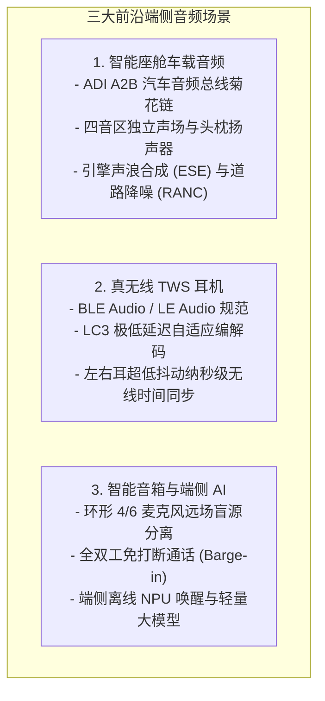

# 11 端侧、车载与可穿戴系统

## 模块导读与原厂定位

随着芯片半导体与无线通信技术的演进，音频系统早已超越了传统单机录放音范畴，向**车规智能座舱、超低功耗真无线耳机（TWS）与端侧大模型智能音箱**三大垂直前沿场景深度裂变。

每个垂直场景都诞生了专属的总线协议、网络拓扑与芯片协同形态：
- 车载座舱采用一条非屏蔽双绞线（UTP）即可串联全车麦克风与功放的 **ADI A2B 总线**；
- 个人穿戴基于下一代 **BLE Audio（低功耗蓝牙音频）与 LC3 极速编解码**；
- 智能音箱则融合了**端侧多麦远场波束拾音与轻量化 NPU 离线大模型协同**。

---

## 模块文章索引

1. [智能座舱 A2B 汽车音频总线](01-automotive-audio-a2b-bus.md)：ADI A2B 菊花链拓扑、单非屏蔽双绞线（UTP）同时传输 32 声道音频与幻象供电（PoDL）
2. [TWS 蓝牙耳机系统架构与 BLE Audio](02-tws-bluetooth-audio-le.md)：蓝牙 LE Audio、多重流音频（Multi-Stream）、LC3 编解码器与左右耳无线时钟对齐
3. [智能音箱远场拾音与端侧大模型](03-smart-speaker-farfield-kws.md)：远场麦克风阵列空间几何、全双工打断（Barge-in）与端侧 DSP/NPU 异构分工
4. [嵌入式音频系统选型设计准则](04-embedded-audio-systems-guide.md)：不同物理场景下音频主控、Codec、总线拓扑与延迟/功耗综合权衡选型规范
5. [车载 A2B 掉线与 TWS 丢包案例](05-cases-debug.md)：实战案例：汽车启动大电流导致 A2B 从节点掉线排查与 2.4GHz 人体遮挡蓝牙丢包卡顿优化
6. [麦克风至扬声器全链路延迟预算推演](06-engineering-analysis.md)：端到端低延迟系统从声学拾取到无线传输、算法处理与空气发声的全链路纳秒级预算模型
