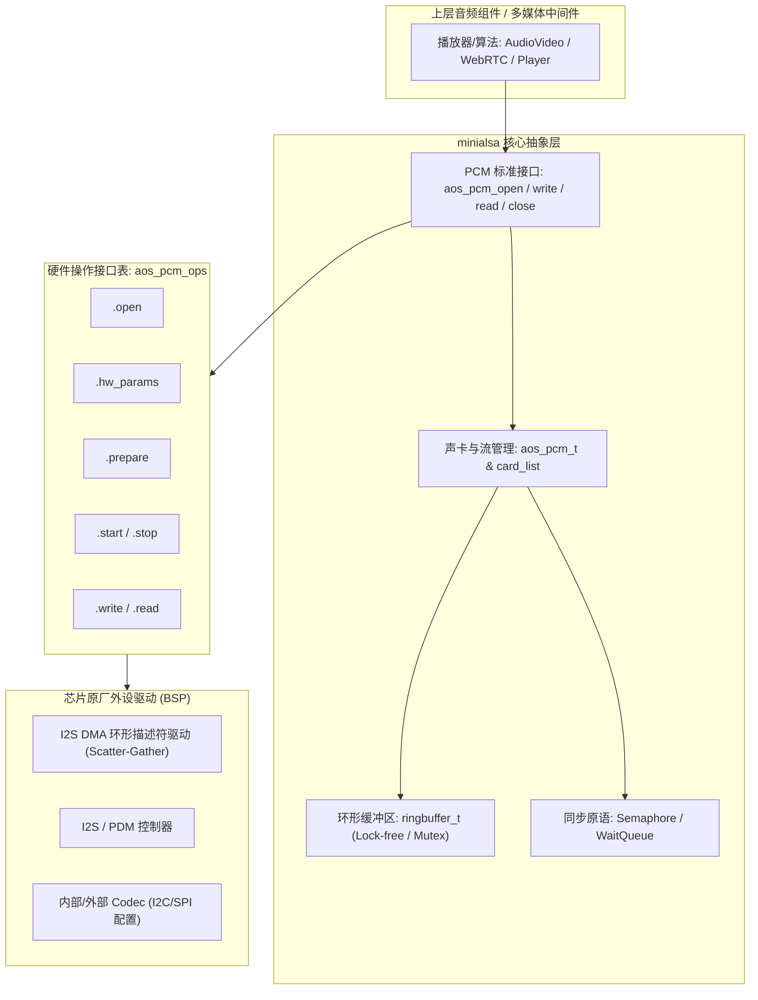
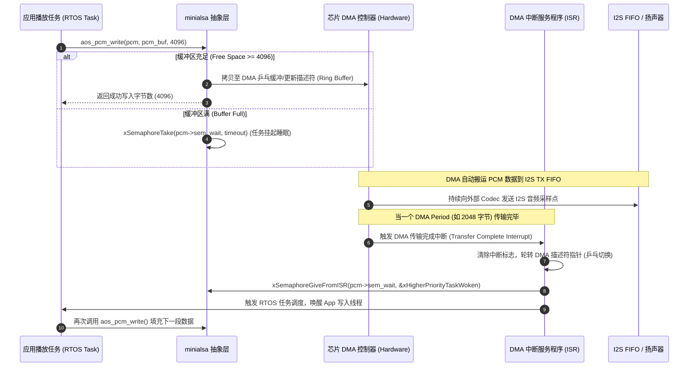

# 01 minialsa 架构与轻量级 PCM 抽象

## 1. 为什么需要 minialsa：嵌入式 RTOS 的音频驱动困境

在 Linux 平台中，ALSA (`libasound`) 与 ASoC 提供了完备的音频子系统抽象，但其代价是极其庞大的内核与用户态代码量（动辄数万行、数百 KB 内存占用），且深度依赖 POSIX 文件描述符 (`/dev/snd/pcmC*D*p`)、动态链接库与 VFS 虚拟文件系统。

在基于 **FreeRTOS / RT-Thread / 裸机** 的嵌入式 AIoT 芯片（如 RISC-V、Cortex-M）中，系统的 RAM 通常在几百 KB 级别，Flash 在几 MB 级别。如果直接移植 Linux ALSA 既不现实也没必要；而若直接暴露芯片原厂裸机 I2S/DMA 寄存器或简单的驱动函数（如 `hal_i2s_write()`），则会导致上层多媒体播放器、算法库（AEC/EQ）与底层硬件紧密耦合，无法实现跨芯片平台复用。

**minialsa（轻量级 ALSA）应运而生**。它的核心使命是：
* **API 标准化**：向上提供极度精简、但在语义上与 Linux ALSA/TinyALSA 完全对齐的标准 PCM 接口（`aos_pcm_open`, `aos_pcm_write`, `aos_pcm_read`, `aos_pcm_close`）。
* **轻量级实现**：核心代码与数据结构控制在 **10KB 以内**，无需依赖 POSIX 文件系统。
* **硬件抽象与隔离**：通过函数指针虚表（`struct aos_pcm_ops`）解耦上层应用与底层硬件 I2S/DMA 控制器。
* **确定性实时性与同步**：基于 RTOS 二值信号量（Binary Semaphore）或事件标志组（Event Group）实现高效的阻塞/非阻塞 PCM 投递，无缝桥接软件线程与硬件 DMA 环形中断。

---

## 2. 软件微架构与核心数据流



---

## 3. 核心数据结构与可见接口

minialsa 通过清晰的数据结构定义了音频硬件的物理参数、流向与驱动操作集。

### 3.1 核心句柄与配置结构体

```c
/* 音频传输方向 */
typedef enum {
    AOS_PCM_STREAM_PLAYBACK = 0,
    AOS_PCM_STREAM_CAPTURE  = 1,
} aos_pcm_stream_t;

/* PCM 硬件参数配置 */
typedef struct {
    uint32_t rate;          /* 采样率: 8000, 16000, 44100, 48000 Hz */
    uint16_t channels;      /* 声道数: 1 (Mono), 2 (Stereo) */
    uint16_t format;        /* 位深: 16-bit, 24-bit, 32-bit PCM */
    uint32_t period_size;   /* 单个周期帧数 (Frames per Period) */
    uint32_t period_count;  /* 周期个数 (通常 2 ~ 4，构成双缓冲或多缓冲) */
} aos_pcm_hw_params_t;

/* PCM 操作接口抽象表 (类似 Linux ASoC platform/dai driver) */
struct aos_pcm_ops {
    int (*open)(aos_pcm_t *pcm);
    int (*close)(aos_pcm_t *pcm);
    int (*hw_params)(aos_pcm_t *pcm, aos_pcm_hw_params_t *params);
    int (*prepare)(aos_pcm_t *pcm);
    int (*start)(aos_pcm_t *pcm);
    int (*stop)(aos_pcm_t *pcm);
    int (*drain)(aos_pcm_t *pcm);
    int (*pause)(aos_pcm_t *pcm, int enable);
    int (*write)(aos_pcm_t *pcm, const void *buf, size_t size);
    int (*read)(aos_pcm_t *pcm, void *buf, size_t size);
};

/* PCM 实例化句柄 */
struct aos_pcm {
    char                name[16];        /* 设备名称: "pcmC0D0p", "default" */
    aos_pcm_stream_t    stream;          /* 播放还是录音 */
    int                 mode;            /* 阻塞模式 (0) 或 非阻塞模式 (NONBLOCK) */
    aos_pcm_hw_params_t hw_params;       /* 当前生效的硬件参数 */
    struct aos_pcm_ops *ops;             /* 绑定的硬件操作接口表 */
    void               *private_data;    /* 指向底层 I2S/DMA 驱动私有句柄 */
    ringbuffer_t        ring_buf;        /* 环形缓冲区 (可选软件平滑缓冲) */
    void               *sem_wait;        /* RTOS 唤醒二值信号量 */
    volatile int        state;           /* PCM 状态: STOP, RUNNING, XRUN, PAUSE */
};
```

---

## 4. 四流全链路分析：PCM Playback 写入与 DMA 消费

以下时序展示了从上层应用调用 `aos_pcm_write` 到硬件扬声器发声的控制流、数据流与事件唤醒流：



---

## 5. 软硬件设计约束：零拷贝与实时同步

### 5.1 零拷贝（Zero-Copy）优化机制
在低算力 MCU（如主频 160MHz~320MHz 的 RISC-V）上，`memcpy` 会消耗宝贵的 CPU 周期与总线带宽。
* **传统拷贝模式**：`App Buffer` $\xrightarrow{\text{memcpy}}$ `minialsa RingBuffer` $\xrightarrow{\text{memcpy}}$ `DMA Buffer`。
* **零拷贝 Direct MMAP 模式**：
  minialsa 借鉴 ALSA MMAP 思维，允许应用通过 `aos_pcm_mmap_begin` 直接获取底层 DMA 正在空闲的物理缓冲指针，音频解码器直接把 PCM 解码写入该内存，最后调用 `aos_pcm_mmap_commit` 提交。全程 **0 次内存拷贝**。

### 5.2 确定性中断与欠载保护（Underrun 防护）
* 当 CPU 被 WiFi 协议栈高优先级任务中断占用，应用写入线程无法及时唤醒时，DMA 缓冲区将被耗尽（Underrun / XRUN）。
* 在 minialsa 中，若 DMA 发生欠载，ISR 不应直接停止硬件，而应将 DMA 源地址临时指向预先准备好的 **静音缓冲区（Mute / Zero Buffer）**，避免 I2S 总线由于断钟或输出浮空产生剧烈的直流偏置“POP”爆音。

---

## 6. 现场排错与调试清单

| 故障现象 | 调试手段与观察点 | 根因与定位分析 | 规避与修复方案 |
| :--- | :--- | :--- | :--- |
| **音频频繁断音、咔哒声 (XRUN)** | 打印 DMA ISR 触发频率与应用写入时间间隔；检查 CPU 占用率 | 上层应用解码线程优先级低于 WiFi/BLE 协议栈，导致投喂不及时 | 提升音频线程优先级，确保其高于网络任务；将 Period Count 从 2 增至 4 |
| **系统偶发崩溃，HardFault / LoadAccessFault** | GDB 查看 PC 指针与崩溃栈，检查调用 `aos_pcm_write` 的缓冲区地址 | DMA 硬件要求地址 4 字节/8 字节对齐，上层传入了奇数地址（未对齐内存） | 在 minialsa 入口处增加内存对齐断言与自动对齐兜底缓冲 |
| **播放结束时最后一段尾音被吞掉** | 示波器抓取 I2S 时序，对比音频文件长度与实际播放时长 | 应用在写入最后一段数据后立即调用 `aos_pcm_close`，硬件 DMA 尚未播完即被强行复位 | 在 `close` 前必须调用 `aos_pcm_drain`，等待底层硬件将 FIFO 数据全部吐出 |
| **多线程写声卡导致死锁或杂音** | 查看 RTOS 任务死锁栈，抓取声卡输出 PCM 数据发现左右声道交错 | 多个线程并发调用同一 PCM 句柄的写入接口，破坏了环形缓冲索引 | minialsa 驱动层必须对同一句柄增加互斥锁（Mutex），或在应用层引入 Mixer 混音器 |

---

## 7. 实验与代码验证：轻量级 minialsa 实现核心骨架

以下为解释 RTOS PCM 抽象的教学骨架，不是经过本仓库验证的量产实现；同步、缓存一致性、错误路径与目标 ABI 需要单独补齐和测试：

```c
#include <stdint.h>
#include <stdbool.h>
#include "FreeRTOS.h"
#include "semphr.h"

/* 状态定义 */
#define PCM_STATE_IDLE     0
#define PCM_STATE_RUNNING  1
#define PCM_STATE_PAUSED   2

int aos_pcm_open(aos_pcm_t **pcm_handle, const char *name,
                 aos_pcm_stream_t stream, int mode)
{
    aos_pcm_t *pcm = (aos_pcm_t *)pvPortMalloc(sizeof(aos_pcm_t));
    if (!pcm) return -1;

    memset(pcm, 0, sizeof(aos_pcm_t));
    strncpy(pcm->name, name, sizeof(pcm->name) - 1);
    pcm->stream = stream;
    pcm->mode = mode;
    pcm->state = PCM_STATE_IDLE;

    /* 创建唤醒信号量 (初始为 1) */
    pcm->sem_wait = xSemaphoreCreateBinary();
    xSemaphoreGive(pcm->sem_wait);

    /* 绑定硬件操作集 (根据设备名绑定对应的芯片 BSP 驱动) */
    pcm->ops = hal_get_i2s_pcm_ops();
    if (pcm->ops && pcm->ops->open) {
        pcm->ops->open(pcm);
    }

    *pcm_handle = pcm;
    return 0;
}

int aos_pcm_write(aos_pcm_t *pcm, const void *buf, size_t size)
{
    if (!pcm || !buf || size == 0) return -1;

    size_t written = 0;
    while (written < size) {
        /* 调用底层硬件驱动写入接口 */
        int ret = pcm->ops->write(pcm, (uint8_t *)buf + written, size - written);
        if (ret > 0) {
            written += ret;
            if (pcm->state != PCM_STATE_RUNNING) {
                pcm->ops->start(pcm);
                pcm->state = PCM_STATE_RUNNING;
            }
        } else if (ret == 0) {
            /* 硬件缓冲区满 */
            if (pcm->mode == 1 /* NONBLOCK */) {
                return written > 0 ? written : -11; /* EAGAIN */
            }
            /* 阻塞等待 DMA ISR 唤醒，超时时间设为 100ms */
            if (xSemaphoreTake(pcm->sem_wait, pdMS_TO_TICKS(100)) != pdTRUE) {
                /* 超时严重错误：DMA 停止工作或时钟丢失 */
                return -1;
            }
        } else {
            return ret; /* 硬件错误 */
        }
    }
    return written;
}

/* 芯片外设 DMA 中断服务程序 (ISR) 回调 */
void hal_i2s_dma_irq_handler(void *arg)
{
    aos_pcm_t *pcm = (aos_pcm_t *)arg;
    BaseType_t xHigherPriorityTaskWoken = pdFALSE;

    /* 唤醒阻塞在 write 的音频任务 */
    if (pcm && pcm->sem_wait) {
        xSemaphoreGiveFromISR(pcm->sem_wait, &xHigherPriorityTaskWoken);
        portYIELD_FROM_ISR(xHigherPriorityTaskWoken);
    }
}
```
