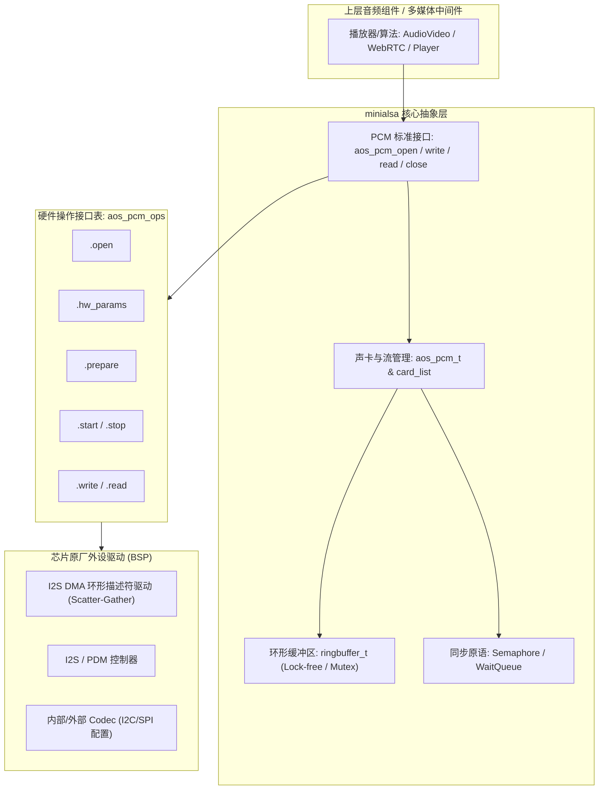
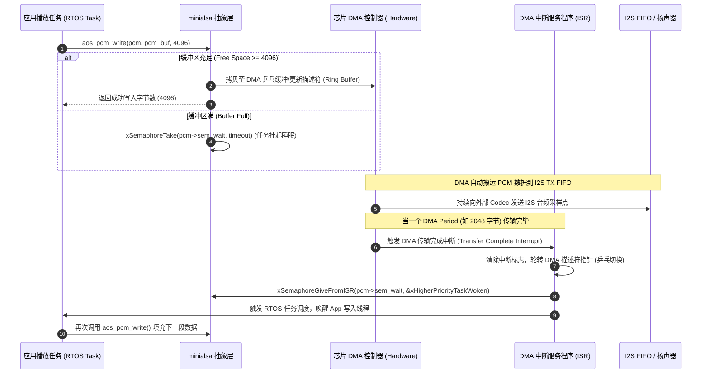

# 01 minialsa 架构与轻量级 PCM 抽象

## 1. 为什么需要 minialsa：嵌入式 RTOS 的音频驱动困境

Linux 的 ALSA 和 ASoC 提供设备、PCM 流和板级音频连接等抽象，应用可通过 `libasound` 和 `/dev/snd/pcmC*D*p` 访问设备。这套接口依赖 Linux 的内核与用户态环境，移植到 MCU 时需要重新评估依赖和资源开销。

在运行 **FreeRTOS / RT-Thread / 裸机** 的 RISC-V 或 Cortex-M 系统中，RAM 可能只有几百 KB，Flash 为几 MB。应用若直接调用特定芯片的 I2S/DMA 接口，如 `hal_i2s_write()`，跨平台时就需要处理这些接口差异。可以用一层较小的 PCM 抽象集中管理参数、状态和缓冲。

本文用 **minialsa** 这一 ALSA-like 抽象说明 RTOS PCM 层的设计，关注以下接口与约束：
* **PCM 接口**：提供 `aos_pcm_open`、`aos_pcm_write`、`aos_pcm_read` 和 `aos_pcm_close`；与 ALSA/TinyALSA 的状态、返回值和单位是否一致，要逐项定义。
* **实现体积**：若目标为核心代码与数据结构 **10KB 以内**，需要明确编译配置和统计范围；接口本身可以不依赖 POSIX 文件系统。
* **硬件抽象与隔离**：通过函数指针虚表（`struct aos_pcm_ops`）解耦上层应用与底层硬件 I2S/DMA 控制器。
* **同步**：通过 RTOS 信号量或事件传递 DMA 完成通知，支持阻塞与非阻塞读写；能否满足实时期限，还取决于任务调度和缓冲配置。

---

## 2. 软件微架构与核心数据流


```mermaid
graph TD
    subgraph UpperLayer[上层音频组件 / 多媒体中间件]
        App[播放器/算法: AudioVideo / WebRTC / Player]
    end

    subgraph minialsa[minialsa 核心抽象层]
        API[PCM 标准接口: aos_pcm_open / write / read / close]
        DevMgr[声卡与流管理: aos_pcm_t & card_list]
        RingBuf["环形缓冲区: ringbuffer_t (Lock-free / Mutex)"]
        Sync[同步原语: Semaphore / WaitQueue]
    end

    subgraph HALOps[硬件操作接口表: aos_pcm_ops]
        Ops1[.open]
        Ops2[.hw_params]
        Ops3[.prepare]
        Ops4[.start / .stop]
        Ops5[.write / .read]
    end

    subgraph ChipDriver["芯片原厂外设驱动 (BSP)"]
        DMA_Drv["I2S DMA 环形描述符驱动 (Scatter-Gather)"]
        I2S_Ctrl[I2S / PDM 控制器]
        Codec_Ctrl["内部/外部 Codec (I2C/SPI 配置)"]
    end

    App --> API
    API --> DevMgr
    DevMgr --> RingBuf
    DevMgr --> Sync
    API --> HALOps
    HALOps --> ChipDriver
```

---

## 3. 核心数据结构与可见接口

minialsa 通过清晰的数据结构定义了音频硬件的物理参数、流向与驱动操作集。

### 3.1 核心句柄与配置结构体

```c
/* 音频传输方向 */
typedef enum {
    AOS_PCM_STREAM_PLAYBACK = 0,
    AOS_PCM_STREAM_CAPTURE  = 1,
} aos_pcm_stream_t;

/* PCM 硬件参数配置 */
typedef struct {
    uint32_t rate;          /* 采样率: 8000, 16000, 44100, 48000 Hz */
    uint16_t channels;      /* 声道数: 1 (Mono), 2 (Stereo) */
    uint16_t format;        /* 位深: 16-bit, 24-bit, 32-bit PCM */
    uint32_t period_size;   /* 单个周期帧数 (Frames per Period) */
    uint32_t period_count;  /* 周期个数 (通常 2 ~ 4，构成双缓冲或多缓冲) */
} aos_pcm_hw_params_t;

/* PCM 操作接口抽象表 (类似 Linux ASoC platform/dai driver) */
struct aos_pcm_ops {
    int (*open)(aos_pcm_t *pcm);
    int (*close)(aos_pcm_t *pcm);
    int (*hw_params)(aos_pcm_t *pcm, aos_pcm_hw_params_t *params);
    int (*prepare)(aos_pcm_t *pcm);
    int (*start)(aos_pcm_t *pcm);
    int (*stop)(aos_pcm_t *pcm);
    int (*drain)(aos_pcm_t *pcm);
    int (*pause)(aos_pcm_t *pcm, int enable);
    int (*write)(aos_pcm_t *pcm, const void *buf, size_t size);
    int (*read)(aos_pcm_t *pcm, void *buf, size_t size);
};

/* PCM 实例化句柄 */
struct aos_pcm {
    char                name[16];        /* 设备名称: "pcmC0D0p", "default" */
    aos_pcm_stream_t    stream;          /* 播放还是录音 */
    int                 mode;            /* 阻塞模式 (0) 或 非阻塞模式 (NONBLOCK) */
    aos_pcm_hw_params_t hw_params;       /* 当前生效的硬件参数 */
    struct aos_pcm_ops *ops;             /* 绑定的硬件操作接口表 */
    void               *private_data;    /* 指向底层 I2S/DMA 驱动私有句柄 */
    ringbuffer_t        ring_buf;        /* 环形缓冲区 (可选软件平滑缓冲) */
    void               *sem_wait;        /* RTOS 唤醒二值信号量 */
    volatile int        state;           /* PCM 状态: STOP, RUNNING, XRUN, PAUSE */
};
```

---

## 4. 四流全链路分析：PCM Playback 写入与 DMA 消费

以下时序展示了从上层应用调用 `aos_pcm_write` 到硬件扬声器发声的控制流、数据流与事件唤醒流：


```mermaid
sequenceDiagram
    autonumber
    participant App as 应用播放任务 (RTOS Task)
    participant MiniALSA as minialsa 抽象层
    participant DMA as 芯片 DMA 控制器 (Hardware)
    participant ISR as DMA 中断服务程序 (ISR)
    participant Speaker as I2S FIFO / 扬声器

    App->>MiniALSA: aos_pcm_write(pcm, pcm_buf, 4096)
    alt 缓冲区充足 (Free Space >= 4096)
        MiniALSA->>DMA: 拷贝至 DMA 乒乓缓冲/更新描述符 (Ring Buffer)
        MiniALSA-->>App: 返回成功写入字节数 (4096)
    else 缓冲区满 (Buffer Full)
        MiniALSA->>MiniALSA: xSemaphoreTake(pcm->sem_wait, timeout) (任务挂起睡眠)
    end

    Note over DMA,Speaker: DMA 自动搬运 PCM 数据到 I2S TX FIFO
    DMA->>Speaker: 持续向外部 Codec 发送 I2S 音频采样点

    Note over DMA,ISR: 当一个 DMA Period (如 2048 字节) 传输完毕
    DMA->>ISR: 触发 DMA 传输完成中断 (Transfer Complete Interrupt)
    ISR->>ISR: 清除中断标志，轮转 DMA 描述符指针 (乒乓切换)
    ISR->>MiniALSA: xSemaphoreGiveFromISR(pcm->sem_wait, &xHigherPriorityTaskWoken)
    ISR->>App: 触发 RTOS 任务调度，唤醒 App 写入线程
    App->>MiniALSA: 再次调用 aos_pcm_write() 填充下一段数据
```

---

## 5. 软硬件设计约束：零拷贝与实时同步

### 5.1 零拷贝（Zero-Copy）优化机制
在主频 160MHz~320MHz 的 MCU 上，可以测量 `memcpy` 占用，判断重复拷贝是否值得优化。
* **传统拷贝模式**：`App Buffer` $\xrightarrow{\text{memcpy}}$ `minialsa RingBuffer` $\xrightarrow{\text{memcpy}}$ `DMA Buffer`。
* **零拷贝 Direct MMAP 模式**：
  可以借鉴 ALSA MMAP 的接口方式，由 `aos_pcm_mmap_begin` 返回可写区域，解码器直接输出 PCM，再用 `aos_pcm_mmap_commit` 提交。这条路径以 **0 次额外 PCM 拷贝**为目标，但要明确区域所有权、对齐、缓存同步和取消时的生命周期。

### 5.2 确定性中断与欠载保护（Underrun 防护）
* 当 CPU 被 WiFi 协议栈高优先级任务中断占用，应用写入线程无法及时唤醒时，DMA 缓冲区将被耗尽（Underrun / XRUN）。
* 欠载时可以考虑切换到预先准备的静音缓冲区，或执行目标 Codec 支持的 mute/stop 流程。哪种方式安全，取决于 DMA 更新时机、时钟要求和模拟输出状态，应结合波形验证。

---

## 6. 现场排错与调试清单

| 故障现象 | 调试手段与观察点 | 根因与定位分析 | 规避与修复方案 |
| :--- | :--- | :--- | :--- |
| **音频频繁断音、咔哒声 (XRUN)** | 打印 DMA ISR 触发频率与应用写入时间间隔；检查 CPU 占用率 | 上层应用解码线程优先级低于 WiFi/BLE 协议栈，导致投喂不及时 | 提升音频线程优先级，确保其高于网络任务；将 Period Count 从 2 增至 4 |
| **系统偶发崩溃，HardFault / LoadAccessFault** | GDB 查看 PC 指针与崩溃栈，检查调用 `aos_pcm_write` 的缓冲区地址 | DMA 硬件要求地址 4 字节/8 字节对齐，上层传入了奇数地址（未对齐内存） | 在 minialsa 入口处增加内存对齐断言与自动对齐兜底缓冲 |
| **播放结束时最后一段尾音被吞掉** | 示波器抓取 I2S 时序，对比音频文件长度与实际播放时长 | 应用在写入最后一段数据后立即调用 `aos_pcm_close`，硬件 DMA 尚未播完即被强行复位 | 在 `close` 前必须调用 `aos_pcm_drain`，等待底层硬件将 FIFO 数据全部吐出 |
| **多线程写声卡导致死锁或杂音** | 查看 RTOS 任务死锁栈，抓取声卡输出 PCM 数据发现左右声道交错 | 多个线程并发调用同一 PCM 句柄的写入接口，破坏了环形缓冲索引 | minialsa 驱动层必须对同一句柄增加互斥锁（Mutex），或在应用层引入 Mixer 混音器 |

---

## 7. 实验与代码验证：轻量级 minialsa 实现核心骨架

以下为解释 RTOS PCM 抽象的教学骨架，不是经过本仓库验证的量产实现；同步、缓存一致性、错误路径与目标 ABI 需要单独补齐和测试：

```c
#include <stdint.h>
#include <stdbool.h>
#include "FreeRTOS.h"
#include "semphr.h"

/* 状态定义 */
#define PCM_STATE_IDLE     0
#define PCM_STATE_RUNNING  1
#define PCM_STATE_PAUSED   2

int aos_pcm_open(aos_pcm_t **pcm_handle, const char *name,
                 aos_pcm_stream_t stream, int mode)
{
    aos_pcm_t *pcm = (aos_pcm_t *)pvPortMalloc(sizeof(aos_pcm_t));
    if (!pcm) return -1;

    memset(pcm, 0, sizeof(aos_pcm_t));
    strncpy(pcm->name, name, sizeof(pcm->name) - 1);
    pcm->stream = stream;
    pcm->mode = mode;
    pcm->state = PCM_STATE_IDLE;

    /* 创建唤醒信号量 (初始为 1) */
    pcm->sem_wait = xSemaphoreCreateBinary();
    xSemaphoreGive(pcm->sem_wait);

    /* 绑定硬件操作集 (根据设备名绑定对应的芯片 BSP 驱动) */
    pcm->ops = hal_get_i2s_pcm_ops();
    if (pcm->ops && pcm->ops->open) {
        pcm->ops->open(pcm);
    }

    *pcm_handle = pcm;
    return 0;
}

int aos_pcm_write(aos_pcm_t *pcm, const void *buf, size_t size)
{
    if (!pcm || !buf || size == 0) return -1;

    size_t written = 0;
    while (written < size) {
        /* 调用底层硬件驱动写入接口 */
        int ret = pcm->ops->write(pcm, (uint8_t *)buf + written, size - written);
        if (ret > 0) {
            written += ret;
            if (pcm->state != PCM_STATE_RUNNING) {
                pcm->ops->start(pcm);
                pcm->state = PCM_STATE_RUNNING;
            }
        } else if (ret == 0) {
            /* 硬件缓冲区满 */
            if (pcm->mode == 1 /* NONBLOCK */) {
                return written > 0 ? written : -11; /* EAGAIN */
            }
            /* 阻塞等待 DMA ISR 唤醒，超时时间设为 100ms */
            if (xSemaphoreTake(pcm->sem_wait, pdMS_TO_TICKS(100)) != pdTRUE) {
                /* 超时严重错误：DMA 停止工作或时钟丢失 */
                return -1;
            }
        } else {
            return ret; /* 硬件错误 */
        }
    }
    return written;
}

/* 芯片外设 DMA 中断服务程序 (ISR) 回调 */
void hal_i2s_dma_irq_handler(void *arg)
{
    aos_pcm_t *pcm = (aos_pcm_t *)arg;
    BaseType_t xHigherPriorityTaskWoken = pdFALSE;

    /* 唤醒阻塞在 write 的音频任务 */
    if (pcm && pcm->sem_wait) {
        xSemaphoreGiveFromISR(pcm->sem_wait, &xHigherPriorityTaskWoken);
        portYIELD_FROM_ISR(xHigherPriorityTaskWoken);
    }
}
```
