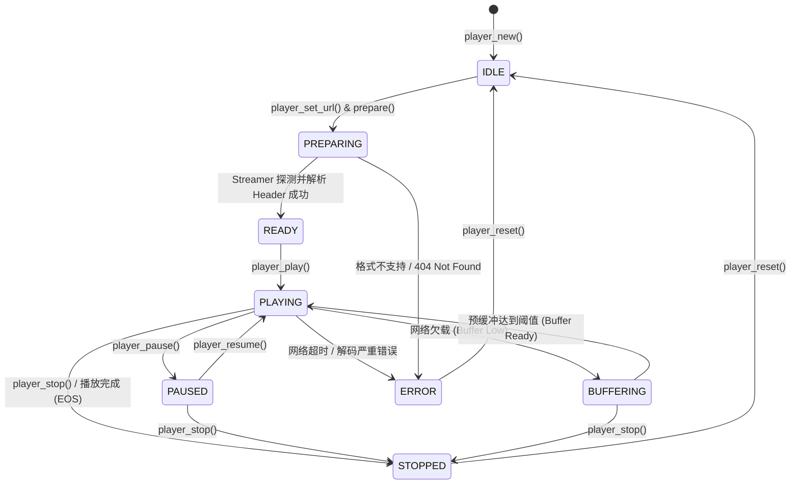
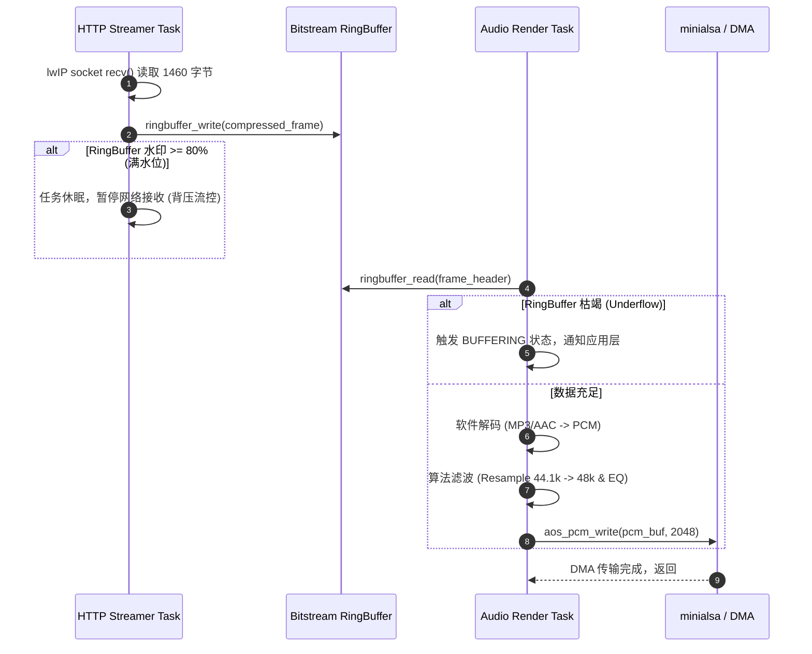

# 02 嵌入式多媒体播放器 Pipeline 架构

## 1. 为什么需要多媒体 Pipeline：解耦异构处理与网络时序

在智能家居音箱、网络收音机、智能门锁与 AIoT 设备中，播放音频绝非简单地“读取文件并写给 I2S”。一个工业级的音频播放任务往往面临以下异构复杂性：
1. **多源输入时钟与网络抖动**：输入流可能来自本地 Flash/SD 卡（微秒级高吞吐），也可能来自极不稳定的 HTTP/HTTPS、HLS 甚至 WebSocket 流（几十到数百毫秒的网络抖动与断流）。
2. **多格式动态编解码**：输入格式可能是 MP3、AAC、Opus、OGG 或高保真 FLAC，且封装可能是裸流（ADTS）、TS 容器或 MP4 容器，需要按需插拔不同的解封装与解码模块。
3. **音效后处理流水化**：源音频采样率（如 22.05kHz 或 44.1kHz）往往与硬件 Codec 固定的 48kHz 不匹配，需要经过重采样（Resample）；同时还需经过 10 段 EQ 均衡器、软音量增益调节。
4. **实时硬件渲染与时延约束**：底层 DMA 要求恒定、无抖动的数据投喂，任何环节的卡顿都将导致扬声器爆音。

因此，基于 **Pipeline（流水线）模式** 的多媒体框架（如芯片原厂 `AudioVideo` 框架、MSP 多媒体服务平台）成为芯片原厂的核心中枢。它通过模块化插件（Element）、环形缓冲管道（Pipeline Buffer）与统一控制状态机，实现了系统的高内聚与低耦合。

---

## 2. 软件微架构与 Pipeline 拓扑

```mermaid
graph LR
    subgraph Streamer[1. Streamer 数据源输入]
        S1[HTTP / HTTPS Client]
        S2[Local POSIX File]
        S3[WebSocket Stream]
    end

    subgraph Demuxer[2. Demuxer 解封装引擎]
        D1[MP4 / M4A Box Parser]
        D2[MPEG-TS Parser]
        D3[Raw Bitstream Pass]
    end

    subgraph Decoder[3. Decoder 解码引擎]
        DEC1[MP3 Helix / libmad]
        DEC2[AAC fdk-aac]
        DEC3[Opus libopus]
    end

    subgraph Filter[4. Audio Filter 音效处理]
        F1[Resample 重采样 44.1k->48k]
        F2[10-Band IIR EQ 均衡器]
        F3[Soft Volume 软件增益]
    end

    subgraph Sink[5. Audio Sink 硬件渲染]
        SK1[minialsa / I2S DMA]
    end

    Streamer -->|RingBuffer 1: ES/Raw Data| Demuxer
    Demuxer -->|RingBuffer 2: Compressed Frames| Decoder
    Decoder -->|RingBuffer 3: Raw PCM| Filter
    Filter -->|RingBuffer 4: Normalized PCM| Sink
```



---

## 3. 核心数据结构与可见接口

### 3.1 核心 Element（插件）抽象

```c
typedef enum {
    ELEMENT_TYPE_STREAMER = 0,
    ELEMENT_TYPE_DEMUXER,
    ELEMENT_TYPE_DECODER,
    ELEMENT_TYPE_FILTER,
    ELEMENT_TYPE_SINK,
} element_type_t;

/* Element 抽象虚表 */
typedef struct media_element {
    const char           *name;
    element_type_t        type;
    ringbuffer_t         *in_buf;       /* 上游输入环形缓冲区 */
    ringbuffer_t         *out_buf;      /* 下游输出环形缓冲区 */
    void                 *priv_data;    /* 模块内部私有数据 */

    int (*init)(struct media_element *elem);
    int (*start)(struct media_element *elem);
    int (*process)(struct media_element *elem); /* 核心流处理函数 */
    int (*pause)(struct media_element *elem);
    int (*stop)(struct media_element *elem);
    int (*destroy)(struct media_element *elem);
} media_element_t;
```

### 3.2 播放器整体状态机（Player State Machine）



---

## 4. 四流全链路分析：多线程协同与缓冲流控

为了平衡网络延迟与音频实时性，工业级嵌入式播放器通常采用 **双任务（Dual-Task）解耦架构**：

1. **IO/Demux 任务（优先级中）**：负责网络 HTTP 接收、TLS 解密、解封装，将压缩音频帧填充到 `Bitstream RingBuffer`。
2. **Audio Decode/Render 任务（优先级极高）**：负责从 `Bitstream RingBuffer` 获取数据，执行软件解码、滤波，并通过 `minialsa` 输出给硬件 DMA。



---

## 5. 软硬件设计约束：嵌入式播放器的关键权衡

### 5.1 环形缓冲区流控与背压机制（Back-pressure）
* **下溢（Underflow）**：网络丢包时，Dec 任务读不到帧，若不流控，DMA 欠载爆音。策略：检测到缓冲低于低水位线（如 10%）时，强制静音并进入 `BUFFERING`，待缓冲回充到高水位线（如 60%）再启动。
* **上溢（Overflow）**：网络吞吐远高于解码消费时，若无背压，TCP 窗口滑窗持续接收将挤爆有限的 SRAM/PSRAM。策略：达到高水位线时，挂起 Streamer 线程，停止从 Socket 读取，触发 TCP 拥塞滑窗自动收缩。

### 5.2 精准时间戳同步与 Seeking 机制
* 在音频播放器中，拖动进度条（Seek）要求在数百毫秒内完成。
* **CBR 格式（恒定码率 MP3）**：通过字节偏移直接线性映射文件偏移：$\text{ByteOffset} = \text{TargetTime} \times \frac{\text{Bitrate}}{8}$。
* **VBR 格式（动态码率 AAC/MP3）**：必须依赖解封装器解析 M4A 中的 `stts`（时间转采样表）与 `stsz`（采样大小表）建立时间-字节索引，跳转后必须寻找最近的同步字或关键帧开始解码，并快速清空（Flush）底层 DMA 残留脏数据。

---

## 6. 现场排错与调试清单

| 故障现象 | 现象观察与排查手段 | 核心根因分析 | 规避与修复方案 |
| :--- | :--- | :--- | :--- |
| **切歌瞬间产生明显“噼啪”爆音** | 示波器观察 I2S 模拟输出波形，切歌时有阶跃跳变 | 上一首歌的残留 PCM 数据未排空，下一首歌格式不同直接切换 | 切歌时遵循：`Pause -> Mute -> Drain/Flush DMA -> Reset Dec -> Unmute` 规程 |
| **网络稍有波动即频繁卡顿** | 打印当前 RingBuffer 实时可用百分比 | 预缓冲阈值设置过小，且缓冲回填逻辑未引入滞回保护（Hysteresis） | 引入高低双门限：低于 10% 暂停播放，高于 70% 恢复播放，避免门限震荡 |
| **播放 VBR MP3 进度条时间漂移** | 播放 10 分钟后，实际时间比显示时间慢数十秒 | 播放器简单采用平均码率推算 PTS，忽略了 VBR 帧长度的动态变化 | 严格以解码后累计输出的 PCM 采样点计数换算精确时间：$T = \frac{\sum \text{Samples}}{f_s}$ |
| **任务看门狗超时 (WDT Timeout)** | 打印死锁栈，卡在 `ringbuffer_write` 或 `ringbuffer_read` | 环形缓冲互斥锁设计缺陷，读写两端在异常分支（如网络中断）未释放 Mutex | 环形缓冲改用单读单写无锁环形队列（Lock-free RingBuffer），消除死锁风险 |

---

## 7. 实验推导与代码验证：无锁环形缓冲实现

在多任务多媒体流水线中，互斥锁的加锁解锁开销和潜在死锁风险极大。以下为针对单读单写（Single-Producer Single-Consumer, SPSC）任务架构高度优化的无锁环形缓冲实现：

```c
#include <stdint.h>
#include <stdbool.h>
#include <string.h>

typedef struct {
    uint8_t *buffer;
    uint32_t size;        /* 必须为 2 的幂次方 (如 4096, 8192) */
    volatile uint32_t in; /* 写入指针 (生产者维护) */
    volatile uint32_t out;/* 读取指针 (消费者维护) */
} spsc_ringbuffer_t;

static inline uint32_t ringbuf_used(spsc_ringbuffer_t *rb) {
    return rb->in - rb->out;
}

static inline uint32_t ringbuf_free(spsc_ringbuffer_t *rb) {
    return rb->size - ringbuf_used(rb);
}

uint32_t ringbuf_write(spsc_ringbuffer_t *rb, const uint8_t *data, uint32_t len) {
    uint32_t free_space = ringbuf_free(rb);
    if (len > free_space) len = free_space;
    if (len == 0) return 0;

    /* 第一段：从 in 偏移处写入到 buffer 尾部 */
    uint32_t offset = rb->in & (rb->size - 1);
    uint32_t l = (len < (rb->size - offset)) ? len : (rb->size - offset);
    memcpy(rb->buffer + offset, data, l);

    /* 第二段：折返回头部写入剩余部分 */
    memcpy(rb->buffer, data + l, len - l);

    /* 内存屏障，确保数据完全写入后才更新写指针 */
    __asm__ volatile ("fence rw, rw" ::: "memory");
    rb->in += len;
    return len;
}

uint32_t ringbuf_read(spsc_ringbuffer_t *rb, uint8_t *data, uint32_t len) {
    uint32_t used_space = ringbuf_used(rb);
    if (len > used_space) len = used_space;
    if (len == 0) return 0;

    /* 第一段：从 out 偏移处读取到 buffer 尾部 */
    uint32_t offset = rb->out & (rb->size - 1);
    uint32_t l = (len < (rb->size - offset)) ? len : (rb->size - offset);
    memcpy(data, rb->buffer + offset, l);

    /* 第二段：折返回头部读取剩余部分 */
    memcpy(data + l, rb->buffer, len - l);

    /* 内存屏障，确保数据读取完毕后才更新读指针 */
    __asm__ volatile ("fence rw, rw" ::: "memory");
    rb->out += len;
    return len;
}
```
