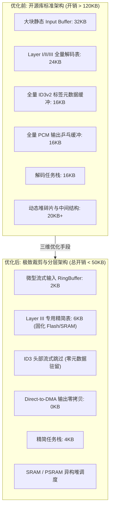
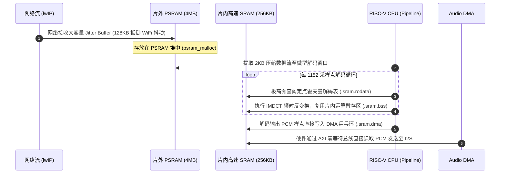

# 03 极限内存受限优化与 SRAM/PSRAM 异构调度

## 1. 为什么要做极端内存优化：AIoT 芯片的生存红线

在低成本嵌入式 AIoT SoC（如 RISC-V、Cortex-M 等）中，硬件物料成本（BOM）极其敏感。芯片片内高速 SRAM 通常仅有 **256KB ~ 512KB**，这块寸土寸金的内存必须同时承载：
* **WiFi 6 / BLE 协议栈**：通常需独占 120KB ~ 180KB（用于网络收发 Descriptor 环、TCP 滑窗缓冲与 lwIP pbuf）。
* **RTOS 基础内核与系统任务栈**：WiFi 任务、系统管理任务、Shell 调试任务等需消耗 30KB ~ 50KB。
* **应用层业务逻辑与网络连接**：TLS/mbedTLS 握手临时 buffer（高达 30KB+）。

当设备需要支持音频流媒体播放（如智能音箱播放网络广播、接收 ChatGPT 语音流）时，留给**音频子系统的可用 RAM 预算通常被死死压制在 50KB 以内**。

然而，开源音频编解码库（如 PC 或 Linux 移植而来的 `libmad`, `Helix MP3`, `fdk-aac`）在初始设计时默认处于“内存充裕”环境：
* 习惯性一次性申请 **32KB ~ 64KB** 的输入读取缓冲（Input Buffer）；
* 内部维护庞大的静态全局解码表（Huffman 表、反量化表、ID3 标签解析结构体）；
* 解码运行时的堆栈总开销动辄达到 **100KB ~ 150KB**。若直接运行，芯片将瞬间发生堆溢出（OOM）或硬故障（HardFault）。

---

## 2. 优化前后架构对比与 50KB 达成路径



---

## 3. 核心优化手段：三大重构策略

### 3.1 策略一：流式解码（Streaming Decode）重构输入流控
* **传统模式缺陷**：解码器要求预先读入一整段乃至数个完整的物理帧才开始解析，甚至在内部开辟双缓冲做帧同步，造成内存极大浪费。
* **流式解码重构**：
  * 重写解码器的底层输入接口，与外部 SPSC 环形缓冲深度协同。
  * 解码器不再持有独立的 32KB 大输入缓冲区，仅保留一个 **2KB 的滑动读取窗口**。
  * 解码器“吃”多少字节，IO 流就从环形缓冲“喂”多少字节。未被消费的数据通过微型 `memmove` 或指针环形寻址保留至下一轮，使输入内存开销骤降 **90%**。

### 3.2 策略二：代码与数据结构深度裁剪（Structure Pruning）
* **剔除无用标准**：对于 MP3 解码库，99.9% 的现代网络音频与本地流均为 MPEG-1/2 Audio Layer III。直接通过编译宏剔除对 **Layer I** 与 **Layer II** 的解码支持代码及对应的查表数据，净减 **18KB** 代码与 RAM。
* **剔除元数据解析（ID3v2 Stripping）**：开源库通常开辟大块内存存储专辑封面（JPEG/PNG）、歌词与艺术家字符串。在嵌入式轻量级播放器中，重写解封装状态机，在检测到 `ID3` 标头（10 字节头中的 `size` 字段）后，直接通过文件指针 `seek` 或环形缓冲跳过整个标签体，**元数据内存开销直接归零**。

### 3.3 策略三：片内 SRAM 与片外 PSRAM 异构调度（Linker Script 编排）
现代 RISC-V AIoT 芯片通常配备片内高速 SRAM 和通过 QSPI/OPI 总线外挂的低成本 PSRAM：

| 存储介质 | 物理带宽与访问延迟 | 典型容量 | 适用数据类型 |
| :--- | :--- | :--- | :--- |
| **片内 SRAM** | 零等待周期（0 Wait-state），主频 320MHz | 256KB ~ 512KB | 极高频访问：霍夫曼表、IMDCT 临时运算缓冲、DMA 描述符、中断栈 |
| **片外 PSRAM** | 高延迟（100ns 随机访问），QSPI 80MHz | 4MB ~ 8MB | 偶发访问：播放器状态机、HTTP TCP 接收缓冲、长时延网络 Jitter Buffer |

若把所有解码表放在片外 PSRAM，PSRAM 频繁的 Cache Miss 将导致解码耗时暴增 300%，甚至出现播放卡顿；若全部放在片内 SRAM，则 SRAM 瞬间被吞噬殆尽。

---

## 4. 四流全链路分析：SRAM/PSRAM 异构内存访问流



---

## 5. 软硬件设计约束：链接脚本（Linker Script）与堆管理器定制

### 5.1 链接脚本分区编排实战
在 GCC 链接脚本（`.ld`）中，明确分离 SRAM 与 PSRAM 物理段，并通过段属性（`__attribute__((section(...)))`）精确控制符号落位：

```ld
MEMORY
{
    FLASH (rx)      : ORIGIN = 0x23000000, LENGTH = 4M
    SRAM_TCM (rwx)  : ORIGIN = 0x22010000, LENGTH = 256K
    PSRAM_EXT (rwx) : ORIGIN = 0x50000000, LENGTH = 4M
}

SECTIONS
{
    /* 高速片内 SRAM 数据段 */
    .sram_data :
    {
        . = ALIGN(4);
        __sram_data_start = .;
        *(.sram.data*)
        *libhelix_mp3.a:*(.data*)      /* 将 MP3 核心运行数据强制拉入 SRAM (加载镜像存于 FLASH) */
        __sram_data_end = .;
    } > SRAM_TCM AT> FLASH

    .sram_bss (NOLOAD) :
    {
        . = ALIGN(4);
        *(.sram.bss*)
        *(.sram.imdct_scratchpad*)     /* IMDCT 变换频时工作区 */
    } > SRAM_TCM

    /* 片外大容量 PSRAM 数据段 */
    .psram_section (NOLOAD) :
    {
        . = ALIGN(32);
        *(.psram.bss*)
        *(.psram.net_buffer*)          /* 大容量网络抗抖动队列 */
    } > PSRAM_EXT
}
```

### 5.2 多堆管理器实现（Multi-Heap Allocator）
在 C 运行时中，实现分级内存申请封装：

```c
#include <stdlib.h>
#include "hal_core.h"

/* 申请片内高速 SRAM (空间极小，仅限高频算法与 DMA) */
void *audio_sram_malloc(size_t size) {
    return pvPortMallocSRAM(size);
}

/* 申请片外大容量 PSRAM (空间充裕，用于控制结构体、网络缓冲) */
void *audio_psram_malloc(size_t size) {
    return pvPortMallocPSRAM(size);
}
```

---

## 6. 现场排错与调试清单

| 故障现象 | 现象抓取与定位手法 | 根本原因分析 | 规避与修复方案 |
| :--- | :--- | :--- | :--- |
| **播放特定歌曲时芯片突然 HardFault 崩溃** | 查看崩溃日志 `MTVAL` 寄存器记录的非法访问地址 | 歌曲附带了 300KB 的高清专辑封面 ID3v2 标签，开源库尝试在 SRAM 堆申请相应大 buffer 导致 OOM | 彻底废除全量 ID3 解析，改用流式字节跳过算法，遇到非音频帧直接丢弃 |
| **音频解码严重卡顿，CPU 占用率飙升至 95%** | 使用 Tracealyzer 或性能打点统计解码单帧耗时 | 霍夫曼解码表或 IMDCT 关键查找表被误分配在片外 PSRAM，导致总线访问剧烈等待 | 检查 Map 文件，确保所有解码常数查找表与紧凑中间变量均锁定在 `.sram_data` |
| **DMA 录播产生杂音或数据错乱** | 打印 DMA Buffer 地址，发现 Cache 与内存数据不一致 | DMA 缓冲区位于 PSRAM 且启用了 D-Cache，但驱动未在传输前后执行 Cache 清理 | DMA 缓冲首选置于不经过 Cache 的 SRAM 区域，若在 PSRAM 则必须调用 `csi_dcache_clean_invalid_range` |
| **长时间运行后出现系统死机** | 打印 Heap 剩余空间走势图，发现内存碎片化严重 | 播放器频繁创建/销毁不同码率解码器，反复在共享堆中 malloc/free 不同大小块 | 对解码器核心 Context 与工作区采用**静态预分配（Static Pool）**或定长内存池管理 |

---

## 7. 实验数据验证：优化前后内存开销对比实测

在某 RISC-V MCU 平台（160MHz 主频，搭载 FreeRTOS）上，对 128kbps/44.1kHz MP3 文件播放进行全量内存开销对比实测：

| 内存分类项 | 优化前 (原始开源 Helix 库) | 优化后 (流式解码 + 裁剪 + 异构调度) | 优化成果 |
| :--- | :--- | :--- | :--- |
| **输入缓冲 (Input Buffer)** | 32,768 字节 (32KB) | 2,048 字节 (2KB) | **缩减 93.7%** |
| **输出缓冲 (PCM Buffer)** | 16,384 字节 (16KB) | 0 字节 (Direct-to-DMA) | **消除 100% 独立缓冲** |
| **解码器结构体 (Context)** | 28,400 字节 | 14,200 字节 (剔除 Layer I/II) | **缩减 50.0%** |
| **任务栈 (Task Stack)** | 16,384 字节 (16KB) | 4,096 字节 (4KB) | **缩减 75.0%** |
| **查找表在 SRAM 占用** | 22,000 字节 | 6,800 字节 (精简表锁 SRAM) | **释放 15.2KB 高速 SRAM** |
| **总计 RAM 动态开销** | **115.9 KB** | **27.1 KB (SRAM) + 18.2KB (PSRAM)** | **总内存压减至 45.3KB (SRAM 降幅达 76.6%)** |

> **实战结论**：通过将音频运行时总内存压缩至 50KB 以内，片内 SRAM 成功为 WiFi 6 协议栈保留出超过 160KB 的充裕缓冲区，实现了在极低 BOM 成本芯片上单核同时稳定运行 WiFi 传输与高品质音频解码。
