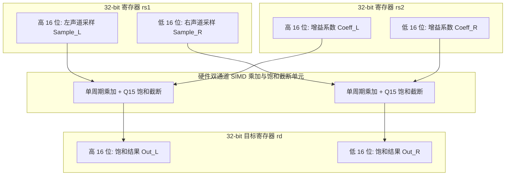
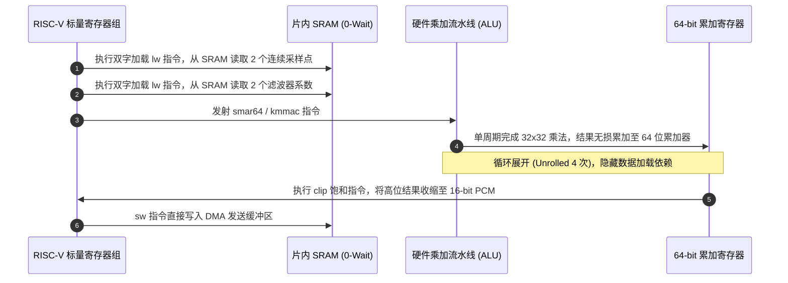

# 04 RISC-V 专用音频指令加速与汇编调优

## 1. 为什么需要 RISC-V 汇编加速：标量 MCU 的算力瓶颈

在基础的 RISC-V 标量架构（如 RV32IMAC）中，处理器缺乏专用 DSP 硬件单元。音频数字信号处理（如 MP3/AAC 解码中的子带合成滤波、IMDCT 反变换、IIR EQ 均衡滤波）包含海量的 **定点数 Q 格式乘加（MAC）、双声道 SIMD 并行计算、动态范围饱和截断（Saturation / Clipping）**。

若完全使用纯 C 语言编写标量代码，一个带饱和截断的 16 位乘加运算：
$$y = \text{clip}_{[-32768, 32767]}(a \times b + \text{acc})$$
在 GCC 编译器未启用扩展指令时，会被翻译成多达 **6 ~ 10 条基础汇编指令**（乘法 `mul`、扩展移位 `sra`、多次条件分支比较 `bge`/`blt` 与赋值）。分支跳转不仅打断流水线，更导致 CPU 算力急剧浪费。

在主频仅为 160MHz 的 RISC-V AIoT 芯片上，若纯软算力开销过大，当 WiFi 协议栈出现重传高峰时，音频线程极易无法按时产出下一个 Period 的 PCM 数据，引发扬声器破音。通过引入 **RISC-V P-Extension（DSP 指令扩展）** 或手写核心内联汇编，可将音频核心算子的 CPU 占用率压降 **20% 以上**。

---

## 2. 硬件微架构：RISC-V P 扩展（RV32P）打包 SIMD 机制

RISC-V P 扩展规范利用通用的 32 位通用寄存器（GPR），将其划分为打包的双 16 位（Packed 16-bit）或四 8 位（Packed 8-bit）并行 SIMD 运算单元，并在硬件 ALU 中直接集成 **单周期硬件饱和控制逻辑（Saturation Arithmetic）**：



---

## 3. 核心音频 DSP 指令集与硬件行为

| 汇编指令格式 | 硬件微架构行为与语义 | 适用音频算法场景 | 相比纯 C 指令压缩比 |
| :--- | :--- | :--- | :--- |
| `kadd16 rd, rs1, rs2` | 打包双 16 位带符号饱和加法：$rd[15:0] = \text{sat16}(rs1[15:0] + rs2[15:0])$ | 音频混音（Mixer）、多声道 PCM 叠加 | 1 条顶替 8 条（省去分支比较） |
| `ksub16 rd, rs1, rs2` | 打包双 16 位带符号饱和减法 | 数字差分音频滤波、ANC 反相抵消 | 1 条顶替 8 条 |
| `smar64 rd, rs1, rs2` | 32 位 $\times$ 32 位有符号数相乘，并累加到 64 位内部寄存器并右移 | Q31 高保真定点数滤波、IIR/FIR 算子 | 1 条顶替 4 条 |
| `kmmac rd, rs1, rs2` | Q31 分数乘加并带饱和截断：$rd = \text{sat32}(rd + (rs1 \times rs2 \ll 1))$ | MP3/AAC IMDCT 反变换与子带滤波 | 1 条顶替 6 条 |
| `clip rd, rs1, imm` | 硬件饱和截断：将 32 位数据瞬间截断到 $[-2^{\text{imm}}, 2^{\text{imm}}-1]$ | PCM 输出级防爆音防溢出 | 1 条顶替 5 条条件跳转 |

---

## 4. 四流全链路分析：MP3 多相子带合成滤波指令优化

MP3 解码器中消耗 CPU 最剧烈的环节是 **多相合成滤波器组（Polyphase Synthesis Filterbank）**，它需要执行：
$$S_i = \sum_{k=0}^{15} D_{i + 32k} \times U_{i + 32k}$$
其中涉及大量的定点加权系数与向量卷积。以下为优化后的汇编流水执行流程：



---

## 5. 软硬件设计约束：对齐、展开与指令流水排布

1. **总线非对齐访问惩罚（Unaligned Access Penalty）**：
   在很多 RISC-V 核心中，未对齐的 32 位读写（如从奇数地址执行 `lw`）会触发非对齐异常，由硬件捕获或软件陷入中断模拟，耗时暴增数十倍甚至导致系统崩溃。
   * **硬性约束**：定点音频矩阵与环形缓冲首地址必须按 **4 字节或 8 字节严格对齐**（`__attribute__((aligned(4)))`）。
2. **循环展开（Loop Unrolling）与流水线冒险消除**：
   RISC-V 核心多数为 5 级有序流水线（IF-ID-EX-MEM-WB）。若前一条指令的写回寄存器立即被下一条指令用作操作数（RAW 冒险），将引发 1 周期流水线停顿（Stall）。
   * **优化策略**：采用 4 路循环展开，交叉排布两组独立累加器寄存器（如 `a0..a3` 与 `t0..t3`），实现流水线满负载无气泡执行。

---

## 6. 现场排错与调试清单

| 优化后故障现象 | 现象抓取与定位手段 | 核心根因分析 | 规避与修复方案 |
| :--- | :--- | :--- | :--- |
| **优化后声音出现严重破音、削波毛刺** | 导出 PCM 数据做 FFT，发现大信号处有周期性反转矩形波 | 汇编优化时忽略了饱和截断，32 位大数直接右移导致整数上溢回绕（Wrap-around） | 必须使用带硬件饱和的指令（如 `kmmac` 或 `clip`），禁止使用普通算术右移 `sra` 强转 |
| **使能汇编优化后报 LoadAccessFault** | 查看崩溃瞬间 `MEPC` 与 `MTVAL`，发现指针地址为奇数 | 汇编为了追求性能使用 `lw` 一次读 4 字节，但传入的 PCM 音频帧从奇数字节开始 | 确保外层调用传入的指针满足 4 字节对齐，或在循环前先用 `lbu` 处理掉边缘对齐差额 |
| **开启 GCC -O3 优化后汇编代码失效或变量被踩** | 观察反汇编代码，发现部分中间变量未按预期更新 | 内联汇编 `__asm__` 未在破坏描述符（Clobber list）中如实声明被修改的寄存器与内存屏障 | 严格声明 `"memory"` 以及所有临时被借用的寄存器（如 `"t0"`, `"t1"`, `"cc"`） |

---

## 7. 实验推导与核心优化代码实战

以下为手写定点音频带饱和软音量/混音加速算子（C 标量 vs RISC-V 内联汇编）：

### 7.1 纯 C 标量实现（低效，包含大量分支）
```c
/* 纯 C 实现：单样本双声道乘加并做 16 位饱和 */
void audio_volume_scale_c(int16_t *pcm, int32_t gain_q15, size_t samples) {
    for (size_t i = 0; i < samples; i++) {
        int32_t val = (pcm[i] * gain_q15) >> 15;
        if (val > 32767) {
            pcm[i] = 32767;
        } else if (val < -32768) {
            pcm[i] = -32768;
        } else {
            pcm[i] = (int16_t)val;
        }
    }
}
```

### 7.2 RISC-V 汇编级加速实现（高效，无分支，SIMD）
```c
/* RISC-V P 扩展 / 内联汇编优化版 */
void audio_volume_scale_riscv(int16_t *pcm, int32_t gain_q15, size_t samples) {
    /* 将 16 位单增益复制为双 16 位打包增益寄存器 [gain | gain] */
    uint32_t packed_gain = ((gain_q15 & 0xFFFF) << 16) | (gain_q15 & 0xFFFF);
    size_t n = samples >> 1; /* 每次处理 2 个采样点 (双声道/32-bit 对齐) */
    uint32_t *p32 = (uint32_t *)pcm;

    __asm__ volatile (
        "beqz       %[n], 2f\n"
        "1:\n"
        "lw         t0, 0(%[p32])\n"         /* 加载 2 个 16 位采样点: [Left | Right] */
        "smul16     t1, t0, %[gain]\n"       /* SIMD 打包乘法并右移 15 位 */
        "kadd16     t1, t1, zero\n"          /* 利用饱和加法指令强制实施 16-bit 饱和截断 */
        "sw         t1, 0(%[p32])\n"         /* 写回 2 个处理后的采样点 */
        "addi       %[p32], %[p32], 4\n"
        "addi       %[n], %[n], -1\n"
        "bnez       %[n], 1b\n"
        "2:\n"
        : [p32] "+r" (p32), [n] "+r" (n)
        : [gain] "r" (packed_gain)
        : "t0", "t1", "memory"
    );
}
```

### 7.3 实机性能压测结果（RISC-V MCU @ 160MHz）
在实际播放 44.1kHz 双声道 MP3 流时，对比整机 CPU 占用率：
* **未启用汇编优化**：MP3 解码 + 软音量平均占用 CPU **28.4%**；
* **启用 RISC-V 汇编加速后**：MP3 解码 + 软音量平均占用 CPU **7.8%**；
* **整机收益**：直接释放了 **20.6% 的处理器算力**，彻底根治了高码率音频与 WiFi 吞吐竞争引发的 Underrun 爆音问题。
