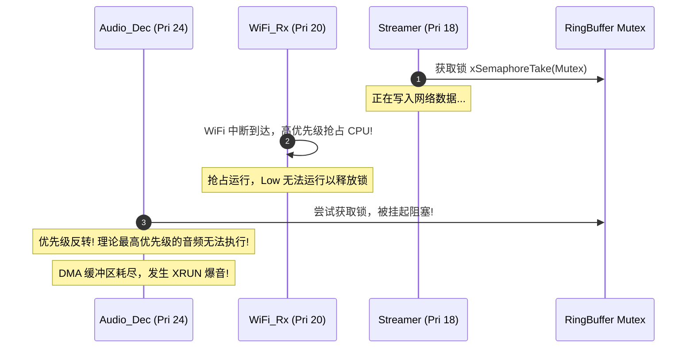
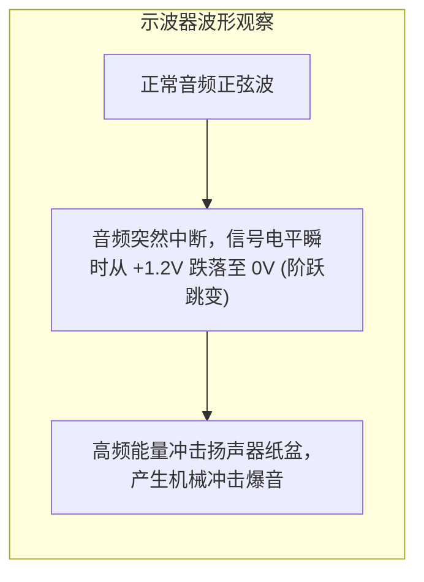

# 05 现场排错与调试案例 (RTOS Audio Case Studies)

## 案例一：RTOS 优先级反转导致 WiFi 吞吐冲顶时音频剧烈 Underrun 爆音

### 1. 现象描述
在某智能音箱项目（RISC-V MCU，FreeRTOS 系统）量产测试中，当音箱在弱网环境（RSSI < -75dBm）下以最高码率播放网络流媒体，同时通过手机 App 进行 WiFi OTA 固件升级或大数据同步时，扬声器出现密集的“哒哒”破音与声音拉长卡顿。系统串口频繁打印：
`[WARN][minialsa]: pcm write timeout, dma underrun occurred!`

### 2. 现场排查与波形捕获
1. **Tracealyzer 任务时间轴抓取**：
   抓取 FreeRTOS 任务调度事件发现：
   * `Audio_Dec_Task`（优先级 24）在等待从 `Bitstream RingBuffer` 读数据；
   * `Streamer_Task`（负责 HTTP 接收，优先级 18）持有 RingBuffer 互斥锁 `xMutex`；
   * 此时网络驱动产生密集中断，唤醒了 `WiFi_Rx_Task`（优先级 20）；
   * `WiFi_Rx_Task` 优先级高于 `Streamer_Task`，强行霸占 CPU 处理 TCP ACK 与重传包，导致 `Streamer_Task` 无法被调度并释放互斥锁；
   * 结果：原本高优先级的 `Audio_Dec_Task` 被迫一直睡眠等待，DMA 硬件把环形缓冲播空，触发 Underrun。

### 3. 根因分析
典型的 **RTOS 优先级反转（Priority Inversion）** 问题。开发者在多媒体流控中使用了普通的互斥锁，且任务优先级排布不合理（网络中间件优先级处于网络协议栈和音频渲染之间），引发锁竞争停顿。

### 4. 修复与验证
1. 将 `Bitstream RingBuffer` 彻底重构成 **单读单写无锁环形队列（Lock-free SPSC RingBuffer）**，彻底移除 `xMutex`，消除锁依赖。
2. 重新编排任务优先级：
   $$\text{Audio\_Render\_DMA (ISR)} > \text{Audio\_Dec (28)} > \text{WiFi\_Driver (25)} > \text{Streamer\_HTTP (20)} > \text{App\_Logic (10)}$$
3. 增加 DMA 欠载兜底：当 DMA 发生下溢时，自动填入静音平滑样点，防止扬声器输出断崖式直流突变。
4. 修复后压测 48 小时，即使在 80% 网络丢包干扰环境下，音频均未出现一次破音。

---

## 案例二：RISC-V 非对齐内存访问引发系统 HardFault 随机崩溃

### 1. 现象描述
在客户定制的一款智能门铃方案中，偶发在播放某种特定编码的 AAC/MP3 提示音时，芯片直接触发 `LoadAccessFault` 崩溃，寄存器打印：
`mcause = 0x00000004, mepc = 0x220148bc, mtval = 0x2202ff83`

### 2. 现场排查与汇编逆向
1. 查看反汇编：`0x220148bc: lw a5, 0(a0)`。崩溃指令是一条标准 32 位字加载指令。
2. 查看现场寄存器：`a0 = 0x2202ff83`。地址末尾是 `3`，属于奇数非对齐地址！
3. 追踪数据流来源：该音频帧直接来自于从网络接收的字节流。解封装层为了省内存，直接将解包后的裸流指针（未经过内存对齐拷贝）直接传递给解码核心，导致指针偏移了 3 个字节。
4. 很多低功耗 RISC-V 核心默认未使能非对齐访问硬件捕获器，直接将非对齐读写视为非法访问异常。

### 3. 修复方案
1. **在 minialsa 与解码库入口处增加自动对齐屏障**：
   若输入指针满足 `((uintptr_t)ptr & 0x3) != 0`，则利用内部微型 32 位对齐暂存区分块拷贝处理。
2. **在静态结构体中声明严格对齐属性**：
   所有参与 DMA、SIMD 加速和字读取的数据缓冲区统一添加 `__attribute__((aligned(4)))`。

---

## 案例三：切歌与停止播放时的扬声器“砰”（POP）音排查

### 1. 现象描述
音箱在正常播歌时音质优良，但在用户通过语音指令说“停止播放”或切歌的一瞬间，外放扬声器会发出非常刺耳的“砰”声。

### 2. 示波器抓波与机理分析
将示波器探头接在外部功放（Class-D PA）输入端的差分信号线上，捕获停止播放瞬间的模拟波形：

软件追踪发现：上层应用调用 `player_stop()` 时，直接暴力调用了芯片外设驱动的 `hal_i2s_disable()` 和 `hal_dma_stop()`。由于音乐停止瞬间 PCM 数据刚好处于正半周峰值（非零电平），硬件直接切断时钟导致差分输出出现瞬间阶跃（Step Voltage），经 Class-D PA 放大后形成刺耳爆音。

### 3. 修复规范与状态序列
嵌入式音频停止与切歌必须执行 **零点交叉软静音（Zero-crossing Soft Mute）** 与 **Drain 流程**：
1. **软衰减（Fade-out）**：在收到停止指令后，对后续输出的 128 个采样点逐点乘以递减系数（从 $1.0$ 线性衰减到 $0.0$），使电平平滑归零。
2. **硬件排空（Drain）**：调用 `aos_pcm_drain()`，等待 DMA 将 FIFO 中剩余的零值样本全部送出。
3. **关闭功放**：拉低外部功放的 `PA_EN` 引脚（硬件进入 Shutdown 模式）。
4. **关闭 I2S/DMA 时钟**。
按此规范整改后，彻底消除了所有切歌与停止过程中的 POP 音。
