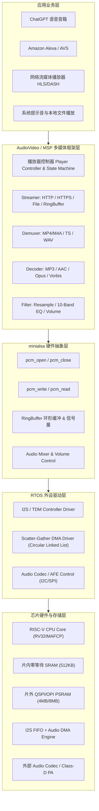

# 12 RTOS 嵌入式音频软件栈与框架 (RTOS Audio Software Stack)

## 1. 模块定位与工程背景

在资源受限的嵌入式 AIoT、智能家居、可穿戴设备以及轻量级微控制器（如 RISC-V、Cortex-M 等）上，受限于芯片面积、成本与功耗预算，系统通常无法承载庞大的 Linux 操作系统及标准 ALSA/ASoC 驱动栈，而是运行在 **FreeRTOS、RT-Thread、NuttX** 等实时操作系统（RTOS）之上。

面对仅有 **数百 KB 片内 SRAM**（常配备低成本 SPI/QSPI PSRAM）的极端硬件条件，嵌入式系统工程师必须解决以下核心矛盾：
1. **统一硬件抽象与极小代码体积**：既要提供与标准 ALSA 相似的 PCM 录播统一接口，屏蔽不同芯片 I2S/DMA 控制器的硬件差异，又要求抽象层体积控制在 **几 KB 至十几 KB** 内（如 `minialsa`）。
2. **多媒体处理流水线与业务逻辑解耦**：音频流需经历网络接收/文件读取（Streamer）、解封装（Demuxer）、音频解码（Decoder）、数字音效处理（Filter/EQ/Resample）到硬件渲染（Audio Sink）的完整链路，各环节需支持异构时钟、多线程状态机解耦与流控。
3. **极小 RAM 预算下的流式处理**：在无 Linux 虚拟内存、页面置换机制的 MCU 环境中，将音频播放任务栈与动态堆内存总开销压减至 **50KB** 以内，同时保障 WiFi 协议栈与应用业务并发运行不 OOM。
4. **异构存储分级与指令级性能优化**：通过芯片片内零等待 SRAM 与片外高延迟 PSRAM 的精准调度，结合 RISC-V DSP/P-Extension 扩展指令集汇编优化，实现算力与功耗的最优平衡。

---

## 2. 模块文档结构

本模块以教学模型整理轻量级音频软件栈的架构与优化方法，不将通用骨架视为量产验证结果：

| 章节序号 | 文档名称 | 核心工程内容 |
| :--- | :--- | :--- |
| **01** | [minialsa 架构与轻量级 PCM 抽象](01-minialsa-architecture.md) | 兼容标准 ALSA 接口的轻量级驱动抽象、环形缓冲 RingBuffer、阻塞/非阻塞信号量同步机制与零拷贝设计 |
| **02** | [嵌入式多媒体播放器 Pipeline 架构](02-multimedia-player-pipeline.md) | 基于 AudioVideo / MSP 的五级流水线设计、状态机跳转、跨线程同步与无缝切歌/暂停/恢复处理 |
| **03** | [极限内存受限优化与 SRAM/PSRAM 异构调度](03-embedded-memory-optimization-sram-psram.md) | 50KB 极端内存裁剪法、流式解码（Streaming Decode）、链接脚本（Linker Script）内存段布局与数据结构精简 |
| **04** | [RISC-V 专用音频指令加速与汇编调优](04-riscv-audio-dsp-acceleration.md) | RV32P / DSP 扩展指令、定点 Q 格式数学运算、内联汇编手写优化，降低 20% CPU 占用率实战 |
| **05** | [现场排错与调试清单](05-cases-debug.md) | 内存踩踏、优先级反转导致 Underrun、环形缓冲死锁与 DMA 对齐崩溃排查 |
| **06** | [工程推演与量化模型](06-engineering-analysis.md) | 任务栈深度预算、PSRAM 带宽延迟推演与 RTOS 音频抖动容限模型 |

---

## 3. 软硬件系统分层全景图

