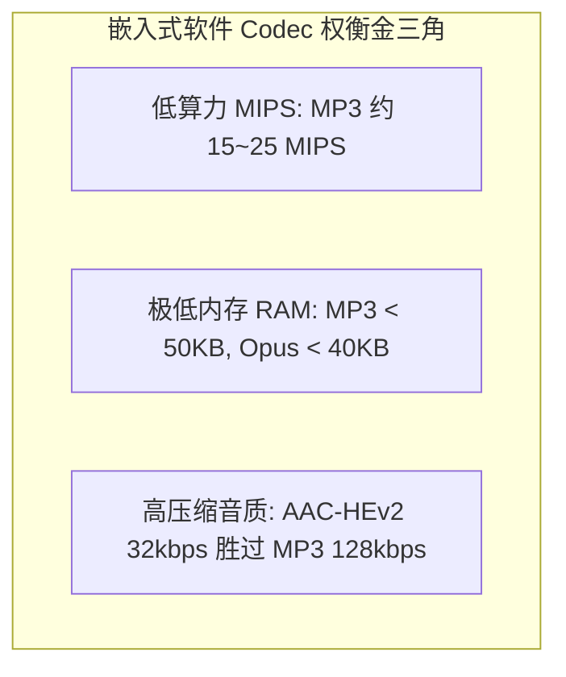
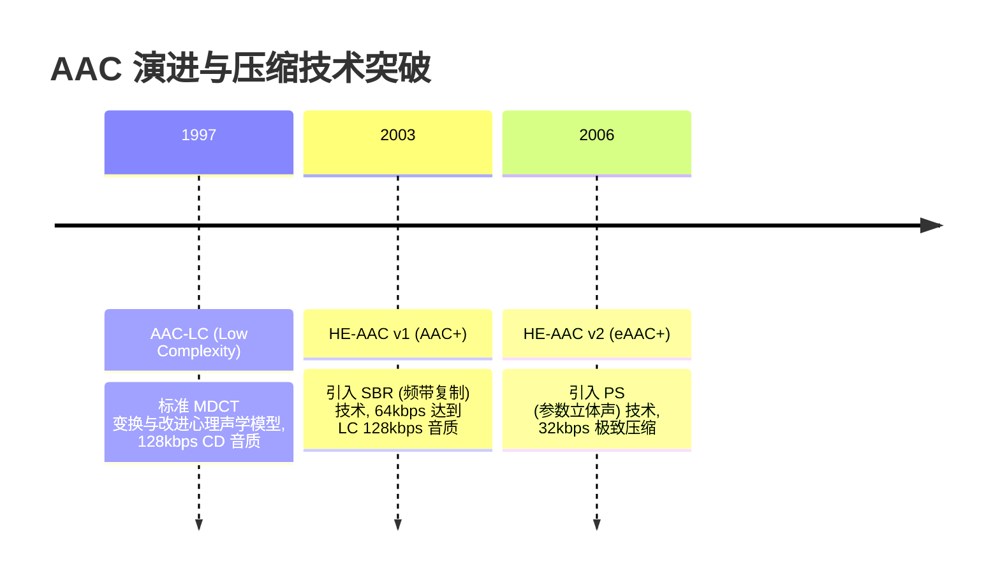

# 01 软件编解码器全家族深度剖析 (MP3, AAC, Opus, Ogg Vorbis)

## 1. 软件 Codec 解决什么问题：带宽、音质与算力金三角

在嵌入式与 AIoT 系统中，未经压缩的原始 PCM 音频体积极其庞大（例如 44.1kHz/16-bit 双声道 PCM 码率高达 $1411.2\text{ kbps}$，约 176 KB/s）。这无论是在低速网络传输（WiFi/BLE/4G Cat.1）、Flash 存储还是云端语音交互中都是不可接受的。

音频压缩算法的核心任务是在 **极小比特率（Bitrate）** 下，利用人类听觉系统的生理与心理声学模型（掩蔽效应），去除人耳无法感知的感知冗余与信号统计冗余。

在嵌入式 MCU 平台进行解码库选型与深度优化时，必须在 **算力消耗（MIPS）、动态内存（RAM footprint）与压缩保真度** 之间做出精准权衡：

---

## 2. MP3 (MPEG-1 Audio Layer III) 核心机理与帧结构

MP3 是嵌入式系统中最普及的经典音频格式，单帧固定对应 **1152 个采样点**。

### 2.1 物理帧结构拆解

### 2.2 核心解码四步流
1. **位流同步与解复用**：在流式数据中滑动查找 `0xFFE` / `0xFFF` 同步字（Syncword），校验 Layer、Bitrate 及 Sampling Rate 字段。
2. **霍夫曼熵解码（Huffman Decoding）**：读取主数据，依据边信息指定的码表索引查表，恢复出 576 个量化频域系数。
3. **反量化（Dequantization）**：将定点整数频域系数还原为真实物理幅值：$xr_i = \text{sign}(is_i) \times |is_i|^{4/3} \times 2^{\frac{\text{scalefactor}_i}{4}}$。
4. **IMDCT 频时变换与子带多相合成滤波**：将 576 个频域系数通过 18 点/36 点 IMDCT 反变换成子带信号，最终通过 32 子带多相合成滤波器输出 1152 个 16-bit PCM 样点。

---

## 3. AAC (Advanced Audio Coding) 全家族演进与向下兼容机制

AAC 相比 MP3 提供了更高的编码效率（单帧通常包含 **1024 个采样点**）。在从 AAC-LC 到 HE-AAC v2 的演化历程中，核心设计哲学是 **完全向下兼容（Backward Compatibility）**：

### 3.1 核心压缩黑科技：SBR 与 PS 机理
1. **SBR (Spectral Band Replication，频带复制)**：
   * **原理**：人类语音和音乐的高频部分与低频基波和谐波存在极强的相关性。SBR 仅用传统的 AAC-LC 编码 0 ~ 12kHz 的低频核心信号；对于 12kHz ~ 24kHz 的高频信号，编码器不传输频谱，仅传输极其微小的 **包络特征参数**。
   * **解码行为**：解码器将低频频谱通过 Transposer 复制搬移到高频区，再利用参数重构高频包络，码率直接砍半！
2. **PS (Parametric Stereo，参数立体声)**：
   * **原理**：双声道立体声左右声道具有高度相似性。PS 将双声道下混为 **单声道（Mono）主信号**，并将左右声道的声道间强度差（IID）、时间差（ITD）和相关性（ICC）抽象为少量参数。
   * **解码行为**：解码单声道 PCM，根据 PS 参数矩阵空间扩展矩阵恢复出伪双声道立体声。

### 3.2 为什么 HE-AAC v2 文件在 ADTS 头中标记为 Mono 且能被 LC 解码器直接播放？
在实际芯片开发中，解析 ADTS 帧头部（7 字节）时会发现一个现象：
* **无论文件是 LC、HE 还是 HEv2，ADTS 头的 `profile` 字段始终显示为 `1`（对应 AAC-LC）**！
* **HE-AAC v2 文件的 ADTS 头中，`channel_configuration` 字段显示的声道数不是 2，而是 1**！

> **原厂工程机理解析**：
> SBR 和 PS 的元数据并没有存放在 ADTS 基础头中，而是伪装并填充在 AAC 帧数据的 **`extension_payload`（扩展有效载荷）** 内部。
> 1. **LC 解码器遇到 HEv2**：老旧或低端 LC 解码器由于不识别 `extension_payload` 中的 SBR/PS 标识，会直接忽略它们，只将基础单声道数据解码并输出 Mono 声音。虽然丢失了高频明亮度与立体声分离度，但**完全不会崩溃且能正常出声**。
> 2. **嵌入式移植经典 Bug**：早期部分开源库（如 Android 旧版 `pvaac`）在移植时，开发者武断地在初始化时将硬件 DAC 强制写死为双声道模式（`channels = 2`），当解析到 HEv2 ADTS 头报告 `channels = 1` 时直接 Assert 报错或产生声道交叉噪音。正确的做法是驱动层需支持根据帧流动态重置声道数。

---

## 4. Opus 编码器：新一代低延迟全场景王者

Opus 是 IETF 发布的现代开源免版税编解码器，融合了针对语音优化的 **Skype SILK** 算法与针对低延迟音乐优化的 **Xiph CELT** 算法：

| 维度 | MP3 | AAC-LC | Opus (libopus) |
| :--- | :--- | :--- | :--- |
| **算法延迟 (Algorithmic Delay)** | 100ms ~ 150ms | 100ms ~ 200ms | **5ms ~ 20.5ms (可按需配置)** |
| **支持采样率** | 8k ~ 48k | 8k ~ 96k | 8k, 12k, 16k, 24k, 48k (原生 48k 运算) |
| **适用场景** | 离线音乐播放 | 广电广播、流媒体点播 | **端侧大模型流式对话、VoIP、对讲机** |
| **定点库支持** | Helix / libmad (成熟) | fdk-aac (成熟) | libopus fixed-point (成熟高效) |

---

## 5. 常见软件解码库在 RISC-V 平台的资源与算力对比

在 RISC-V 芯片（主频 160MHz）上，各解码库实际测试数据基准：

| 解码库名称 | 解码格式 | 典型 ROM 代码开销 | 运行时 RAM 开销 (优化后) | 160MHz CPU 占用率 (128kbps) |
| :--- | :--- | :--- | :--- | :--- |
| **Helix MP3** | MP3 (Layer III) | 32 KB | **28 KB** (极小 SRAM) | **7.8%** (汇编加速) |
| **libmad** | MP3 (Layer I/II/III) | 68 KB | 45 KB | 14.5% |
| **fdk-aac** | AAC-LC / HE / HEv2 | 140 KB | 60 KB (需外挂 PSRAM) | 18.2% |
| **libopus (fixed)** | Opus (SILK/CELT) | 110 KB | **38 KB** | **12.0%** (16kHz 语音宽带) |
| **libtremor** | Ogg Vorbis (定点) | 75 KB | 36 KB | 16.5% |

---

## 6. 现场排错与调试清单

| 故障现象 | 调试手段与观察点 | 根因与机理分析 | 规避与修复方案 |
| :--- | :--- | :--- | :--- |
| **播放特定 AAC 音频声音发闷且为单声道** | 打印解码器识别到的扩展特性，检查 SBR/PS 使能标志 | 该音频为 HE-AAC v2 编码，但系统选配的轻量级 AAC 解码库为精简版 LC，无 SBR 展开模块 | 属于向下兼容的正常降级；若客户要求高保真，需编译使能 `CONFIG_DECODER_AAC_HE` 完整库 |
| **解高码率 MP3 时偶发爆音伴随内存踩踏** | GDB 抓取栈回溯，检查反量化输出暂存区边界 | 某些非标 MP3 文件在主数据中包含了异常大的量化步长，导致频域系数越界 | 在霍夫曼解码循环中强制增加频域系数下标边界断言（`idx < 576`） |
| **Opus 解码语音断断续续** | 打印网络包接收时间戳与解码器消费时延 | Opus 帧时长默认为 20ms，若网络接收线程抖动超过 20ms 且无抗抖动缓冲，将导致解码欠载 | 增加深度为 3 ~ 5 帧的轻量级 Jitter Buffer，并使能 Opus 原生 PLC（丢包补偿）功能 |
