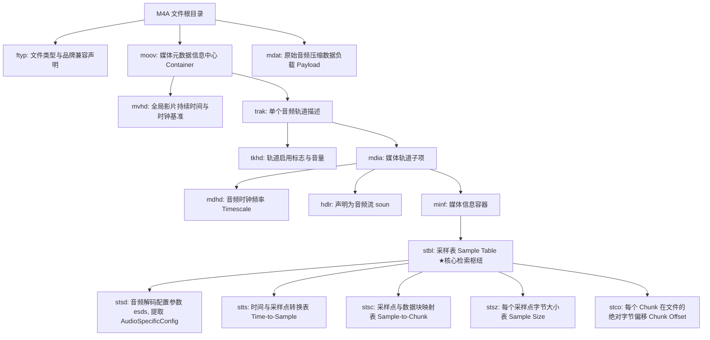
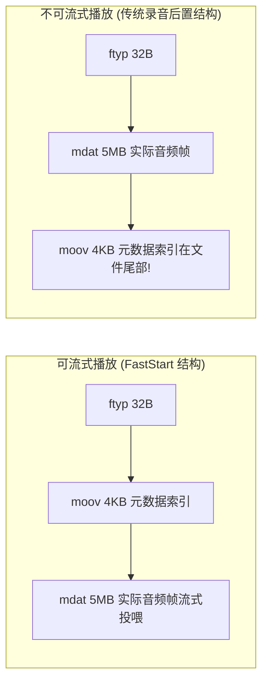

# 02 音频容器解封装与流媒体协议实战 (M4A, TS, HLS, DASH)

## 1. 为什么需要解封装：裸流与容器的本质区别

在嵌入式音频开发中，初学者常将“音频编码格式”（如 AAC, MP3, Opus）与“容器封装格式”（如 M4A/MP4, TS, OGG, WAV）混为一谈。
* **裸编码位流（Elementary Stream, ES）**：由单纯的音频编码帧串联而成（如带 ADTS 头的 AAC 裸流）。虽然结构简单，但无法精确存储全局元数据、多轨道同步时钟、精确快进快退索引表（Seeking Index）或交织的加密信息。
* **多媒体容器（Container / Box）**：是一种文件包裹规范。它像一个精密的树状文件系统，将音频压缩数据块（Payload）与时间戳索引、采样率、位深、专辑标签等结构化元数据严格隔离存放。

在智能音箱与 AIoT 流媒体应用中，超过 80% 的网络音频流均以 **M4A (MP4 Audio)** 或 **HLS (M3U8 切片)** 形式下发。嵌入式工程师必须攻克解封装器（Demuxer）在极小内存下的流式解析难题。

---

## 2. MP4 / M4A 容器微架构与 Box 树状结构

MP4/M4A 遵循 ISO/IEC 14496-12 基础媒体文件格式（ISOBMFF），其文件由一个个嵌套的 **Box（Atom）** 组成：



### 核心索引解算逻辑（如何定位指定时间的音频帧）
若要在指定时间点 $T$ 开始播放：
1. 查 `stts` 表：将时间 $T \times \text{timescale}$ 转换为目标采样序号 $S$；
2. 查 `stsc` 表：计算该采样 $S$ 落在第几个数据块（Chunk $K$）中；
3. 查 `stco` 表：获取 Chunk $K$ 在整个文件中的物理文件起始偏移量 $\text{Offset}_{\text{chunk}}$；
4. 查 `stsz` 表：累加该 Chunk 内部在 $S$ 之前的所有采样点字节大小，得到最终精确的读取指针偏移：
   $$\text{FileOffset} = \text{Offset}_{\text{chunk}} + \sum_{i=\text{start}}^{S-1} \text{Size}_i$$

---

## 3. 疑难攻坚：M4A 部分网络音频流无法播放深度剖析

### 3.1 故障现场
在某芯片原厂多媒体 SDK 开发中，部分从网络下载或 CDN 下发的 `.m4a` 文件在嵌入式播放器中报格式不支持或无限卡死，但通过 PC 端 VLC 播放器却完全正常。

### 3.2 根因定位：Moov Atom 后置与渐进式流式下载的冲突
使用 MP4Box 分析两类文件的物理结构差异：
* **正常可播放文件**：`[ftyp] -> [moov] -> [mdat]`（`moov` 紧跟在文件头部）。
* **无法播放文件**：`[ftyp] -> [mdat (高达数兆字节)] -> [moov]`（`moov` 被写入在文件最尾部！）。



* **为什么录音器默认把 `moov` 写在尾部**：因为在手机或录音笔编码录音时，开发者无法在录音开始时预知最终的总时长、总帧数与各 Chunk 偏移，必须在录音停止后才将统计好的 `stbl` 索引表写入文件末尾。
* **嵌入式 MCU 的致命困境**：
  MCU 片内 RAM 仅有数百 KB，绝不可能把整个数 MB 的 `mdat` 全量下载到内存中再去读尾部的 `moov`；当播放器采用纯流式（Streaming）从前向后读取时，若在开头找不到 `moov`，根本无法获知音频采样率、声道数及解码配置，导致解析失败。

### 3.3 工业级双重解决方案
1. **服务端规整（离线处理）**：
   在资源发布时，使用 FFmpeg 强制执行 `faststart` 标记，将尾部 `moov` 重排到 `mdat` 之前：
   ```bash
   ffmpeg -i input.m4a -c copy -f mp4 -movflags faststart output.m4a
   ```
2. **嵌入式客户端 HTTP Range 两阶段探测（在线处理）**：
   在轻量级 HTTP Streamer 中引入两阶段握手逻辑：
   * **Stage 1**：发送 HTTP `HEAD` 请求获取文件总长度 $L$（`Content-Length`）；
   * **Stage 2**：若前 4KB 未发现 `moov`，发起断点续传请求获取尾部数据：`Range: bytes=(L-65536)-(L-1)`，在内存暂存区快速解析尾部 `moov`，提取解码所需的 `AudioSpecificConfig`；
   * **Stage 3**：索引建立完毕后，重新发起 `Range: bytes=(mdat_start)-`，平滑开启边下边解边播。

---

## 4. 网络流媒体协议栈：HLS (M3U8) 与网络抗抖动

### 4.1 扩展 M3U8 协议解析实战
HLS 将长音频流切分为若干个持续时间为 2~10 秒的 `.ts` 或 `.m4s (fMP4)` 独立切片。客户端通过定时轮询 `.m3u8` 文本文件获取切片列表：

```m3u8
#EXTM3U
#EXT-X-VERSION:3
#EXT-X-TARGETDURATION:6
#EXT-X-MEDIA-SEQUENCE:1024

#EXTINF:5.000,
https://audio-cdn.example.com/stream_1024.ts
#EXTINF:6.000,
https://audio-cdn.example.com/stream_1025.ts
```

### 4.2 嵌入式 HLS 状态机与双重缓冲模型
在嵌入式多媒体播放器中，设计 **切片预取状态机（Segment Prefetch FSM）**：
1. **前向预取**：当第 $N$ 个切片正在解码播放时，后台网络线程提前发起第 $N+1$ 个切片的 HTTP GET 请求，下载至 PSRAM 中的 `Segment RingBuffer`；
2. **无缝拼接（Gapless Stitching）**：切片文件尾部可能包含几个字节的填充。解封装器需剥除 TS 包头（188 字节，同步字 `0x47`）并比对 PTS 时间戳，在上一个切片结束与新切片开启时复用解码器上下文，避免切片切换瞬间出现人耳可闻的“咔哒”断音；
3. **网络自适应重试（Exponential Backoff）**：遇到 WiFi 丢包或 CDN 返回 404/503 时，状态机进入退避重试，同时底层由 Jitter Buffer 维持扬声器平滑输出，保障在 3 秒网络抖动内不发生卡顿。

---

## 5. 广播级流媒体：Icecast / Shoutcast (ICY 协议)

在互联网收音机与网络电台中，广泛采用基于 HTTP 长连接的 **Shoutcast/Icecast (ICY)** 协议：
* 客户端发起带有 `Icy-MetaData: 1` 头的标准 HTTP 请求；
* 服务端在响应头返回 `icy-metaint: 16000`，表示每传输 **16000 字节** 纯音频数据后，紧跟 **1 字节** 元数据长度字段 $L$；
* 随后紧随 $L \times 16$ 字节的 ASCII 文本元数据（如 `StreamTitle='Beatles - Yesterday';`）。
* **嵌入式流控关键**：流媒体解复用器必须精确计数字节流，在命中 `metaint` 边界瞬间将元数据抽离并投递给 UI 任务，严禁将文本字符灌入解码器，否则将引发剧烈爆音。

---

## 6. 现场排错与调试清单

| 故障现象 | 排查手法与工具 | 根本原因分析 | 规避与修复方案 |
| :--- | :--- | :--- | :--- |
| **M4A 播放无声，串口打印 esds parse failed** | 二进制查看 `stsd` Box 下的 `esds` 描述符 | 某些非标编码器在 `esds` 中省略了可选的 `DecoderSpecificInfo` 标签 | 增强容错解析逻辑，缺省时默认按标准 AAC-LC 44.1kHz 立体声初始化 Codec |
| **播放 HLS 切片切换时偶发轻微咔哒声** | 抓取切换处的 PCM 数据做波形分析 | 播放器在切片交界处重新创建了解码器，导致重叠相加（Overlap-add）历史样点清零 | 跨切片必须复用同一个解码器实例，严禁销毁上下文，仅重置输入比特流指针 |
| **网络收音机播放半小时后突然严重杂音** | 监控网络字节流与解封装状态 | ICY 元数据解析字节计数器发生 16 位整数溢出回绕，导致元数据文本被误当成 MP3 帧喂给解码器 | 将元数据周期计数器提升为 32 位无符号整数，并在每次抽取后做严格边界断言 |
